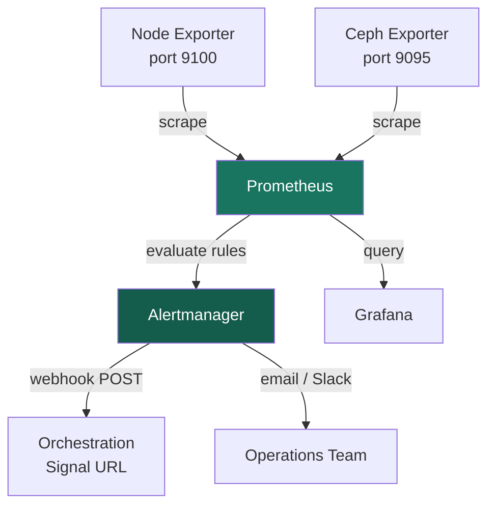

## Overview

Prometheus is the primary metrics backend for Xloud environments. It collects time-series
metrics from compute nodes, storage clusters, and deployed services through scrape targets
and service discovery. Alertmanager receives rule evaluation results from Prometheus and
routes alert notifications — including webhook signals that trigger Xloud Orchestration
auto-scaling policies.

Prometheus replaces legacy telemetry stacks (Ceilometer/Aodh) for metric collection and
alarm-based scaling in Xloud deployments.

<Note>
  **Prerequisites**
  - Prometheus 2.40 or later deployed (included in XIMP monitoring stack)
  - Alertmanager 0.25 or later
  - Node exporter deployed on all instances to be monitored
  - Network access from the Prometheus host to scrape targets on port 9100 (node exporter)
</Note>

---

## Architecture



---

## Prometheus Configuration

### Base Configuration

```yaml title="prometheus.yml"
global:
  scrape_interval: 15s
  evaluation_interval: 15s
  scrape_timeout: 10s
  external_labels:
    environment: "production"
    region: "RegionOne"

rule_files:
  - "/etc/prometheus/rules/*.yml"

alerting:
  alertmanagers:
    - static_configs:
        - targets:
            - "alertmanager:9093"

scrape_configs:
  - job_name: "prometheus"
    static_configs:
      - targets: ["localhost:9090"]

  - job_name: "node_exporter"
    static_configs:
      - targets:
          - "10.0.1.71:9100"
          - "10.0.1.72:9100"
          - "10.0.1.75:9100"

  - job_name: "ceph"
    static_configs:
      - targets: ["10.0.1.71:9095"]
```

### Service Discovery via Xloud API

Use the `openstack_sd_configs` scrape configuration to automatically discover instances
by project and assign labels from instance metadata:

```yaml title="scrape-config-discovery.yml"
scrape_configs:
  - job_name: "xloud_instances"
    openstack_sd_configs:
      - identity_endpoint: "https://api.<your-domain>:5000/v3"
        username: "prometheus"
        password: "{{ OS_PASSWORD }}"
        domain_name: Default
        project_name: monitoring
        region: RegionOne
        role: instance
        port: 9100
        tls_config:
          insecure_skip_verify: false

    relabel_configs:
      - source_labels: [__meta_openstack_instance_name]
        target_label: instance
      - source_labels: [__meta_openstack_project_id]
        target_label: project
      - source_labels: [__meta_openstack_tag_role]
        target_label: role
      - source_labels: [__meta_openstack_instance_status]
        regex: ACTIVE
        action: keep
```

<Tip>
  Tag instances with `role=web`, `role=app`, or `role=db` via instance metadata to enable
  role-based Prometheus label filtering and targeted alert rule evaluation.
</Tip>

---

## Alert Rules

### Infrastructure Alert Rules

```yaml title="/etc/prometheus/rules/infrastructure.yml"
groups:
  - name: infrastructure
    interval: 30s
    rules:
      - alert: InstanceDown
        expr: up == 0
        for: 2m
        labels:
          severity: critical
        annotations:
          summary: "Instance {{ $labels.instance }} is unreachable"
          description: "Prometheus has not received a scrape response for 2 minutes."

      - alert: HighCpuUsage
        expr: >
          100 - (avg by (instance) (
            rate(node_cpu_seconds_total{mode="idle"}[2m])
          ) * 100) > 80
        for: 2m
        labels:
          severity: warning
        annotations:
          summary: "High CPU on {{ $labels.instance }}"
          description: "CPU usage is {{ $value | printf \"%.1f\" }}% — above 80% threshold."

      - alert: LowCpuUsage
        expr: >
          100 - (avg by (instance) (
            rate(node_cpu_seconds_total{mode="idle"}[10m])
          ) * 100) < 20
        for: 10m
        labels:
          severity: info
        annotations:
          summary: "Low CPU on {{ $labels.instance }}"
          description: "CPU usage is {{ $value | printf \"%.1f\" }}% — below 20% threshold."

      - alert: HighMemoryUsage
        expr: >
          (1 - (node_memory_MemAvailable_bytes / node_memory_MemTotal_bytes)) * 100 > 85
        for: 5m
        labels:
          severity: warning
        annotations:
          summary: "High memory usage on {{ $labels.instance }}"
          description: "Memory usage is {{ $value | printf \"%.1f\" }}%."

      - alert: DiskSpaceLow
        expr: >
          (node_filesystem_avail_bytes{mountpoint="/"} /
           node_filesystem_size_bytes{mountpoint="/"}) * 100 < 15
        for: 5m
        labels:
          severity: warning
        annotations:
          summary: "Low disk space on {{ $labels.instance }}"
          description: "Root filesystem has {{ $value | printf \"%.1f\" }}% space remaining."
```

### Auto-Scaling Alert Rules

Wire these alert rules into Alertmanager webhook receivers to drive Xloud Orchestration
scaling policies:

```yaml title="/etc/prometheus/rules/autoscaling.yml"
groups:
  - name: autoscaling
    rules:
      - alert: ScaleOutWeb
        expr: >
          avg(rate(node_cpu_seconds_total{mode!="idle",role="web"}[2m])) > 0.80
        for: 2m
        labels:
          severity: warning
          action: scale_out
          tier: web
        annotations:
          summary: "Web tier CPU high — scale out"

      - alert: ScaleInWeb
        expr: >
          avg(rate(node_cpu_seconds_total{mode!="idle",role="web"}[10m])) < 0.20
        for: 10m
        labels:
          severity: info
          action: scale_in
          tier: web
        annotations:
          summary: "Web tier CPU low — scale in"
```

---

## Alertmanager Configuration

```yaml title="alertmanager.yml"
global:
  resolve_timeout: 5m

route:
  receiver: "default"
  group_by: ["alertname", "tier"]
  group_wait: 30s
  group_interval: 5m
  repeat_interval: 4h
  routes:
    - match:
        action: scale_out
        tier: web
      receiver: "web-scale-out"
      repeat_interval: 2m

    - match:
        action: scale_in
        tier: web
      receiver: "web-scale-in"
      repeat_interval: 12m

    - match:
        severity: critical
      receiver: "ops-critical"

receivers:
  - name: "default"
    email_configs:
      - to: "ops@example.com"
        from: "alertmanager@xloud.tech"
        smarthost: "smtp.xloud.tech:587"

  - name: "web-scale-out"
    webhook_configs:
      - url: "<scale_out_url from orchestration stack output>"
        send_resolved: false

  - name: "web-scale-in"
    webhook_configs:
      - url: "<scale_in_url from orchestration stack output>"
        send_resolved: false

  - name: "ops-critical"
    email_configs:
      - to: "oncall@example.com"
        from: "alertmanager@xloud.tech"
        smarthost: "smtp.xloud.tech:587"

inhibit_rules:
  - source_match:
      severity: critical
    target_match:
      severity: warning
    equal: ["instance"]
```

---

## Useful Queries

| Query | Purpose |
|-------|---------|
| `up` | Check which scrape targets are reachable |
| `rate(node_cpu_seconds_total{mode!="idle"}[5m])` | CPU utilization per core |
| `node_memory_MemAvailable_bytes / node_memory_MemTotal_bytes` | Memory availability ratio |
| `node_filesystem_avail_bytes{mountpoint="/"}` | Root disk free bytes |
| `rate(node_network_receive_bytes_total[5m])` | Network ingress rate |
| `node_load1` | 1-minute load average |

---

## Validation

<Tabs>
  <Tab title="Prometheus UI" icon="gauge">
    Navigate to `http://<prometheus-host>:9090`:

    1. Open **Status → Targets** — all scrape targets show **UP** state
    2. Open **Alerts** — configured rules appear with their evaluation state
    3. Run a query: enter `up` in the expression bar and click **Execute**

    <Check>All expected targets appear with state `UP` and no scrape errors.</Check>
  </Tab>
  <Tab title="CLI" icon="terminal">
    ```bash title="Check Prometheus health"
    curl -s http://localhost:9090/-/healthy
    ```

    ```bash title="Query active alerts via API"
    curl -s http://localhost:9090/api/v1/alerts | jq '.data.alerts[] | .labels'
    ```

    ```bash title="Check Alertmanager status"
    curl -s http://localhost:9093/-/healthy
    ```

    <Check>All endpoints return `Healthy` status and alert list matches configured rules.</Check>
  </Tab>
</Tabs>

---

## Next Steps

<CardGroup cols={2}>
  <Card title="Grafana Dashboards" href="/integrations/grafana" color="#197560">
    Build operational dashboards using Prometheus as a data source
  </Card>
  <Card title="Auto-Scaling" href="/services/orchestration/autoscaling" color="#197560">
    Wire Alertmanager webhooks into Orchestration scaling policy signal URLs
  </Card>
  <Card title="Wazuh SIEM" href="/integrations/wazuh" color="#197560">
    Complement Prometheus metrics with Wazuh security event monitoring
  </Card>
  <Card title="XIMP Monitoring" href="/services/monitoring/user-guide/dashboards" color="#197560">
    Explore the built-in XIMP monitoring stack that includes Prometheus
  </Card>
</CardGroup>
