## Overview

Wazuh provides a unified security information and event management (SIEM) platform for your Polystack
environment. Agents deployed on your compute instances forward security events, system logs, and
file integrity alerts to a central Wazuh manager. The manager correlates events across all
monitored instances, applies detection rules, and generates alerts for security incidents,
compliance violations, and vulnerability findings.

<Note>
  **Prerequisites**
  - Wazuh manager 4.7 or later deployed (standalone or cluster)
  - Network access from all instances to the Wazuh manager on TCP port 1514 (agent enrollment)
    and TCP port 1515 (agent registration)
  - `sudo` or root access on instances for agent installation
  - Ansible for automated bulk deployment (recommended for more than 5 instances)
</Note>

---

## Architecture

```mermaid
graph TD
    A1[Instance: web-01<br/>Wazuh Agent] -->|TLS 1514| MGR[Wazuh Manager]
    A2[Instance: app-01<br/>Wazuh Agent] -->|TLS 1514| MGR
    A3[Instance: db-01<br/>Wazuh Agent] -->|TLS 1514| MGR
    MGR -->|index events| IDX[Wazuh Indexer<br/>OpenSearch]
    IDX -->|query| DASH[Wazuh Dashboard]
    MGR -->|alerts| EMAIL[Email / Slack]
    style MGR fill:#bf9667,color:#fff
    style DASH fill:#bf9667,color:#fff
```



### Components

| Component | Role |
|-----------|------|
| **Wazuh Agent** | Installed on each monitored instance — collects logs, monitors files, and reports to the manager |
| **Wazuh Manager** | Receives agent data, evaluates detection rules, and generates security alerts |
| **Wazuh Indexer** | OpenSearch-based index for storing and querying security events |
| **Wazuh Dashboard** | Web UI for alert review, compliance reports, and agent management |

---

## Agent Deployment

### Manual Installation (Single Instance)

<Tabs>
  <Tab title="Linux (Ubuntu/Debian)" icon="terminal">
    <Steps titleSize="h3">
      <Step title="Add Wazuh repository" icon="download">
        ```bash title="Add Wazuh GPG key and repository"
        curl -s https://packages.wazuh.com/key/GPG-KEY-WAZUH | \
          gpg --no-default-keyring --keyring gnupg-ring:/usr/share/keyrings/wazuh.gpg \
          --import && chmod 644 /usr/share/keyrings/wazuh.gpg

        echo "deb [signed-by=/usr/share/keyrings/wazuh.gpg] \
          https://packages.wazuh.com/4.x/apt/ stable main" | \
          sudo tee /etc/apt/sources.list.d/wazuh.list

        sudo apt-get update
        ```
      </Step>
      <Step title="Install the agent" icon="box">
        ```bash title="Install Wazuh agent"
        WAZUH_MANAGER="<wazuh-manager-ip>" \
        WAZUH_AGENT_NAME="$(hostname)" \
        sudo apt-get install -y wazuh-agent
        ```

        Replace `<wazuh-manager-ip>` with the IP address of your Wazuh manager.
      </Step>
      <Step title="Enable and start the agent" icon="play">
        ```bash title="Start Wazuh agent"
        sudo systemctl daemon-reload
        sudo systemctl enable wazuh-agent
        sudo systemctl start wazuh-agent
        ```

        <Check>Agent registers with the manager. Verify in the Wazuh Dashboard under **Agents** — the instance appears with status **Active**.</Check>
      </Step>
    </Steps>
  </Tab>
  <Tab title="Linux (RHEL/Rocky)" icon="terminal">
    <Steps titleSize="h3">
      <Step title="Add Wazuh repository" icon="download">
        ```bash title="Add Wazuh RPM repository"
        sudo rpm --import https://packages.wazuh.com/key/GPG-KEY-WAZUH

        cat > /etc/yum.repos.d/wazuh.repo << 'EOF'
        [wazuh]
        gpgcheck=1
        gpgkey=https://packages.wazuh.com/key/GPG-KEY-WAZUH
        enabled=1
        name=EL-$releasever - Wazuh
        baseurl=https://packages.wazuh.com/4.x/yum/
        protect=1
        EOF
        ```
      </Step>
      <Step title="Install and start" icon="play">
        ```bash title="Install Wazuh agent"
        WAZUH_MANAGER="<wazuh-manager-ip>" \
        WAZUH_AGENT_NAME="$(hostname)" \
        sudo yum install -y wazuh-agent

        sudo systemctl daemon-reload
        sudo systemctl enable --now wazuh-agent
        ```

        <Check>Agent registers with the manager and appears **Active** in the Dashboard.</Check>
      </Step>
    </Steps>
  </Tab>
</Tabs>

### Bulk Deployment via Ansible

Deploy Wazuh agents to all Polystack instances using the Ansible dynamic inventory:

```yaml title="playbooks/wazuh-deploy.yml"
---
- name: Deploy Wazuh agent to all instances
  hosts: all
  become: true
  vars:
    wazuh_manager_ip: "10.0.1.71"
    wazuh_version: "4.7"

  tasks:
    - name: Add Wazuh GPG key (Debian/Ubuntu)
      apt_key:
        url: https://packages.wazuh.com/key/GPG-KEY-WAZUH
        state: present
      when: ansible_os_family == "Debian"

    - name: Add Wazuh repository (Debian/Ubuntu)
      apt_repository:
        repo: >
          deb https://packages.wazuh.com/4.x/apt/ stable main
        state: present
        filename: wazuh
      when: ansible_os_family == "Debian"

    - name: Install Wazuh agent (Debian/Ubuntu)
      apt:
        name: wazuh-agent
        state: present
        update_cache: true
      environment:
        WAZUH_MANAGER: "{{ wazuh_manager_ip }}"
        WAZUH_AGENT_NAME: "{{ inventory_hostname }}"
      when: ansible_os_family == "Debian"

    - name: Enable and start Wazuh agent
      systemd:
        name: wazuh-agent
        enabled: true
        state: started
        daemon_reload: true

    - name: Verify agent is running
      command: systemctl is-active wazuh-agent
      register: agent_status
      changed_when: false

    - name: Confirm agent status
      assert:
        that: agent_status.stdout == "active"
        fail_msg: "Wazuh agent is not running on {{ inventory_hostname }}"
```

Run the playbook using the Polystack dynamic inventory:

```bash title="Deploy Wazuh agents to all instances"
ansible-playbook -i inventory/openstack.yml playbooks/wazuh-deploy.yml
```

---

## Log Collection Configuration

Configure the agent to forward specific log files to the Wazuh manager for centralized
analysis:

```xml title="/var/ossec/etc/ossec.conf (log collection section)"
<ossec_config>
  <localfile>
    <log_format>syslog</log_format>
    <location>/var/log/syslog</location>
  </localfile>

  <localfile>
    <log_format>syslog</log_format>
    <location>/var/log/auth.log</location>
  </localfile>

  <localfile>
    <log_format>apache</log_format>
    <location>/var/log/nginx/access.log</location>
  </localfile>

  <localfile>
    <log_format>apache</log_format>
    <location>/var/log/nginx/error.log</location>
  </localfile>

  <localfile>
    <log_format>json</log_format>
    <location>/var/log/app/*.json</location>
  </localfile>
</ossec_config>
```

---

## File Integrity Monitoring

Wazuh monitors filesystem paths for unauthorized modifications — files added, deleted, or
modified outside of expected change windows trigger alerts:

```xml title="/var/ossec/etc/ossec.conf (FIM section)"
<ossec_config>
  <syscheck>
    <frequency>3600</frequency>
    <alert_new_files>yes</alert_new_files>

    <directories check_all="yes" report_changes="yes" realtime="yes">
      /etc
    </directories>
    <directories check_all="yes" report_changes="yes">
      /usr/bin
      /usr/sbin
      /bin
      /sbin
    </directories>

    <ignore>/etc/mtab</ignore>
    <ignore>/etc/resolv.conf</ignore>
    <ignore type="sregex">.log$|.swp$</ignore>
  </syscheck>
</ossec_config>
```

---

## Compliance Reporting

Wazuh includes pre-built compliance rule mappings for common frameworks. Enable compliance
scanning in the agent configuration:

| Framework | Coverage | Wazuh Rule Group |
|-----------|----------|-----------------|
| CIS Ubuntu 22.04 | Level 1 and Level 2 | `cis_ubuntu_linux_22-04` |
| PCI DSS 3.2.1 | Requirements 6, 10, 11 | `pci_dss` |
| HIPAA | Security rule subset | `hipaa` |
| NIST 800-53 | Control families | `nist_800_53` |

View compliance dashboards in the Wazuh Dashboard under **Security → Regulatory Compliance**.

---

## Verification

<Tabs>
  <Tab title="Wazuh Dashboard" icon="gauge">
    Navigate to the Wazuh Dashboard at `http://<wazuh-dashboard-host>:5601`:

    1. Open **Agents** — all deployed instances appear with status **Active**
    2. Open **Security Events** — incoming events from agents are visible in real time
    3. Open **Integrity Monitoring** — file change events appear per monitored path
    4. Open **Regulatory Compliance** — compliance scores per instance

    <Check>All agents show **Active** status. Events are flowing from monitored instances.</Check>
  </Tab>
  <Tab title="CLI" icon="terminal">
    Check agent registration from the Wazuh manager:

    ```bash title="List all registered agents"
    sudo /var/ossec/bin/agent_control -lc
    ```

    Check agent connectivity status:

    ```bash title="Show agent detail"
    sudo /var/ossec/bin/agent_control -i <agent-id>
    ```

    Test rule evaluation with a sample log entry:

    ```bash title="Test Wazuh rule engine"
    sudo /var/ossec/bin/wazuh-logtest
    ```

    <Check>All agents appear with status `Active`. Log test confirms rules are evaluated correctly.</Check>
  </Tab>
</Tabs>

---

## Troubleshooting

<AccordionGroup>
  <Accordion title="Agent shows Disconnected in Wazuh Dashboard" icon="ban">
    **Cause**: The agent cannot reach the Wazuh manager on TCP port 1514, or the agent
    service stopped.

    **Resolution**:
    ```bash title="Check agent service status"
    sudo systemctl status wazuh-agent
    ```
    ```bash title="Test connectivity to manager"
    nc -zv <wazuh-manager-ip> 1514
    ```
    Verify that the security group for the instance allows outbound TCP 1514 to the manager.
  </Accordion>

  <Accordion title="Agent registered but no events in Dashboard" icon="clock">
    **Cause**: Log collection paths do not exist, or the agent configuration has a syntax
    error.

    **Resolution**:
    ```bash title="Validate agent configuration"
    sudo /var/ossec/bin/wazuh-logtest -V
    ```
    ```bash title="Restart agent after config change"
    sudo systemctl restart wazuh-agent
    ```
    Check `/var/ossec/logs/ossec.log` on the instance for parsing errors.
  </Accordion>

  <Accordion title="Bulk deployment fails on some instances" icon="circle-xmark">
    **Cause**: Package manager repository not reachable from instance (outbound internet
    blocked), or wrong OS family detected.

    **Resolution**: Ensure instances have outbound HTTP/HTTPS access to
    `packages.wazuh.com`, or host the Wazuh packages internally and update the repository
    URL in the playbook. Use `--limit` to re-run the playbook on failed hosts only.
  </Accordion>
</AccordionGroup>

---

## Next Steps

<CardGroup cols={2}>
  <Card title="Ansible Integration" href="/integrations/ansible" color="#bf9667">
    Automate Wazuh agent deployment and configuration updates using Ansible playbooks
  </Card>
  <Card title="Prometheus Integration" href="/integrations/prometheus" color="#bf9667">
    Complement Wazuh security events with infrastructure metrics from Prometheus
  </Card>
  <Card title="Grafana Dashboards" href="/integrations/grafana" color="#bf9667">
    Build unified security and operations dashboards combining Wazuh and Prometheus data
  </Card>
  <Card title="Key Manager" href="/services/key-manager/store-secrets" color="#bf9667">
    Store Wazuh registration keys securely in Polystack Key Manager
  </Card>
</CardGroup>
