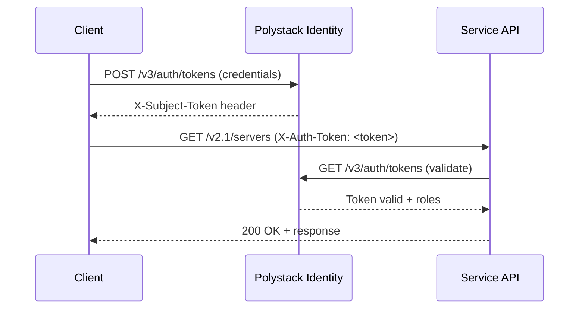
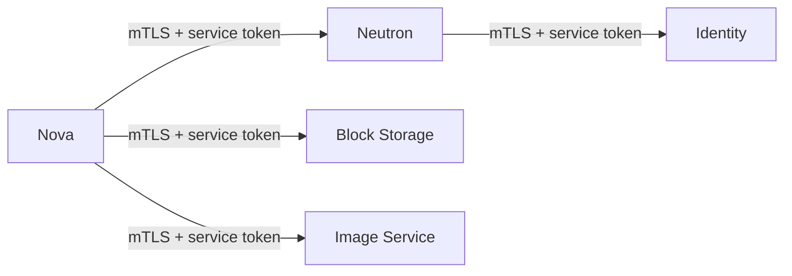

## Overview

All Polystack platform services expose REST APIs secured by Polystack Identity (Keystone). Authentication is token-based with configurable expiry, and the platform enforces authorization through a role-based access control (RBAC) policy engine. This page covers the full API security stack: authentication flows, application credentials, and rate limiting. It also covers audit logging, CORS configuration, and service-to-service mutual TLS.

<Note>
  **Prerequisites**
  - An active Polystack account with the `member` or `admin` role
  - CLI tools installed: `openstack` CLI ([setup guide](/cli-setup))
  - For application credentials: access to **Project → Identity → Application Credentials**
</Note>

---

## Token-Based Authentication

All API requests require a valid token issued by Polystack Identity. Tokens are scoped to a project and carry the user's role assignments for that project.



### Token Scopes

| Scope | Description | Use Case |
|-------|-------------|----------|
| Project-scoped | Bound to a specific project | Standard user operations |
| Domain-scoped | Bound to a domain | Domain administrator operations |
| System-scoped | Platform-wide admin operations | Infrastructure management |
| Unscoped | No project or domain binding | Token exchange only |

<Tabs>
  <Tab title="CLI" icon="terminal">
    ```bash title="Authenticate and get a token"
    source admin-openrc.sh

    # Verify the active token
    openstack token issue
    ```

    ```bash title="Expected output"
    +------------+----------------------------------------------------------+
    | Field      | Value                                                    |
    +------------+----------------------------------------------------------+
    | expires    | 2025-03-18T11:00:00+0000                                 |
    | id         | gAAAAABm...                                              |
    | project_id | a1b2c3d4...                                              |
    | user_id    | e5f6g7h8...                                              |
    +------------+----------------------------------------------------------+
    ```

    ```bash title="Authenticate via API directly"
    curl -si -X POST https://<vip>:5000/v3/auth/tokens \
      -H "Content-Type: application/json" \
      -d '{
        "auth": {
          "identity": {
            "methods": ["password"],
            "password": {
              "user": {
                "name": "admin",
                "domain": {"name": "Default"},
                "password": "<password>"
              }
            }
          },
          "scope": {
            "project": {"name": "admin", "domain": {"name": "Default"}}
          }
        }
      }' | grep -i x-subject-token
    ```
  </Tab>
  <Tab title="Dashboard" icon="gauge">
    The Polystack Dashboard handles token acquisition automatically at login. Session tokens are stored server-side and refreshed transparently.

    To inspect the active session token:
    1. Navigate to **Project → API Access**.
    2. Click **Download OpenStack RC File** to export credentials for CLI use.
    3. Click **View Credentials** to see the active API endpoint list.

    <Tip>Download the RC file and source it in your shell to configure CLI access with the same credentials used in the Dashboard session.</Tip>
  </Tab>
</Tabs>

---

## Application Credentials

Application credentials allow automation scripts and CI/CD pipelines to authenticate without embedding a username and password. They are scoped to a project, have configurable expiry, and can be restricted to specific API operations using access rules.

<Warning>
  Never store your account password in scripts or configuration files. Use application credentials instead. Application credentials can be revoked individually without changing the account password.
</Warning>

<Tabs>
  <Tab title="Dashboard" icon="gauge">
    <Steps titleSize="h3">
      <Step title="Navigate to Application Credentials" icon="key">
        Navigate to **Project → Identity → Application Credentials** and click **Create Application Credential**.
      </Step>
      <Step title="Configure the credential" icon="settings">
        | Field | Recommended Value | Notes |
        |-------|------------------|-------|
        | Name | `ci-deployment-prod` | Descriptive name identifying the use case |
        | Secret | Auto-generated | Store the secret securely — it is shown only once |
        | Expiration Date | Set an expiry | Required for compliance environments |
        | Roles | Select only required roles | Follow least-privilege |
        | Unrestricted | No | Leave unchecked to allow role inheritance restrictions |

        <Warning>The secret is displayed only once after creation. Store it immediately in a secrets manager or CI/CD vault. It cannot be retrieved again.</Warning>
      </Step>
      <Step title="Download the RC file" icon="download">
        Click **Download openrc file**. Source this file in your automation environment to authenticate using the application credential.

        <Check>The downloaded RC file uses `OS_AUTH_TYPE=v3applicationcredential` — no password is stored in plaintext.</Check>
      </Step>
    </Steps>
  </Tab>
  <Tab title="CLI" icon="terminal">
    ```bash title="Create application credential"
    openstack application credential create \
      --description "CI/CD deployment automation" \
      --expiration "2026-01-01T00:00:00" \
      ci-deployment-prod
    ```

    ```bash title="Create with access rules (least privilege)"
    openstack application credential create \
      --description "Read-only monitoring credential" \
      --access-rules '[
        {"service": "compute", "method": "GET", "path": "/v2.1/servers"},
        {"service": "identity", "method": "GET", "path": "/v3/projects"}
      ]' \
      monitoring-readonly
    ```

    ```bash title="Use application credential in scripts"
    export OS_AUTH_TYPE=v3applicationcredential
    export OS_AUTH_URL=https://<vip>:5000/v3
    export OS_APPLICATION_CREDENTIAL_ID=<id>
    export OS_APPLICATION_CREDENTIAL_SECRET=<secret>
    openstack server list
    ```
  </Tab>
</Tabs>

---

## RBAC Policy Enforcement

Polystack enforces access control using oslo.policy rules. Every API operation checks the caller's token against the service's policy file before executing.

### Default Role Hierarchy

| Role | Scope | Permissions |
|------|-------|-------------|
| `admin` | System or project | Full access to all operations |
| `member` | Project | Standard create/read/update/delete within the project |
| `reader` | Project | Read-only access to project resources |
| `heat_stack_owner` | Project | Manage orchestration stacks |
| `load-balancer_admin` | Project | Manage load balancers |

### Custom Policy Overrides

```bash title="View current compute policy"
docker exec nova_api cat /etc/nova/policy.yaml 2>/dev/null || \
  docker exec nova_api cat /etc/nova/policy.json
```

```yaml title="Example: restrict live migration to system-admin only"
# /etc/ironcore/nova-api/policy.yaml
"os_compute_api:os-migrate-server:migrate_live": "role:admin and system_scope:all"
```

<Info>
  Polystack uses the standard RBAC model. Custom policy overrides should be placed in service-specific policy files and deployed via the Ironcore config overlay mechanism. Do not modify policy files directly inside containers — changes are lost on restart.
</Info>

---

## API Rate Limiting

Rate limiting protects the platform from abuse and ensures fair resource allocation between projects. Limits are enforced at the HAProxy layer and within individual services.

| Limit Type | Default | Configurable |
|-----------|---------|-------------|
| Compute API (per user) | 50 POST / minute | Yes |
| Compute API (per project) | 200 requests / minute | Yes |
| Identity token issuance | 100 / minute | Yes |
| Image upload | 10 / hour | Yes |

```yaml title="Configure compute rate limits"
# /etc/ironcore/globals.d/_60_rate_limits.yml
nova_api_rate_limits: |
  (POST, "*", .*, 50, MINUTE);
  (GET, "*", .*, 300, MINUTE)
```

---

## CORS Configuration

Cross-Origin Resource Sharing (CORS) controls which origins can make browser-based API requests. Configure allowed origins to match your Dashboard and any custom web applications.

```yaml title="Restrict CORS origins"
# /etc/ironcore/globals.d/_60_cors.yml
keystone_cors_allowed_origin: "https://connect.<your-domain>"
nova_cors_allowed_origin: "https://connect.<your-domain>"
neutron_cors_allowed_origin: "https://connect.<your-domain>"
```

<Warning>
  Do not set `allowed_origin: "*"` in production. This allows any website to make authenticated API calls on behalf of a user with an active session cookie, enabling cross-site request forgery (CSRF) attacks.
</Warning>

---

## Service-to-Service Authentication (Mutual TLS)

Platform services authenticate to each other using service user accounts. When internal TLS is enabled, these connections also use mutual TLS certificate validation.



Service accounts are created during deployment with minimal permissions scoped to inter-service operations only. Do not use these accounts for manual operations.

```bash title="List service users"
openstack user list --domain service
```

---

## Audit Logging for API Calls

All API calls are recorded in the audit log with the caller identity, token scope, target resource, and operation result. See the [Compliance and Auditing](/security/compliance) page for log format, retention, and aggregation configuration.

```bash title="View recent API audit events"
docker exec keystone grep "req-" /var/log/kolla/keystone/keystone.log | tail -20
```

---

## Next Steps

<CardGroup cols={2}>
  <Card title="Compliance and Auditing" href="/security/compliance" color="#197560">
    Audit log format, retention, and compliance framework mapping
  </Card>
  <Card title="Identity and Access" href="/services/identity/index" color="#197560">
    Users, projects, domains, and federation configuration
  </Card>
  <Card title="Infrastructure Security" href="/security/infrastructure" color="#197560">
    TLS configuration and certificate management
  </Card>
  <Card title="Application Credentials" href="/services/identity/application-credentials" color="#197560">
    Detailed application credential management guide
  </Card>
</CardGroup>
