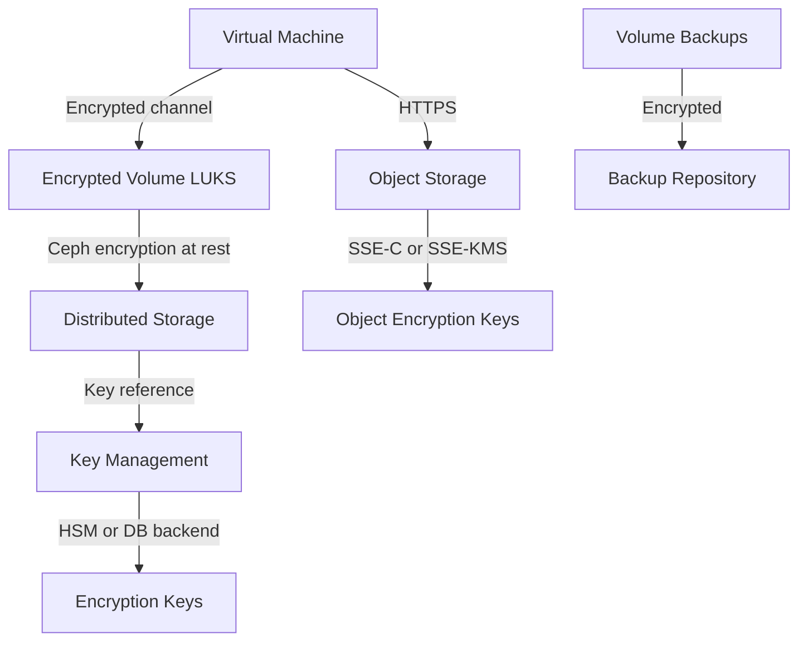

## Overview

Polystack protects data at every stage: in transit between services, at rest on storage backends, and during backup operations. Volume encryption uses LUKS with keys managed exclusively by Polystack Key Management (Barbican). Object storage supports server-side encryption. This page covers configuration for all data protection mechanisms available in the platform.

<Note>
  **Prerequisites**
  - Administrator role in Polystack Identity
  - Polystack Key Management enabled (`enable_barbican: "yes"` in XDeploy configuration)
  - For encrypted volumes: an encrypted volume type configured in Block Storage
  - For object storage encryption: access to the object storage admin API
</Note>

---

## Data Protection Architecture



| Layer | Mechanism | Key Storage |
|-------|-----------|-------------|
| Block volume (LUKS) | AES-256-XTS | Polystack Key Management |
| Ceph OSD at rest | AES-256-GCM | Ceph key management daemon |
| Object storage SSE | AES-256-CBC | Per-object or per-bucket keys |
| Database | MariaDB TDE or encrypted tablespace | External KMS |
| Backup | Inherited from volume encryption | Same key as source volume |

---

## Volume Encryption (LUKS)

<Badge color="green" size="sm" shape="pill">GA</Badge>

LUKS encryption wraps every I/O operation at the compute host before data reaches the storage network. The compute host fetches the encryption key from Polystack Key Management at volume attachment time and never writes it to disk.

### Create an Encrypted Volume Type

<Tabs>
  <Tab title="Dashboard" icon="gauge">
    <Steps titleSize="h3">
      <Step title="Open Volume Types" icon="database">
        Navigate to **Admin → Volume → Volume Types** and click **Create Volume Type**.
      </Step>
      <Step title="Define encryption parameters" icon="key">
        After creating the type, select **View Encryption** and click **Create Encryption**:

        | Field | Value | Notes |
        |-------|-------|-------|
        | Provider Class | `nova.volume.encryptors.luks.LuksEncryptor` | LUKS v2 encryptor |
        | Control Location | `front-end` | Encryption at the compute host |
        | Cipher | `aes-xts-plain64` | AES-256 in XTS mode |
        | Key Size | `256` | 256-bit AES key |

        <Check>The volume type now shows **Encrypted: Yes** in the type list.</Check>
      </Step>
      <Step title="Create an encrypted volume" icon="plus">
        Navigate to **Project → Volumes → Create Volume** and select the encrypted type. The platform generates a unique encryption key in Polystack Key Management and associates it with the volume.

        <Warning>Once a volume is created with encryption enabled, the encryption cannot be removed without creating a new unencrypted volume and migrating the data. Plan your volume type strategy before provisioning production volumes.</Warning>
      </Step>
    </Steps>
  </Tab>
  <Tab title="CLI" icon="terminal">
    ```bash title="Create encrypted volume type"
    openstack volume type create encrypted-nvme \
      --description "NVMe-backed encrypted volumes"

    openstack volume type set encrypted-nvme \
      --encryption-provider nova.volume.encryptors.luks.LuksEncryptor \
      --encryption-cipher aes-xts-plain64 \
      --encryption-key-size 256 \
      --encryption-control-location front-end
    ```

    ```bash title="Provision an encrypted volume"
    openstack volume create \
      --size 200 \
      --type encrypted-nvme \
      --description "Production database volume" \
      db-vol-01
    ```

    ```bash title="Verify encryption is active"
    openstack volume show db-vol-01 --column encrypted --format value
    # Returns: True

    openstack volume show db-vol-01 --column "volume_image_metadata" --format json
    ```
  </Tab>
</Tabs>

---

## Key Management Integration (Barbican)

Polystack Key Management stores, rotates, and controls access to all encryption keys. Each encrypted volume has a unique key. Key access is audited and can be restricted by ACL.

### Key Operations

<Tabs>
  <Tab title="CLI" icon="terminal">
    ```bash title="List secrets managed by Key Management"
    openstack secret list --limit 10
    ```

    ```bash title="Retrieve key metadata (not the key material)"
    openstack secret get <secret-href>
    ```

    ```bash title="Create a named secret for application use"
    openstack secret store \
      --name "app-encryption-key" \
      --secret-type "symmetric" \
      --payload-content-type "application/octet-stream" \
      --payload "$(openssl rand -base64 32)"
    ```

    ```bash title="Set an ACL on a secret"
    openstack acl user add \
      --user <user-id> \
      --project <project-id> \
      <secret-href>
    ```
  </Tab>
  <Tab title="Dashboard" icon="gauge">
    Navigate to **Project → Key Manager → Secrets** to view and manage secrets associated with your project.

    - **Store** — Store a new secret (symmetric key, certificate, passphrase, or opaque blob)
    - **View ACL** — Control which users and projects can access each secret
    - **Delete** — Remove a secret and revoke access to associated encrypted resources

    <Warning>Deleting an encryption key for an in-use volume renders that volume permanently inaccessible. Key deletion is irreversible. Always verify a key is no longer in use before deleting it.</Warning>
  </Tab>
</Tabs>

### Key Rotation

```bash title="Rotate an encryption key (create new, re-encrypt)"
# Step 1: Create a new key
NEW_KEY=$(openstack secret store \
  --name "rotated-key-$(date +%Y%m)" \
  --secret-type symmetric \
  --payload "$(openssl rand -base64 32)" \
  -c "Secret href" -f value)

# Step 2: Migrate volume to new key (requires volume to be detached)
openstack volume migrate <volume-id> --host <new-host-with-new-key>
```

<Tip>Key rotation requires migrating the volume. Schedule rotations during maintenance windows. Polystack Key Management retains old keys until explicitly deleted to support rollback scenarios.</Tip>

---

## Object Storage Encryption

Object storage encryption protects data at rest in the object store. Two modes are supported:

| Mode | Description | Key Location |
|------|-------------|--------------|
| SSE-C | Customer-provided key sent per request | Client-managed |
| SSE-KMS | Keys managed by Polystack Key Management | Platform-managed |

```bash title="Upload object with SSE-C encryption"
# Generate a 256-bit key
KEY=$(openssl rand -base64 32)

openstack object create my-container my-file.dat \
  --object-name encrypted-file.dat \
  -H "X-Object-Sysmeta-Crypto-Key: $KEY" \
  -H "X-Object-Sysmeta-Crypto-Etag: yes"
```

<Info>
  With SSE-C, the client is responsible for storing and supplying the encryption key on every request. If the key is lost, the object is permanently unreadable. Use SSE-KMS for platform-managed key storage and rotation.
</Info>

---

## Encrypted Backups

Volume backups inherit the encryption state of their source volume. Backups of encrypted volumes are stored encrypted in the backup repository.

```bash title="Create encrypted backup"
openstack volume backup create \
  --name db-vol-backup-$(date +%Y%m%d) \
  --force \
  db-vol-01
```

```bash title="Verify backup encryption"
openstack volume backup show db-vol-backup-20251201 \
  --column "availability_zone" \
  --column "volume_id" \
  --column "status" \
  --format table
```

<Warning>
  Backup keys are tied to the same Polystack Key Management secret as the source volume. If the source volume's encryption key is deleted, the backup becomes permanently unreadable. Do not delete keys for volumes that have active backups.
</Warning>

---

## Data-at-Rest Encryption for Databases

Platform databases (MariaDB) use encrypted tablespaces for sensitive configuration and credential storage. XDeploy configures this during deployment, so you do not need manual intervention.

```yaml title="Enable database encryption (XDeploy configuration)"
mariadb_enable_encryption: "yes"
mariadb_encryption_key_management: "file"
```

For production deployments, use an external key management server:

```yaml title="External KMS for database encryption"
mariadb_encryption_key_management: "hashicorp_vault"
mariadb_encryption_vault_addr: "https://vault.internal:8200"
mariadb_encryption_vault_token: "{{ vault_token }}"
```

---

## Secure Deletion and Data Scrubbing

When a volume is deleted, the underlying storage blocks are marked for reclamation. For regulatory compliance requiring secure deletion:

```bash title="Zero-fill a volume before deletion"
# Attach volume to a temporary instance and zero it
# Inside the instance:
sudo dd if=/dev/zero of=/dev/vdb bs=4M status=progress
sudo sync

# Then detach and delete the volume
openstack volume detach <instance-id> <volume-id>
openstack volume delete <volume-id>
```

<Info>
  For Ceph-backed storage, the storage layer performs data scrubbing through Ceph's object deletion and placement group (PG) scrub process. Immediately after deletion, the data may remain on OSDs until the next scrub cycle. For environments requiring immediate data erasure, use LUKS encryption. Deleting the key renders the data unreadable without waiting for the scrub cycle.
</Info>

---

## Next Steps

<CardGroup cols={2}>
  <Card title="Key Manager Service" href="/services/key-manager/store-secrets" color="#bf9667">
    Detailed guide for storing and managing secrets in Polystack Key Management
  </Card>
  <Card title="Volume Encryption (Admin)" href="/services/storage/encryption" color="#bf9667">
    Administrative guide for volume encryption and volume type management
  </Card>
  <Card title="VM Security" href="/security/vm-security" color="#bf9667">
    vTPM, Secure Boot, and hypervisor-level protection for virtual machines
  </Card>
  <Card title="Compliance" href="/security/compliance" color="#bf9667">
    Audit logging and compliance framework requirements for encrypted data
  </Card>
</CardGroup>
