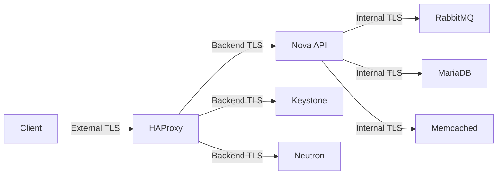

## Overview

Polystack platform services communicate over encrypted channels by default. TLS protects your API endpoints, inter-service traffic, database connections, and message queue channels. This page covers certificate provisioning and TLS configuration at the internal and external layers. It also covers HAProxy termination and endpoint hardening for production deployments.

<Note>
  **Prerequisites**
  - XDeploy access with administrator privileges
  - SSL/TLS certificates (CA-signed, self-signed, or Let's Encrypt)
  - Access to the XDeploy configuration interface or `/etc/ironcore/globals.d/` on the bootstrap node
</Note>

---

## TLS Architecture

Polystack separates TLS configuration into three independent scopes:

| Scope | Description | Applies To |
|-------|-------------|------------|
| **External TLS** | Traffic between clients and the platform API / Dashboard | Public-facing endpoints, HAProxy VIP |
| **Internal TLS** | Service-to-service traffic within the cluster | API ↔ database, API ↔ message queue, service ↔ service |
| **Backend TLS** | HAProxy to upstream service connections | HAProxy → Keystone, Nova API, Neutron, etc. |



<Warning>
  Enabling TLS requires all services to be restarted. Plan a maintenance window for initial TLS enablement on an existing cluster. New clusters should have TLS configured before the first deployment.
</Warning>

---

## TLS Configuration

<Tabs>
  <Tab title="XDeploy" icon="gauge">
    <Steps titleSize="h3">
      <Step title="Open Global Configuration" icon="settings">
        Log in to XDeploy and navigate to **Configuration → Global Settings**.
      </Step>
      <Step title="Enable TLS Scopes" icon="lock">
        Locate the **Security** section and enable each TLS scope appropriate for your deployment:

        | Setting | Recommended Value | Description |
        |---------|------------------|-------------|
        | Enable External TLS | Yes | Encrypts client-to-HAProxy traffic |
        | Enable Internal TLS | Yes | Encrypts service-to-service traffic |
        | Enable Backend TLS | Yes | Encrypts HAProxy-to-service traffic |

        <Tip>For greenfield deployments, enable all three scopes from the start. For existing clusters, enable external TLS first, then internal TLS in a second maintenance window.</Tip>
      </Step>
      <Step title="Configure Certificate Source" icon="certificate">
        Select the certificate source for external TLS:

        - **Self-signed**: Polystack generates certificates automatically using the internal CA
        - **CA-signed**: Upload your organization's certificate and private key
        - **Let's Encrypt**: Provide a domain name and contact email for automatic provisioning

        Upload the certificate bundle if using CA-signed certificates.
      </Step>
      <Step title="Apply Configuration" icon="play">
        Click **Save and Deploy**. XDeploy runs the TLS configuration playbook across all nodes.

        <Check>All services restart with TLS enabled. HAProxy health checks confirm green status.</Check>
      </Step>
    </Steps>
  </Tab>
  <Tab title="CLI" icon="terminal">
    <Steps titleSize="h3">
      <Step title="Create TLS globals override" icon="file">
        Create or edit the TLS configuration file:

        ```bash title="Create TLS configuration"
        cat > /etc/ironcore/globals.d/_60_tls.yml << 'EOF'
        kolla_enable_tls_external: "yes"
        kolla_enable_tls_internal: "yes"
        kolla_enable_tls_backend: "yes"
        EOF
        ```
      </Step>
      <Step title="Configure external certificates" icon="certificate">
        For CA-signed certificates, place your files in the correct locations:

        ```bash title="Install CA-signed certificate"
        # Copy certificate and key to Ironcore certificates directory
        cp your-cert.crt /etc/ironcore/certificates/haproxy.crt
        cp your-key.key  /etc/ironcore/certificates/haproxy.key
        cp your-ca.crt   /etc/ironcore/certificates/ca/polystack-ca.crt
        chmod 600 /etc/ironcore/certificates/haproxy.key
        ```

        For self-signed certificates, run the certificate generation utility:

        ```bash title="Generate self-signed certificates"
        ironcore-ansible certificates
        ```
      </Step>
      <Step title="Deploy TLS configuration" icon="play">
        ```bash title="Deploy with TLS enabled"
        ironcore-ansible deploy --tags haproxy,certificates
        ```

        After the initial certificate deployment, reconfigure all services:

        ```bash title="Reconfigure all services"
        ironcore-ansible reconfigure
        ```

        <Check>All service endpoints respond on HTTPS. Run `openssl s_client -connect <VIP>:443` to verify certificate validity.</Check>
      </Step>
    </Steps>
  </Tab>
</Tabs>

---

## Certificate Management

### Self-Signed Certificates

Polystack uses an internal CA to generate self-signed certificates for all services. You must distribute the CA certificate to all clients that communicate with the platform.

```bash title="Export internal CA certificate"
cat /etc/ironcore/certificates/ca/polystack-ca.crt
```

Import this CA certificate into your browser, operating system trust store, or client configuration to avoid certificate validation errors.

### CA-Signed Certificates

<Steps titleSize="h3">
  <Step title="Generate a CSR" icon="file-text">
    ```bash title="Generate certificate signing request"
    openssl req -new -newkey rsa:4096 -nodes \
      -keyout haproxy.key \
      -out haproxy.csr \
      -subj "/CN=<your-vip-hostname>/O=Your Organization/C=IN" \
      -addext "subjectAltName=DNS:<hostname>,IP:<vip-ip>"
    ```
  </Step>
  <Step title="Submit CSR to your CA" icon="building">
    Submit `haproxy.csr` to your certificate authority. The CA returns a signed certificate (`haproxy.crt`) and the CA chain (`ca-chain.crt`).
  </Step>
  <Step title="Install the signed certificate" icon="circle-check">
    ```bash title="Install certificate files"
    cp haproxy.crt      /etc/ironcore/certificates/haproxy.crt
    cp haproxy.key      /etc/ironcore/certificates/haproxy.key
    cp ca-chain.crt     /etc/ironcore/certificates/ca/polystack-ca.crt
    ironcore-ansible deploy --tags haproxy
    ```
  </Step>
</Steps>

### Certificate Renewal

<Warning>
  Certificates must be renewed before expiry. Monitor certificate expiration and plan renewals at least 30 days in advance. An expired certificate causes authentication failures across all platform services.
</Warning>

```bash title="Check certificate expiration"
openssl x509 -in /etc/ironcore/certificates/haproxy.crt -noout -enddate
```

---

## HAProxy TLS Termination

HAProxy terminates external TLS at the VIP and forwards requests to upstream services. The configuration supports both TLS termination (backend plain) and TLS pass-through (backend TLS).

| Mode | Description | Use Case |
|------|-------------|----------|
| Termination | HAProxy decrypts; backend receives plain HTTP | Default — simplifies backend config |
| Re-encryption | HAProxy decrypts; re-encrypts to backend | Maximum security; backend TLS required |
| Pass-through | HAProxy forwards encrypted bytes unchanged | End-to-end mTLS for specific services |

The default configuration uses TLS termination for external traffic and re-encryption for backend traffic when `kolla_enable_tls_backend: "yes"` is set.

---

## Service Endpoint Hardening

<AccordionGroup>
  <Accordion title="Disable unused API versions" icon="code">
    Restrict API endpoints to the minimum required versions. For Polystack Compute, disable legacy v2.0 and enforce v2.1:

    ```yaml title="/etc/ironcore/globals.d/_60_endpoint_hardening.yml"
    nova_api_enabled_apis: "osapi_compute,metadata"
    ```
  </Accordion>
  <Accordion title="Restrict cipher suites" icon="lock">
    Enforce modern cipher suites and disable weak protocols. Add to the HAProxy global configuration:

    ```yaml title="Cipher suite hardening"
    kolla_tls_min_version: "TLSv1.2"
    kolla_tls_ciphers: "ECDHE+AESGCM:ECDHE+CHACHA20:!aNULL:!MD5:!DSS"
    ```

    This disables TLS 1.0, TLS 1.1, and all weak cipher suites including RC4, 3DES, and export ciphers.
  </Accordion>
  <Accordion title="Enable HSTS headers" icon="shield">
    For Dashboard (Horizon) endpoints, enable HTTP Strict Transport Security to prevent protocol downgrade attacks:

    ```yaml title="HSTS configuration"
    horizon_enable_hsts: "yes"
    horizon_hsts_max_age: 31536000
    ```
  </Accordion>
  <Accordion title="Configure Keystone token expiry" icon="clock">
    Reduce the default token lifetime to limit the window of exposure for compromised tokens:

    ```yaml title="Token expiry configuration"
    keystone_token_expiration: 3600
    keystone_allow_expired_window: 300
    ```

    The default token lifetime is 3600 seconds (1 hour). Reduce to 1800 for sensitive environments.
  </Accordion>
</AccordionGroup>

---

## Validation

Verify TLS is active across all platform endpoints:

<Tabs>
  <Tab title="Dashboard" icon="gauge">
    Navigate to the XDeploy **Services** view. All service health indicators should show green. Click on any service to view its TLS status.

    <Check>All services show a valid certificate with a matching hostname and a future expiry date.</Check>
  </Tab>
  <Tab title="CLI" icon="terminal">
    ```bash title="Verify external TLS"
    openssl s_client -connect <vip-hostname>:443 -servername <vip-hostname> 2>/dev/null \
      | openssl x509 -noout -subject -dates
    ```

    ```bash title="Test API endpoint"
    curl -sk https://<vip-hostname>:5000/v3 | python3 -m json.tool
    ```

    ```bash title="Check all service ports"
    for port in 443 5000 8774 9292 9696 8004 9511; do
      echo -n "Port $port: "
      openssl s_client -connect <vip>:$port -servername <vip-hostname> \
        -brief 2>/dev/null | grep -E "Protocol|Cipher"
    done
    ```

    <Check>Each port responds with a valid TLS handshake and a modern cipher suite (TLS 1.2 or 1.3).</Check>
  </Tab>
</Tabs>

---

## Next Steps

<CardGroup cols={2}>
  <Card title="Hardening Guide" href="/security/hardening-guide" color="#197560">
    OS-level hardening, SSH configuration, and service minimization to complement TLS
  </Card>
  <Card title="API Security" href="/security/api-security" color="#197560">
    Token authentication, application credentials, and RBAC enforcement
  </Card>
  <Card title="Compliance" href="/security/compliance" color="#197560">
    Audit logging, log retention, and compliance framework mapping
  </Card>
  <Card title="Network Security" href="/security/network-security" color="#197560">
    Security groups, FWaaS, and network segmentation
  </Card>
</CardGroup>
