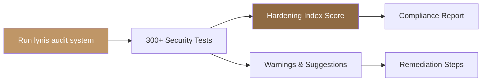

## Overview

Lynis is an open-source security auditing tool that performs in-depth system scans directly on Linux hosts — no agent required. It checks over 300 security controls covering kernel hardening, authentication configuration, filesystem permissions, network services, software patches, and logging posture. Each scan produces a hardening index score and a prioritized list of remediation suggestions.

Polystack bundles Lynis in XOS and makes it available via the XDeploy automation pipeline for both individual node audits and fleet-wide compliance sweeps.

<Info>**Polystack-Developed** — Lynis is one of three independent scanners in [Polystack SIEM](/security/polystack-siem) — Wazuh, Lynis, and OpenSCAP run in parallel across all nodes for layered compliance coverage. Results are aggregated on the **Security Posture** page in Monitor Center.</Info>

<Note>
  **Prerequisites**
  - SSH access to the target host (or run directly on the node)
  - Lynis installed (pre-installed on XOS nodes; install via `apt install lynis` on guest VMs)
  - Root or sudo access on the target system
</Note>

---

## How Lynis Works

Lynis runs as a shell script directly on the host. It does not require a daemon, network connection, or external service. It tests the live system state — not a snapshot — and reports findings immediately.



| Phase | What Lynis Checks |
|-------|--------------------|
| **Boot & Services** | GRUB password, bootloader permissions, running services, inetd |
| **Kernel** | Kernel parameters (sysctl), loaded modules, ASLR, core dumps |
| **Authentication** | PAM configuration, password policies, sudo rules, SSH settings |
| **File Systems** | Mount options (noexec, nosuid), world-writable files, SUID binaries |
| **Networking** | Open ports, firewall status, TCP wrappers, IPv6 configuration |
| **Logging** | Syslog daemon, log rotation, audit daemon (auditd) status |
| **Software** | Package manager integrity, outdated packages, compiler availability |
| **Malware** | Rootkit indicators, suspicious files, integrity tool presence |

---

## Run a Security Audit

<Tabs>
  <Tab title="Single Host" icon="terminal">
    <Steps titleSize="h3">
      <Step title="Run the full system audit" icon="play">
        ```bash title="Run Lynis audit"
        lynis audit system
        ```

        Lynis runs all tests interactively and prints results to stdout. The full report is saved to `/var/log/lynis.log` and the report data to `/var/log/lynis-report.dat`.
      </Step>
      <Step title="Review the hardening index" icon="bar-chart">
        At the end of the scan output, Lynis shows:

        ```
        Hardening index : 72 [##############      ]
        Tests performed : 238
        Plugins enabled : 2
        ```

        Scores above 80 indicate a well-hardened system. Scores below 60 indicate significant gaps.
      </Step>
      <Step title="Review warnings and suggestions" icon="circle-x">
        ```bash title="Filter warnings from the log"
        grep "^\\[WARNING\\]" /var/log/lynis.log
        ```

        ```bash title="Filter suggestions"
        grep "^\\[SUGGESTION\\]" /var/log/lynis.log
        ```
      </Step>
    </Steps>
  </Tab>
  <Tab title="Non-Interactive (CI/CD)" icon="settings">
    Run Lynis in non-interactive mode for automated pipelines:

    ```bash title="Non-interactive audit with exit code"
    lynis audit system --non-interactive --quiet --logfile /tmp/lynis.log
    echo "Exit code: $?"
    ```

    Exit codes:

    | Code | Meaning |
    |------|---------|
    | `0` | Audit completed successfully |
    | `1` | Audit aborted |
    | `64–127` | Warnings found (non-zero count) |

    ```bash title="Extract hardening score from report"
    grep "hardening_index" /var/log/lynis-report.dat | cut -d= -f2
    ```
  </Tab>
  <Tab title="Fleet Audit (Ansible)" icon="layers">
    Run Lynis across all instances in a project:

    ```yaml title="ansible/playbooks/lynis-audit.yml"
    ---
    - name: Run Lynis security audit
      hosts: all
      become: true
      tasks:
        - name: Install Lynis
          apt:
            name: lynis
            state: present
            update_cache: true

        - name: Run Lynis audit
          command: lynis audit system --non-interactive --quiet
          register: lynis_result
          changed_when: false

        - name: Fetch hardening index
          command: grep "hardening_index" /var/log/lynis-report.dat
          register: hardening_score
          changed_when: false

        - name: Display score
          debug:
            msg: "{{ inventory_hostname }}: {{ hardening_score.stdout }}"

        - name: Fetch report
          fetch:
            src: /var/log/lynis-report.dat
            dest: "reports/{{ inventory_hostname }}-lynis.dat"
            flat: true
    ```

    ```bash title="Run the fleet audit"
    ironcore-ansible run --playbook lynis-audit.yml --limit web-tier
    ```
  </Tab>
</Tabs>

---

## Common Findings and Fixes

<AccordionGroup>
  <Accordion title="SSH configuration weaknesses" icon="terminal">
    **Finding**: Lynis warns that root login is permitted or password authentication is enabled.

    ```bash title="Harden SSH"
    cat >> /etc/ssh/sshd_config << 'EOF'
    PermitRootLogin no
    PasswordAuthentication no
    MaxAuthTries 3
    X11Forwarding no
    AllowTcpForwarding no
    EOF
    systemctl restart sshd
    ```
  </Accordion>

  <Accordion title="Kernel parameters not hardened" icon="cpu">
    **Finding**: ASLR disabled, IP forwarding enabled unnecessarily, or core dumps allowed.

    ```bash title="Apply kernel hardening via sysctl"
    cat >> /etc/sysctl.d/99-polystack-hardening.conf << 'EOF'
    kernel.randomize_va_space = 2
    kernel.dmesg_restrict = 1
    kernel.kptr_restrict = 2
    fs.suid_dumpable = 0
    net.ipv4.conf.all.log_martians = 1
    net.ipv4.conf.all.rp_filter = 1
    net.ipv4.tcp_syncookies = 1
    EOF
    sysctl --system
    ```
  </Accordion>

  <Accordion title="Audit daemon not running" icon="clipboard-list">
    **Finding**: `auditd` not installed or not running — system activity is not being logged.

    ```bash title="Install and enable auditd"
    apt install auditd audispd-plugins -y
    systemctl enable --now auditd
    ```

    ```bash title="Add basic audit rules"
    cat >> /etc/audit/rules.d/polystack.rules << 'EOF'
    -w /etc/passwd -p wa -k identity
    -w /etc/shadow -p wa -k identity
    -w /etc/sudoers -p wa -k sudo
    -w /var/log/auth.log -p wa -k auth
    -a always,exit -F arch=b64 -S execve -k exec
    EOF
    augenrules --load
    ```
  </Accordion>

  <Accordion title="World-writable files detected" icon="file-x">
    **Finding**: Files or directories are world-writable, creating privilege escalation risk.

    ```bash title="Find world-writable files"
    find / -xdev -type f -perm -002 -not -path "/proc/*" 2>/dev/null

    # Remove world-write permission
    chmod o-w <FILE_PATH>
    ```
  </Accordion>

  <Accordion title="Compiler available on production host" icon="code">
    **Finding**: Build tools (`gcc`, `cc`) present on a production node — unnecessary attack surface.

    ```bash title="Remove compilers from production hosts"
    apt remove --purge gcc g++ make build-essential -y
    apt autoremove -y
    ```
  </Accordion>
</AccordionGroup>

---

## Hardening Index Targets

| Environment | Target Score | Notes |
|-------------|-------------|-------|
| Development VMs | 60+ | Baseline — essential controls only |
| Staging / Test | 70+ | Near-production hardening |
| Production workloads | 80+ | Full hardening applied |
| Regulated environments (PCI, HIPAA) | 85+ | Compliance-grade hardening |

<Tip>
  Run Lynis immediately after provisioning a new node and again after applying the hardening guide. Use the score delta to confirm controls are applied correctly.
</Tip>

---

## Scheduled Audits

Run Lynis on a schedule to detect configuration drift:

```bash title="/etc/cron.weekly/lynis-audit"
#!/bin/bash
lynis audit system --non-interactive --quiet \
  --logfile /var/log/lynis-$(date +%Y%m%d).log \
  --report-file /var/log/lynis-report-$(date +%Y%m%d).dat
```

```bash
chmod +x /etc/cron.weekly/lynis-audit
```

---

## Next Steps

<CardGroup cols={2}>
  <Card title="Polystack SIEM Overview" href="/security/polystack-siem" color="#bf9667">
    Back to the unified Polystack SIEM hub — Security Posture and Alerts dashboards
  </Card>
  <Card title="Wazuh HIDS" href="/security/wazuh" color="#bf9667">
    Add real-time intrusion detection and file integrity monitoring on top of periodic Lynis audits
  </Card>
  <Card title="OpenSCAP" href="/security/openscap" color="#bf9667">
    Perform SCAP-based compliance scans against CIS, STIG, and PCI-DSS profiles
  </Card>
  <Card title="Compliance" href="/security/compliance" color="#bf9667">
    Map Lynis findings to SOC 2, ISO 27001, and HIPAA compliance requirements
  </Card>
</CardGroup>
