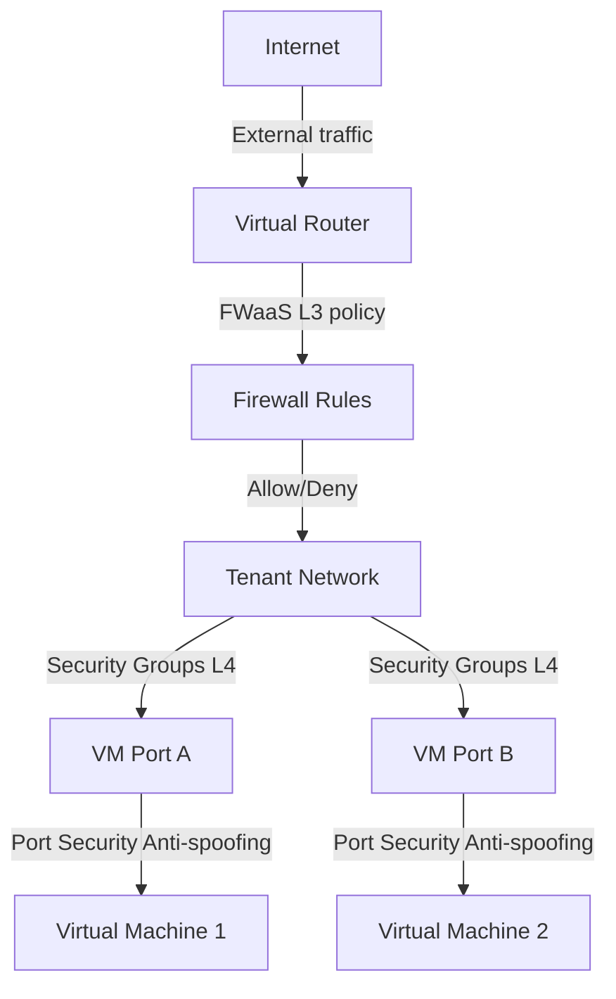

## Overview

Polystack Networking enforces security at the network plane without requiring agents inside your virtual machines. Stateful security groups operate at the virtual switch level, and FWaaS policies apply at the virtual router. Port security prevents spoofing attacks, and VLAN/VXLAN segmentation isolates tenant traffic at the data plane. This agentless model provides consistent enforcement regardless of guest OS configuration.

<Note>
  **Prerequisites**
  - An active Polystack project with at least one network and subnet
  - `member` or `admin` role in Polystack Identity
  - For FWaaS: XPCI license with `enable_neutron_fwaas: "yes"` in XDeploy configuration
  - For VPNaaS: `enable_neutron_vpnaas: "yes"` in XDeploy configuration
</Note>

---

## Network Security Architecture



| Layer | Control | Enforcement Point |
|-------|---------|------------------|
| L3 routing | Firewall as a Service | Virtual router |
| L3/L4 filtering | Security groups | Virtual switch port |
| L2 anti-spoofing | Port security | Virtual switch port |
| L2 isolation | VLAN/VXLAN segmentation | Overlay network |
| L3 remote access | VPN as a Service | Virtual router |

---

## Security Groups

Security groups implement stateful L3/L4 packet filtering. Each rule specifies a direction (ingress/egress), protocol, port range, and a source/destination specifier (CIDR or another security group). The firewall automatically permits return traffic for allowed sessions.

<Tabs>
  <Tab title="Dashboard" icon="gauge">
    <Steps titleSize="h3">
      <Step title="Open Security Groups" icon="shield">
        Navigate to **Project → Network → Security Groups**. The `default` security group allows all outbound traffic and permits inbound traffic only from other members of the same group.
      </Step>
      <Step title="Create a purpose-specific group" icon="plus">
        Click **Create Security Group**. Give it a meaningful name such as `database-servers` or `load-balancer-frontend`.
      </Step>
      <Step title="Add rules" icon="list">
        Click **Manage Rules** → **Add Rule**. Define each rule:

        | Field | Description |
        |-------|-------------|
        | Rule | Protocol preset (SSH, HTTP, HTTPS) or Custom |
        | Direction | Ingress (inbound) or Egress (outbound) |
        | Open Port | Port or port range |
        | Remote | CIDR for IP-based restriction, or another Security Group for group-based restriction |

        <Tip>Use security group references as the Remote source instead of CIDR ranges when possible. This allows membership-based access that scales automatically as instances are added to the referenced group.</Tip>
      </Step>
      <Step title="Apply to instance" icon="link">
        In **Project → Compute → Instances**, open the instance menu and select **Edit Security Groups**. Assign the new group and remove overly permissive groups.

        <Check>Test connectivity from an allowed host and confirm blocked traffic is dropped silently.</Check>
      </Step>
    </Steps>
  </Tab>
  <Tab title="CLI" icon="terminal">
    ```bash title="Create a tiered security group"
    # Create the group
    openstack security group create database-servers \
      --description "MySQL access from app tier only"

    # Allow MySQL from app-servers group only (no CIDR needed)
    openstack security group rule create database-servers \
      --protocol tcp \
      --dst-port 3306 \
      --remote-group app-servers \
      --ingress

    # Allow monitoring from management CIDR
    openstack security group rule create database-servers \
      --protocol tcp \
      --dst-port 9104 \
      --remote-ip 10.10.0.0/24 \
      --ingress

    # Deny all other inbound (implicit — no additional rule needed)
    ```

    ```bash title="List all rules in a group"
    openstack security group rule list database-servers --long
    ```

    ```bash title="Apply to a running instance"
    openstack server add security group my-db-server database-servers
    openstack server remove security group my-db-server default
    ```
  </Tab>
</Tabs>

---

## Firewall as a Service (FWaaS)

<Badge color="purple" size="sm" shape="pill">Enterprise</Badge>

FWaaS applies stateless or stateful L3 firewall policies at the virtual router. Unlike security groups (which operate per port), FWaaS policies apply to all traffic traversing a router. This makes them suitable for north-south perimeter control and micro-segmentation between subnets.

<Tabs>
  <Tab title="Dashboard" icon="gauge">
    <Steps titleSize="h3">
      <Step title="Create firewall rules" icon="list">
        Navigate to **Project → Network → Firewalls → Rules** and click **Add Rule**:

        | Field | Example |
        |-------|---------|
        | Name | `block-telnet` |
        | Protocol | TCP |
        | Destination Port | 23 |
        | Action | Deny |
        | Enabled | Yes |
      </Step>
      <Step title="Create a firewall policy" icon="clipboard-list">
        Navigate to **Firewall Policies → Create Policy**. Add the rules in priority order (first match wins).
      </Step>
      <Step title="Create a firewall group" icon="shield">
        Navigate to **Firewall Groups → Create Group**. Associate the ingress and egress policies, then attach the firewall group to one or more router ports.

        <Check>Test blocked traffic — packets matching deny rules are dropped at the router without reaching the destination VM's security group layer.</Check>
      </Step>
    </Steps>
  </Tab>
  <Tab title="CLI" icon="terminal">
    ```bash title="Create firewall rules"
    openstack firewall group rule create \
      --name block-telnet \
      --protocol tcp \
      --destination-port 23 \
      --action deny \
      --enabled

    openstack firewall group rule create \
      --name allow-https \
      --protocol tcp \
      --destination-port 443 \
      --action allow \
      --enabled
    ```

    ```bash title="Create policy and group"
    openstack firewall group policy create perimeter-ingress \
      --firewall-rule block-telnet \
      --firewall-rule allow-https

    openstack firewall group create \
      --name perimeter-fw \
      --ingress-firewall-policy perimeter-ingress \
      --port <router-port-id>
    ```
  </Tab>
</Tabs>

---

## Port Security and Anti-Spoofing

Port security prevents virtual machines from injecting packets with spoofed source MAC or IP addresses. This blocks ARP poisoning (spoofing MAC-to-IP mappings), DHCP starvation (exhausting IP address leases), and IP spoofing attacks.

Port security is enabled by default on all ports. To verify:

```bash title="Check port security status"
openstack port show <port-id> --column port_security_enabled --format value
# Returns: True
```

### Allowed Address Pairs

For use cases requiring secondary IPs (virtual IPs, HAProxy floating IPs, Keepalived), add allowed address pairs:

```bash title="Add allowed address pair for VIP"
openstack port set <port-id> \
  --allowed-address ip-address=192.168.10.100,mac-address=fa:16:3e:xx:xx:xx
```

<Warning>
  Disabling port security (`openstack port set --no-port-security-enabled`) removes all anti-spoofing controls and bypasses security group enforcement on that port. Only disable port security when explicitly required (e.g., NFV workloads managing their own forwarding).
</Warning>

---

## Network Segmentation (VLAN and VXLAN)

Tenant networks are isolated at the data plane using VLAN tags (provider networks) or VXLAN encapsulation (overlay networks). Each tenant network has a unique segmentation ID that prevents cross-tenant traffic even on shared physical infrastructure.

| Network Type | Segmentation | Isolation Scope |
|-------------|-------------|----------------|
| VLAN | 802.1Q tag (1–4094) | Hardware-enforced on physical switches |
| VXLAN | 24-bit VXLAN Network Identifier (VNI), up to 16M segments | Software-defined, scales across hypervisors |
| GRE | Tunnel key | Point-to-point overlay |

```bash title="Create an isolated tenant network"
openstack network create \
  --provider-network-type vxlan \
  --description "Isolated production network" \
  prod-internal-net

openstack subnet create \
  --network prod-internal-net \
  --subnet-range 172.16.10.0/24 \
  --dns-nameserver 8.8.8.8 \
  --no-dhcp-dns \
  prod-internal-subnet
```

---

## DDoS Protection

Polystack Networking provides rate limiting at the port and router levels to mitigate volumetric attacks:

```bash title="Apply QoS bandwidth limit to a port"
openstack qos policy create ddos-protection

openstack qos rule create \
  --type bandwidth-limit \
  --max-kbps 100000 \
  --max-burst-kbps 200000 \
  ddos-protection

openstack port set <port-id> --qos-policy ddos-protection
```

For infrastructure-level DDoS protection, use the XIMP monitoring integration to detect anomalous traffic patterns and trigger automated response playbooks.

---

## VPN as a Service

<Badge color="purple" size="sm" shape="pill">Enterprise</Badge>

VPN as a Service extends tenant networks to remote sites over IPsec tunnels without exposing public floating IPs.

```bash title="Create an IPsec VPN connection"
# Create IKE policy
openstack vpn ikepolicy create \
  --ike-version v2 \
  --encryption-algorithm aes-256 \
  --auth-algorithm sha-256 \
  --pfs group14 \
  ike-aes256-sha256

# Create IPsec policy
openstack vpn ipsecpolicy create \
  --transform-protocol esp \
  --encryption-algorithm aes-256 \
  --auth-algorithm sha-256 \
  --pfs group14 \
  ipsec-aes256-sha256

# Create VPN service on the router
openstack vpn service create \
  --router <router-id> \
  --subnet <local-subnet-id> \
  prod-vpn-service

# Create site connection
openstack vpn ipsec site connection create \
  --vpnservice prod-vpn-service \
  --ikepolicy ike-aes256-sha256 \
  --ipsecpolicy ipsec-aes256-sha256 \
  --peer-address <remote-gateway-ip> \
  --peer-cidr <remote-subnet-cidr> \
  --psk "<pre-shared-key>" \
  site-to-hq
```

---

## Next Steps

<CardGroup cols={2}>
  <Card title="VM Security" href="/security/vm-security" color="#197560">
    Hypervisor isolation, vTPM, and anti-affinity workload placement
  </Card>
  <Card title="Infrastructure Security" href="/security/infrastructure" color="#197560">
    TLS configuration and endpoint hardening
  </Card>
  <Card title="Networking Service" href="/services/networking/index" color="#197560">
    Complete networking service documentation with user and admin guides
  </Card>
  <Card title="Hardening Guide" href="/security/hardening-guide" color="#197560">
    Pre-deployment hardening checklist for compute and network nodes
  </Card>
</CardGroup>
