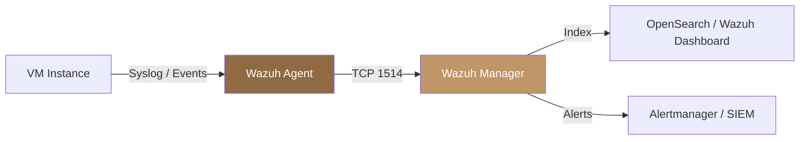

## Overview

Wazuh is the host-based intrusion detection and security monitoring platform bundled with Polystack Platform. It provides host-level visibility into what is happening inside each of your virtual machines through a lightweight agent. The Wazuh manager runs as a centralized service. Agents deploy to each instance and stream security events, file changes, and vulnerability data back for real-time correlation.

Polystack ships this platform pre-integrated with XDeploy, so you can mass-deploy agents across projects using the standard automation pipeline.

<Info>**Polystack-Developed** — This capability is developed by Polystack and ships with Ironcore. The integrated security platform is surfaced in the Polystack Dashboard as the **Security Posture** page in Monitor Center, providing a unified view of agent status, threat alerts, and compliance results across the cluster. See [Polystack SIEM](/security/polystack-siem) for the full overview.</Info>

<Tip>
  **XDeploy GUI** — Enable Wazuh (with Lynis auditing, OpenSCAP compliance, and OS hardening) through the [XDeploy Configuration](/deployment/configuration) interface under **XDeploy → Security → HIDS**. No manual file editing required.
</Tip>

<Note>
  **Prerequisites**
  - Wazuh Manager deployed (enabled via XDeploy → Security → HIDS)
  - Network reachability from guest VMs to the Wazuh Manager on ports 1514/1515
  - Agent registration token available from the Wazuh Manager dashboard
</Note>

---

## Architecture



| Component | Role |
|-----------|------|
| **Wazuh Agent** | Collects logs, file events, process activity, and vulnerability data from each VM |
| **Wazuh Manager** | Correlates events, applies detection rules, triggers alerts |
| **Wazuh Dashboard** | OpenSearch-based UI for alert triage, compliance reports, and forensic queries |
| **Ruleset** | MITRE ATT&CK-mapped detection rules — over 3,000 out of the box |

---

## Capabilities

<CardGroup cols={2}>
  <Card title="File Integrity Monitoring" icon="file-scan" color="#bf9667">
    Track every create, modify, and delete on monitored paths. Alert on unauthorized changes to `/etc/passwd`, SSH keys, cron files, and application configs.
  </Card>
  <Card title="Intrusion Detection" icon="shield-alert" color="#bf9667">
    Real-time log analysis against MITRE ATT&CK-mapped rules. Detects brute-force attempts, privilege escalation, rootkits, and lateral movement.
  </Card>
  <Card title="Vulnerability Assessment" icon="bug" color="#bf9667">
    Continuous scan of installed packages against CVE databases. Reports vulnerable packages per host with severity scores and remediation guidance.
  </Card>
  <Card title="Compliance Auditing" icon="clipboard-list" color="#bf9667">
    Built-in checks for PCI-DSS, HIPAA, NIST 800-53, CIS benchmarks, and GDPR. Generates per-host compliance reports with pass/fail details.
  </Card>
</CardGroup>

---

## Deploy Wazuh Agent

<Tabs>
  <Tab title="Linux (Ansible)" icon="terminal">
    Use the bundled Ansible role to deploy agents across all instances in a project:

    ```bash title="Deploy Wazuh agents via ironcore-ansible"
    ironcore-ansible deploy --tags wazuh-agent \
      --extra-vars "wazuh_manager_ip=<MANAGER_IP> wazuh_registration_token=<TOKEN>"
    ```

    The role installs the agent, registers it with the manager, and starts the `wazuh-agent` service automatically.

    <Check>Agent appears in the Wazuh Dashboard under **Agents** within 60 seconds of deployment.</Check>
  </Tab>
  <Tab title="Linux (Manual)" icon="terminal">
    <Steps titleSize="h3">
      <Step title="Add the Wazuh repository" icon="package">
        ```bash title="Add repository and install agent"
        curl -s https://packages.wazuh.com/key/GPG-KEY-WAZUH | gpg --dearmor \
          -o /usr/share/keyrings/wazuh.gpg

        echo "deb [signed-by=/usr/share/keyrings/wazuh.gpg] \
          https://packages.wazuh.com/4.x/apt/ stable main" \
          > /etc/apt/sources.list.d/wazuh.list

        apt-get update && apt-get install -y wazuh-agent
        ```
      </Step>
      <Step title="Configure the manager address" icon="settings">
        ```bash title="Set Wazuh Manager IP"
        sed -i 's|MANAGER_IP|<YOUR_MANAGER_IP>|g' /var/ossec/etc/ossec.conf
        ```
      </Step>
      <Step title="Register and start the agent" icon="play">
        ```bash title="Register agent and start service"
        /var/ossec/bin/agent-auth -m <MANAGER_IP> -p 1515
        systemctl enable --now wazuh-agent
        ```
        <Check>Agent registers and begins streaming events to the manager.</Check>
      </Step>
    </Steps>
  </Tab>
  <Tab title="Windows" icon="monitor">
    <Steps titleSize="h3">
      <Step title="Download and install the MSI" icon="download">
        Download the Wazuh Windows agent MSI from the Wazuh Manager dashboard under **Agents → Deploy new agent**.
      </Step>
      <Step title="Install with manager address" icon="settings">
        ```powershell title="Silent install with manager configuration"
        msiexec /i wazuh-agent.msi /q `
          WAZUH_MANAGER="<MANAGER_IP>" `
          WAZUH_REGISTRATION_SERVER="<MANAGER_IP>" `
          WAZUH_AGENT_NAME="<HOSTNAME>"
        ```
      </Step>
      <Step title="Start the agent service" icon="play">
        ```powershell title="Start Wazuh agent"
        NET START WazuhSvc
        ```
        <Check>Agent appears in the Wazuh Dashboard within 60 seconds.</Check>
      </Step>
    </Steps>
  </Tab>
</Tabs>

---

## File Integrity Monitoring Configuration

Configure which paths are monitored for changes in `/var/ossec/etc/ossec.conf`:

```xml title="/var/ossec/etc/ossec.conf — FIM configuration"
<syscheck>
  <frequency>3600</frequency>

  <!-- Critical system files -->
  <directories check_all="yes" realtime="yes">/etc/passwd,/etc/shadow,/etc/group</directories>
  <directories check_all="yes" realtime="yes">/etc/ssh</directories>
  <directories check_all="yes" realtime="yes">/root/.ssh</directories>

  <!-- Application configs -->
  <directories check_all="yes">/etc/nginx</directories>
  <directories check_all="yes">/etc/apache2</directories>

  <!-- Ignore transient paths -->
  <ignore>/etc/mtab</ignore>
  <ignore>/etc/hosts.deny</ignore>
</syscheck>
```

| Option | Description |
|--------|-------------|
| `realtime="yes"` | Alert immediately on change (inotify-based), not at next scan cycle |
| `check_all="yes"` | Monitor permissions, ownership, size, MD5, SHA1, SHA256, and mtime |
| `frequency` | Scan interval in seconds for non-realtime paths |

---

## Vulnerability Assessment

Wazuh continuously scans installed packages against NVD and vendor CVE feeds. Results appear in the Dashboard under **Vulnerability Detector**.

```bash title="Trigger an on-demand vulnerability scan"
/var/ossec/bin/wazuh-control restart
```

| Severity | CVSS Score Range | Action |
|----------|-----------------|--------|
| Critical | 9.0–10.0 | Immediate patching required |
| High | 7.0–8.9 | Patch within 7 days |
| Medium | 4.0–6.9 | Patch within 30 days |
| Low | 0.1–3.9 | Track and remediate at next maintenance window |

---

## Compliance Reports

Wazuh ships with built-in compliance checks. Enable a framework in `ossec.conf`:

```xml title="Enable PCI-DSS compliance checks"
<rootcheck>
  <system_audit>/var/ossec/etc/shared/pci_dss_reqs.txt</system_audit>
</rootcheck>
```

Available compliance frameworks:

| Framework | File |
|-----------|------|
| PCI-DSS 3.2.1 | `pci_dss_reqs.txt` |
| HIPAA | `hipaa_reqs.txt` |
| NIST 800-53 | `nist800_53_reqs.txt` |
| GDPR | `gdpr_reqs.txt` |
| CIS Benchmark | `cis_debian_linux_rcl.txt` / `cis_rhel_linux_rcl.txt` |

Reports are accessible in the Wazuh Dashboard under **Regulatory Compliance**.

---

## Alert Integration

Forward Wazuh alerts to external systems:

<Tabs>
  <Tab title="Slack / Webhook" icon="bell">
    ```xml title="/var/ossec/etc/ossec.conf — webhook integration"
    <integration>
      <name>slack</name>
      <hook_url>https://hooks.slack.com/services/YOUR/WEBHOOK/URL</hook_url>
      <level>10</level>
      <alert_format>json</alert_format>
    </integration>
    ```
    Alerts at level 10 and above (high severity) are forwarded automatically.
  </Tab>
  <Tab title="Syslog / SIEM" icon="server">
    ```xml title="/var/ossec/etc/ossec.conf — syslog forwarding"
    <syslog_output>
      <level>9</level>
      <server>10.0.1.100</server>
      <port>514</port>
      <format>default</format>
    </syslog_output>
    ```
  </Tab>
</Tabs>

---

## Next Steps

<CardGroup cols={2}>
  <Card title="Polystack SIEM Overview" href="/security/polystack-siem" color="#bf9667">
    Back to the unified Polystack SIEM hub — Security Posture and Alerts dashboards
  </Card>
  <Card title="Lynis Security Auditing" href="/security/lynis" color="#bf9667">
    Run automated OS security audits and generate hardening recommendations
  </Card>
  <Card title="OpenSCAP Compliance Scanning" href="/security/openscap" color="#bf9667">
    Scan instances against CIS, STIG, and PCI-DSS profiles using SCAP content
  </Card>
  <Card title="Compliance and Auditing" href="/security/compliance" color="#bf9667">
    Understand audit logging and compliance frameworks supported by Polystack
  </Card>
</CardGroup>
