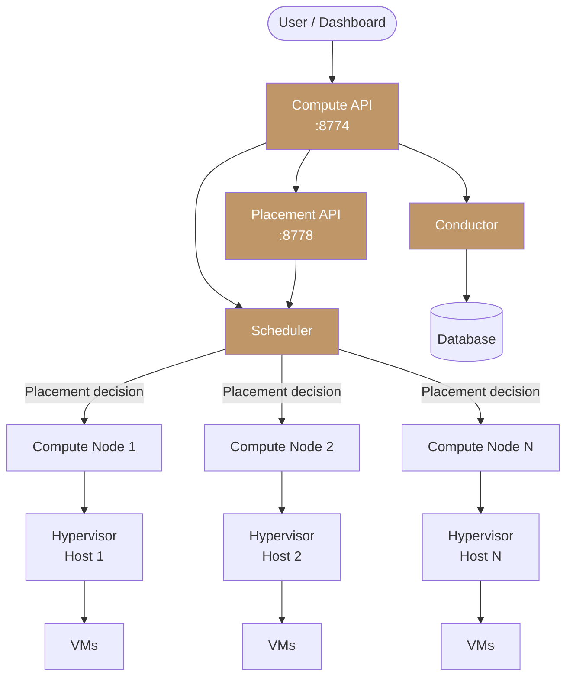

import AdminWarning from '/snippets/admin-warning.mdx';

## Overview

Polystack Compute follows a distributed, service-oriented architecture. API requests enter
through a central API tier, are routed through the Scheduler and Placement services to
select the optimal host, and are executed by Compute Agents running on every hypervisor
node. Each agent communicates directly with the local hypervisor to manage instance
lifecycle operations — creation, power state, migration, and console access.

<AdminWarning />

---

## Service Topology

The diagram below illustrates how requests flow from the end user through the Polystack
Compute control plane to the hypervisor layer.



---

## Service Components

| Component | Port | Runs On | Description |
|-----------|------|---------|-------------|
| **Compute API** | 8774 | Controller nodes | REST API endpoint for all instance lifecycle operations |
| **Placement API** | 8778 | Controller nodes | Tracks resource inventory and allocation across all compute hosts |
| **Scheduler** | Internal | Controller nodes | Selects the optimal compute node for each new instance request |
| **Conductor** | Internal | Controller nodes | Orchestrates multi-step operations; acts as a database proxy for compute agents |
| **Compute Agent** | Internal | Every hypervisor node | Manages instance lifecycle on the local hypervisor |
| **Console Proxy** | 6080 | Controller nodes | VNC console proxy for browser-based instance access |

<Note>
  The Conductor service decouples compute agents from direct database access. All database
  writes from hypervisor nodes flow through the Conductor, which enforces access control
  and serializes state transitions.
</Note>

---

## Service Lifecycle

The following table describes the expected runtime state of each service on a healthy
cluster.

| Service | Expected State | Managed By |
|---------|---------------|-----------|
| `nova-api` | Running, listening on `:8774` | the deployment console / Ironcore |
| `placement-api` | Running, listening on `:8778` | the deployment console / Ironcore |
| `nova-scheduler` | Running | the deployment console / Ironcore |
| `nova-conductor` | Running | the deployment console / Ironcore |
| `nova-compute` | Running on every hypervisor node | the deployment console / Ironcore |
| `nova-novncproxy` | Running, listening on `:6080` | the deployment console / Ironcore |

<Tabs>
  <Tab title="Web Console" icon="server">
    In the deployment console, navigate to **Operations** and run **Prechecks** to validate all
    Compute service components across the cluster. The output shows:

    - Per-service status on every node
    - Last heartbeat timestamp
    - Service version and host assignment

    Use **Reconfigure** from Operations to recover a failed component without
    a full node reboot.
  </Tab>
  <Tab title="CLI" icon="terminal">
    Verify that all Compute services are in an `up` state:

    ```bash title="List all compute services"
    openstack compute service list
    ```

    Expected output shows all services with `State: up` and `Status: enabled`.

    ```bash title="Filter for degraded services"
    openstack compute service list | grep -v "up"
    ```

    <Check>All services report `State: up`. Any service showing `down` requires investigation on the host where it runs.</Check>
  </Tab>
</Tabs>

---

## Request Flow: Instance Creation

Understanding the creation flow helps diagnose failures at each stage.

<Steps titleSize="h3">
  <Step title="API receives the request" icon="arrow-down-to-line">
    The Compute API validates the request, checks quota, and creates an instance record
    in the database with status `BUILD`.
  </Step>
  <Step title="Placement selects resources" icon="bullseye">
    The Placement API queries resource inventories to find hosts with sufficient vCPU,
    RAM, and disk. It returns a list of allocation candidates.
  </Step>
  <Step title="Scheduler filters and ranks" icon="filter">
    The Scheduler applies the configured filter chain to eliminate ineligible hosts,
    then ranks remaining candidates using weighers. The top-ranked host is selected.
  </Step>
  <Step title="Conductor orchestrates the build" icon="code-merge">
    The Conductor sends a `build_instance` RPC call to the Compute Agent on the selected
    host. It monitors progress and updates the database with state transitions.
  </Step>
  <Step title="Compute Agent creates the instance" icon="play">
    The Compute Agent on the target hypervisor node provisions the instance — downloading
    the image, allocating network interfaces, attaching volumes, and starting the virtual
    machine. The instance transitions from `BUILD` to `ACTIVE`.
  </Step>
</Steps>

---

## Next Steps

<CardGroup cols={3}>
  <Card title="Compute Hosts" href="/services/compute/compute-hosts" color="#bf9667">
    Manage hypervisor nodes — list, inspect, enable, and disable hosts.
  </Card>
  <Card title="Scheduling" href="/services/compute/scheduling" color="#bf9667">
    Configure filters, weighers, host aggregates, and availability zones.
  </Card>
  <Card title="Admin Guide" href="/services/compute/admin-guide" color="#bf9667">
    Return to the Compute Administration Guide index.
  </Card>
</CardGroup>
