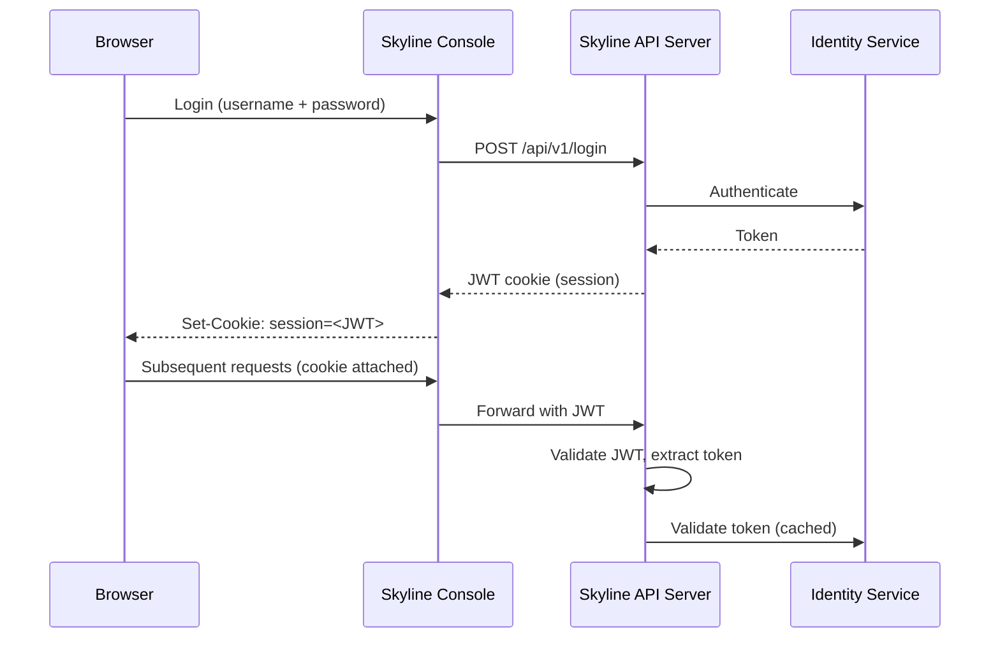

## Overview

The Polystack Dashboard uses JWT (JSON Web Token) based session management. When a user
logs in, the Dashboard obtains a Keystone authentication token and wraps it in a JWT
stored as a browser cookie named `session`. No server-side session storage (Memcached,
Redis, database) is required.

<Note>
  **Prerequisites**
  - Administrator access for session configuration changes
  - XDeploy access for applying configuration changes
</Note>

---

## How Sessions Work



---

## Session Properties

| Property | Description | Default |
|----------|-------------|---------|
| **Cookie name** | `session` | Fixed |
| **Token format** | JWT containing Keystone token | Fixed |
| **Session duration** | Follows Keystone token expiration | Typically 1 hour |
| **Storage** | Client-side (browser cookie) | No server-side storage |
| **RBAC cache** | Per-endpoint permission cache | 30 seconds TTL |

<Tip>
  Since sessions are stateless JWT tokens, the Dashboard can be horizontally scaled
  across multiple nodes behind a load balancer without shared session storage.
  Any node can validate any session.
</Tip>

---

## Configuration

<Tabs>
  <Tab title="XDeploy" icon="settings">
    Session behavior is configured through the Skyline API server configuration:

    <Steps titleSize="h3">
      <Step title="Open Advanced Configuration">
        Navigate to **XDeploy > Advanced Configuration** and select **skyline-apiserver**
        in the service tree.
      </Step>
      <Step title="Edit session settings">
        In the `skyline.yaml` configuration file, the relevant settings are:

        - **secret_key** — JWT signing key (auto-generated during deployment)
        - **session_name** — Cookie name (default: `session`)
        - **token_expiration** — Inherited from Keystone token settings

        <Warning>
          Changing the `secret_key` invalidates all active sessions. Users will need
          to log in again after the change is applied.
        </Warning>
      </Step>
      <Step title="Apply changes">
        Save the configuration and run **Operations > Reconfigure** to apply.
      </Step>
    </Steps>
  </Tab>
  <Tab title="CLI" icon="terminal">
    The Skyline API server configuration is at `/etc/ironcore/config/skyline-apiserver/`.

    ```bash title="View current session configuration"
    cat /etc/skyline/skyline.yaml | grep -A 5 session
    ```

    After changes, restart the Skyline API server:

    ```bash title="Apply configuration"
    ironcore-ansible reconfigure -t skyline
    ```
  </Tab>
</Tabs>

---

## Security Considerations

<AccordionGroup>
  <Accordion title="Cookie security flags" defaultOpen>
    The session cookie is set with:
    - **HttpOnly** — not accessible via JavaScript (prevents XSS token theft)
    - **Secure** — only sent over HTTPS connections
    - **SameSite** — prevents CSRF attacks

    These flags are enforced by the Skyline API server and cannot be overridden
    by client-side code.
  </Accordion>
  <Accordion title="Token expiration">
    Session duration is tied to the Keystone token expiration. When the token expires,
    the session cookie becomes invalid and the user is redirected to the login page.
    Configure Keystone token expiration through XDeploy to adjust session duration.
  </Accordion>
  <Accordion title="Multi-node deployments">
    Since sessions are stateless (JWT in cookie), no shared session backend is needed.
    All Dashboard nodes behind HAProxy can validate any session independently using
    the shared `secret_key` configured during deployment.
  </Accordion>
</AccordionGroup>

---

## Next Steps

<CardGroup cols={2}>
  <Card title="Dashboard Admin Guide" href="/services/dashboard/admin-guide" color="#bf9667">
    Return to the admin guide overview
  </Card>
  <Card title="Identity Admin Guide" href="/services/identity/admin-guide" color="#bf9667">
    Configure token expiration and authentication backends
  </Card>
  <Card title="Deployment" href="/deployment/configuration" color="#bf9667">
    Configure Dashboard settings through XDeploy
  </Card>
  <Card title="Security" href="/security/index" color="#bf9667">
    Platform security hardening and compliance
  </Card>
</CardGroup>
