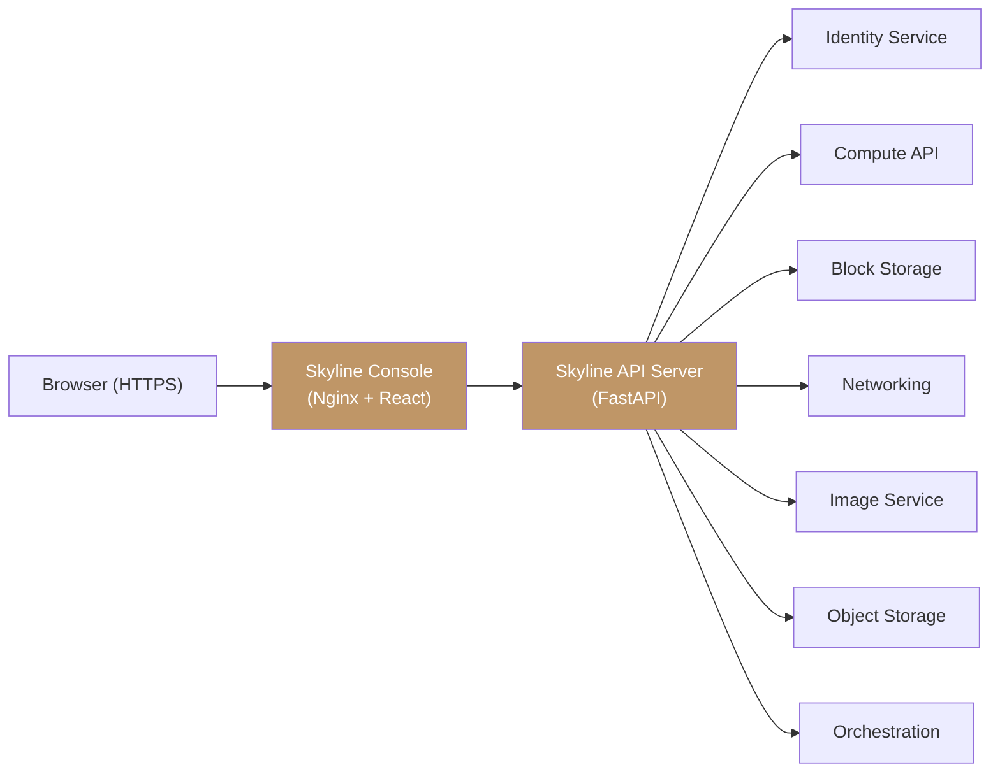

The Polystack Dashboard is a browser-based interface for centralized management of all cloud
resources across Compute, Storage, Networking, Identity, and more. Powered by the Skyline
platform, it provides a modern, high-performance UI with integrated monitoring, role-based
access control, and real-time resource management.

<Note>
  The Dashboard is included in all Polystack products: [Ironcore](/products/ironcore)
  and [Polystack](/products/xhci). Access it at `https://connect.<your-domain>` after deployment.
</Note>

---

Guides

<CardGroup cols={2}>
  <Card title="User Guide" icon="book-open" href="/services/dashboard/user-guide" color="#bf9667">
    Navigate the Dashboard, manage resources, and understand the console and admin views.
  </Card>
  <Card title="Admin Guide" icon="shield" href="/services/dashboard/admin-guide" color="#bf9667">
    Configure the Dashboard, manage projects and users, and administer platform resources.
  </Card>
</CardGroup>

---

Dashboard Layout

The Dashboard is organized into two views — **Console** (project-scoped) and **Admin**
(platform-wide) — accessible via a toggle in the header.

<Tabs>
  <Tab title="Console View (User)" icon="gauge">
    The Console view shows project-scoped resources. Sidebar sections:

    | Section | Pages |
    |---------|-------|
    | **Compute** | Instances, Instance Snapshots, Flavors, Server Groups, Images, Key Pairs |
    | **Storage** | Volumes, Volume Backups, Volume Snapshots, Object Storage |
    | **Network** | Networks, Ports, QoS Policies, Routers, Floating IPs, Topology, Load Balancers, Certificates, VPNs, Security Groups, Firewalls, DNS Zones, DNS Reverse |
    | **Orchestration** | Stacks |
    | **Share File Storage** | Shares, Share Networks, Share Groups |
    | **Key Manager** | Secrets, Containers |
    | **Identity** | Projects, Users, User Groups, Roles |
  </Tab>
  <Tab title="Admin View" icon="shield">
    The Admin view shows platform-wide resources. Additional sections:

    | Section | Pages |
    |---------|-------|
    | **Compute** | + Hypervisors, Host Aggregates, Bare Metal Nodes |
    | **Storage** | + Volume Types, Storage Backends |
    | **Network** | + RBAC Policies |
    | **Identity** | + Domains, RBAC Management |
    | **Monitor Center** | Overview, Physical Nodes, Storage Clusters, Services, Monitoring, Logging, Activity Log, Cluster Health |
    | **Optimization** | Goals, Strategies, Audit Templates, Audits, Action Plans, Actions |
    | **Instance-HA** | Segments, Hosts, Notifications, VM Moves |
    | **Global Setting** | System Info, System Config, Metadata Definitions |
  </Tab>
</Tabs>

---

Key Capabilities

<CardGroup cols={3}>
  <Card title="Instance Management" icon="server" href="/services/compute/launch-instance" color="#bf9667">
    4-step creation wizard with real-time quota tracking
  </Card>
  <Card title="Storage Control" icon="hard-drive" href="/services/storage/create-volume" color="#bf9667">
    Volume creation with storage tier selection
  </Card>
  <Card title="Network Topology" icon="network" href="/services/networking/create-network" color="#bf9667">
    Visual topology map and full SDN configuration
  </Card>
  <Card title="Image Library" icon="disc" href="/services/images/upload-image" color="#bf9667">
    Upload images with OS metadata and format support
  </Card>
  <Card title="Identity & Access" icon="fingerprint" href="/services/identity/user-guide" color="#bf9667">
    Project and user management with RBAC
  </Card>
  <Card title="Monitoring" icon="activity" href="/services/monitoring/user-guide" color="#bf9667">
    Integrated monitoring, logging, and health dashboards
  </Card>
</CardGroup>

---

Polystack-Developed Features

<Info>
  **Polystack-Developed** — These capabilities are developed by Polystack and ship with Ironcore.
</Info>

<CardGroup cols={2}>
  <Card title="Live vCPU/RAM Scaling" icon="sliders" href="/services/compute/live-resize" color="#bf9667">
    Adjust instance CPU and memory via slider controls — no reboot required
  </Card>
  <Card title="Instance HA" icon="heart-pulse" href="/services/instance-ha/user-guide/how-it-works" color="#bf9667">
    Failover segments, host monitoring, real-time VM evacuation tracking
  </Card>
  <Card title="Resource Optimizer" icon="chart-bar" href="/services/optimization/user-guide" color="#bf9667">
    Automated workload placement and resource consolidation
  </Card>
  <Card title="Cluster Health" icon="activity" color="#bf9667">
    Service health with RabbitMQ, MariaDB/Galera, and service monitoring
  </Card>
</CardGroup>

---

Architecture

The Dashboard communicates through the Skyline API server, which proxies requests to
service APIs. All actions enforce the same RBAC rules as CLI and direct API calls.

| Component | Description |
|-----------|-------------|
| **Skyline Console** | React-based single-page application served by Nginx |
| **Skyline API Server** | FastAPI backend handling authentication, RBAC, and API proxying |
| **Session Management** | JWT-based session cookies with configurable expiration |
| **RBAC Engine** | Per-endpoint role-based access control with 30-second cache |

---

Related Services

<CardGroup cols={3}>
  <Card title="Identity & Access" icon="fingerprint" href="/services/identity/index" color="#bf9667">
    Authentication and RBAC for Dashboard login
  </Card>
  <Card title="Compute" icon="server" href="/services/compute" color="#bf9667">
    Instance lifecycle management
  </Card>
</CardGroup>
