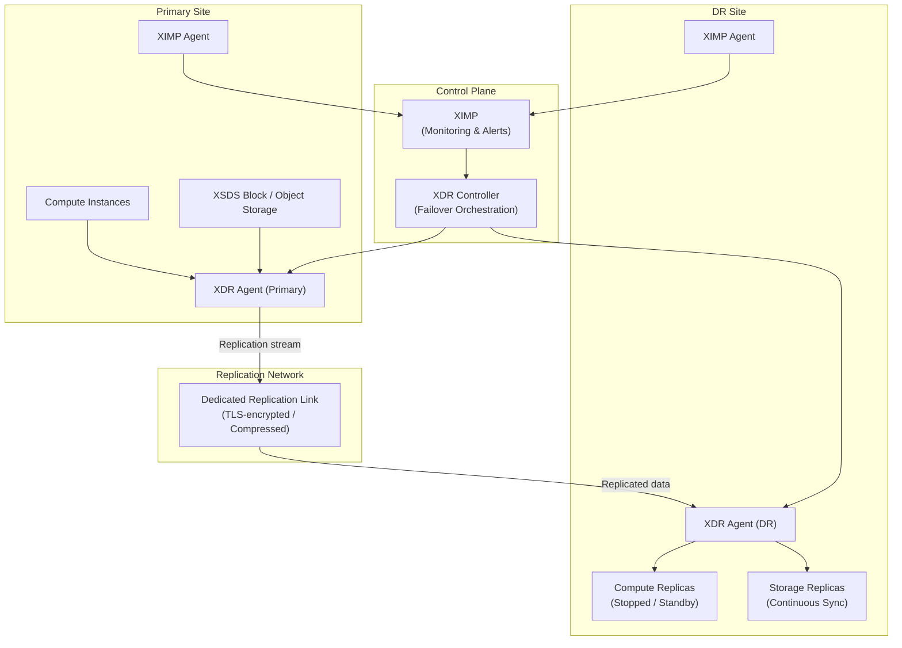

## Overview

XDR operates as a control plane layer over the underlying compute and storage
infrastructure, orchestrating continuous replication and coordinated recovery
across geographically separated sites. Understanding the component architecture
helps administrators size deployments, plan network requirements, and diagnose
failures effectively.

<Note>
  **Prerequisites**
  - Administrator credentials on both primary and DR sites
  - Familiarity with RPO/RTO concepts and distributed storage replication terminology
</Note>

---

## Component Topology

---

## Core Components

| Component | Role |
|-----------|------|
| **XDR Controller** | Central orchestration service — manages protection plans, tracks recovery state, and triggers failover |
| **XDR Agent (Primary)** | Runs on primary site nodes; captures change streams from storage and forwards to DR agent |
| **XDR Agent (DR)** | Receives replicated data, applies it to DR-site replicas, and executes the recovery runbook during failover |
| **Replication Network** | Dedicated link carrying encrypted, optionally compressed replication traffic between sites |
| **XIMP Integration** | Provides health visibility for replication lag, RPO adherence, and site availability |

---

## Replication Pipeline

Data flows through a multi-stage pipeline from the primary site to the DR site:

<Steps titleSize="h3">
  <Step title="Change capture" icon="activity">
    The XDR agent on the primary site intercepts write operations at the storage
    layer, capturing changed data blocks as a continuous stream. For
    application-consistent replication, the agent coordinates with in-guest
    agents to quiesce writes at consistent intervals.
  </Step>
  <Step title="Compression and encryption" icon="lock">
    The change stream is optionally compressed (recommended for WAN links) and
    encrypted using TLS 1.3 before transmission. Compression reduces bandwidth
    consumption by 30–60% for typical mixed workloads.
  </Step>
  <Step title="Transfer" icon="arrow-right">
    The compressed, encrypted stream is transmitted over the replication link
    to the DR-site XDR agent. Bandwidth throttling applies during peak hours
    if configured.
  </Step>
  <Step title="Apply to replicas" icon="hard-drive">
    The DR-site agent writes the received changes to the standby storage replicas.
    Compute replicas remain stopped — the data is current but the instances are
    not running.
  </Step>
  <Step title="Recovery point snapshot" icon="camera">
    At configurable intervals, the XDR agent creates a recovery point — a
    consistent snapshot of the replicated state. Recovery points define the
    available restore targets during failover.
  </Step>
</Steps>

---

## Deployment Models

<Tabs>
  <Tab title="Active-Passive (Standard)" icon="shield">
    The most common deployment model. One site runs production workloads; the
    other site holds warm replicas that activate only during failover.

    | Characteristic | Value |
    |---------------|-------|
    | **Sites** | 2 (primary + DR) |
    | **Production traffic** | Primary site only |
    | **DR site resource consumption** | Storage cost + agent overhead (no compute billing for stopped replicas) |
    | **Failover time** | Minutes (RTO depends on workload complexity) |
    | **RPO** | Seconds to minutes (asynchronous) or zero (synchronous) |

    <Tip>
      The DR site requires approximately the same storage capacity as the primary
      site. Compute resources are only consumed during an actual failover or DR test.
    </Tip>
  </Tab>
  <Tab title="Active-Active (Bidirectional)" icon="refresh-cw">
    Both sites run production workloads. XDR replicates in both directions,
    protecting each site from failure of the other.

    | Characteristic | Value |
    |---------------|-------|
    | **Sites** | 2 (both active) |
    | **Production traffic** | Both sites simultaneously |
    | **Complexity** | Higher — requires split-brain prevention and write conflict resolution |
    | **Failover time** | Near-instant (surviving site already running) |
    | **Use case** | Geographically distributed active users; maximum availability requirement |

    <Warning>
      Active-active deployments require careful application design to avoid write
      conflicts. Not all workloads are suitable for bidirectional replication.
      Contact Xloud support before deploying active-active XDR.
    </Warning>
  </Tab>
  <Tab title="Multi-Site Fan-Out" icon="git-branch">
    One primary site replicates to two or more DR sites simultaneously —
    typically used for geographic redundancy or regulatory data residency requirements.

    | Characteristic | Value |
    |---------------|-------|
    | **Sites** | 3 or more (1 primary + N DR) |
    | **Bandwidth** | Multiplied by the number of DR sites |
    | **Use case** | Regulatory requirements for multiple geographic copies |

    <Note>
      Multi-site fan-out doubles or triples replication bandwidth requirements.
      Ensure the primary site uplink can sustain concurrent streams to all DR sites.
    </Note>
  </Tab>
</Tabs>

---

## Control Plane Placement

The XDR controller can be co-located with the primary site or deployed on a
separate management network:

| Placement | Consideration |
|-----------|--------------|
| **Primary site** | Simpler deployment; controller unavailable if primary site fails |
| **DR site** | Controller survives primary site failure; manages failover independently |
| **Dedicated management host** | Highest availability; additional infrastructure required |
| **XDeploy cluster** | Recommended — integrated with XDeploy's high-availability deployment |

<Tip>
  Deploy the XDR controller in the XDeploy management cluster. XDeploy runs
  with redundancy across nodes, so the controller remains available even during
  a primary site failure event.
</Tip>

---

## Network Requirements

| Traffic Type | Direction | Port | Protocol |
|-------------|-----------|------|----------|
| Replication data | Primary → DR | TCP 7000 | TLS |
| Replication control | Bidirectional | TCP 7001 | TLS |
| Agent API | Controller → Agents | TCP 7002 | HTTPS |
| Health checks | Controller → Primary | Configurable | HTTP/TCP |

All ports must be open in both directions between primary and DR site networks.
Use a dedicated VLAN or MPLS circuit for replication traffic to avoid impacting
production workloads during initial sync or peak change rate periods.

---

## Next Steps

<CardGroup cols={2}>
  <Card title="Replication Configuration" href="/services/disaster-recovery/admin-guide/replication-config" color="#197560">
    Register sites and configure the replication link
  </Card>
  <Card title="Recovery Plans" href="/services/disaster-recovery/admin-guide/recovery-plans" color="#197560">
    Define resource groups and recovery ordering
  </Card>
  <Card title="Monitoring" href="/services/disaster-recovery/admin-guide/monitoring" color="#197560">
    Configure XIMP alerts for replication health
  </Card>
  <Card title="DR Automation" href="/services/disaster-recovery/admin-guide/dr-automation" color="#197560">
    Set up automatic failover triggers and runbook scripts
  </Card>
</CardGroup>
