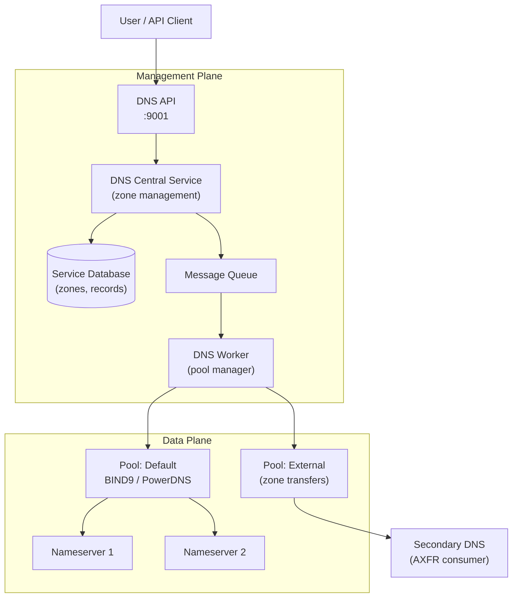
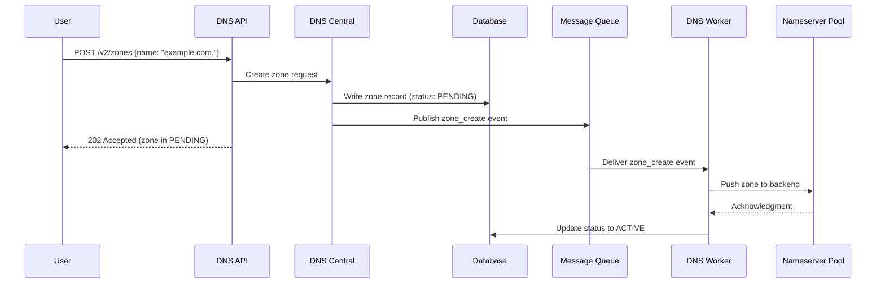

## Overview

The Xloud DNS service uses a multi-tier architecture separating the API layer, the
central processing service, and the backend DNS server pools. This separation allows the
management plane to scale independently from the data plane that serves resolver queries.

---

## Service Topology

<Info>
  The DNS API and central service operate in the management plane. Nameservers in
  pools operate as data-plane components — they respond to resolver queries directly
  without routing through the API layer.
</Info>

---

## Component Descriptions

| Component | Role | Port |
|-----------|------|------|
| **DNS API** | REST API for zone and record management | 9001 |
| **DNS Central** | Orchestrates zone lifecycle, writes to the database | Internal |
| **DNS Worker** | Pushes zone data to backend nameserver pools | Internal |
| **Message Queue** | Decouples Central from Workers for async processing | Internal |
| **Service Database** | Stores zone metadata, record sets, and pool configuration | Internal |
| **Nameserver Pool** | Backend DNS servers that answer resolver queries | 53 (UDP/TCP) |

---

## Request Flow

### Zone Creation

---

## High Availability

The DNS management plane components (API, Central, Worker) are deployed as containerized
services managed by XDeploy. For production deployments:

- Deploy at least two API containers behind a load balancer
- Run two Worker instances for redundancy — only one processes each event (queue-based)
- Database and message queue are shared, managed services

<Note>
  The data plane (nameservers) operates independently of the management plane. Resolver
  queries continue to be served even if the DNS API or central service is temporarily
  unavailable. Only zone updates and record changes require the management plane.
</Note>

---

## Next Steps

<CardGroup cols={2}>
  <Card title="Backend Configuration" href="/services/dns/backend-config" color="#197560">
    Configure backend DNS drivers and pool targets
  </Card>
  <Card title="Pool Management" href="/services/dns/pool-management" color="#197560">
    Manage nameserver pools and geographic distribution
  </Card>
  <Card title="Security" href="/services/dns/security" color="#197560">
    Harden the DNS service and protect zone data
  </Card>
  <Card title="Troubleshooting" href="/services/dns/admin-troubleshooting" color="#197560">
    Diagnose and resolve platform-level DNS issues
  </Card>
</CardGroup>
