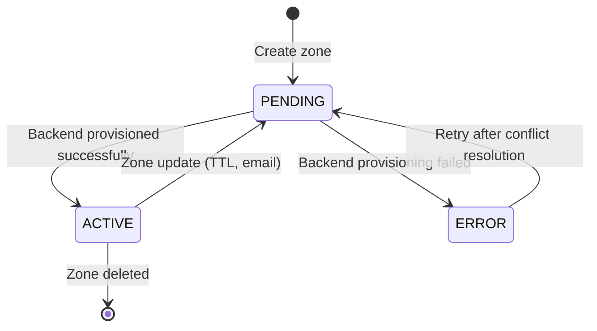

import PrerequisitesAuth from '/snippets/prerequisites-auth.mdx';

<iframe
  className="w-full aspect-video rounded-xl"
  src="https://www.youtube.com/embed/jircMR5UVC8"
  title="How to Create DNS Zones and Record Sets on Xloud"
  allow="accelerometer; autoplay; clipboard-write; encrypted-media; gyroscope; picture-in-picture"
  allowFullScreen
></iframe>

## Overview

A DNS zone is the authoritative domain boundary that contains all record sets for a
given domain (e.g., `example.com.`). Creating a zone in Xloud DNS registers that domain
with the platform's nameservers and makes it available for record management.

Zones are **project-scoped** — each zone belongs to the project that created it. Users
in other projects cannot see or modify your zones unless access is explicitly shared.

<PrerequisitesAuth />

---

## Zone Types

| Type | Description | Use Case |
|------|-------------|----------|
| **Primary** | Your authoritative copy — you manage all records directly | Standard zone management |
| **Secondary** | Read-only replica slaved from another DNS server via zone transfer | Disaster recovery, geographic redundancy |

---

## Create a Zone

<Tabs>
  <Tab title="Dashboard" icon="gauge">
    <Steps titleSize="h3">
      <Step title="Navigate to DNS Zones">
        Navigate to
        **Network > DNS Zones**.

        Click **Create Zone** to open the creation dialog.
      </Step>
      <Step title="Enter the zone name">
        Enter the **Name** for your zone. This is the fully qualified domain name (FQDN).

        <Warning>
          The zone name **must end with a trailing dot** (e.g., `example.com.`).
          The API requires more than one label — use `example.com.` rather than
          `example.` for a valid zone.
        </Warning>
      </Step>
      <Step title="Add a description (optional)">
        Enter an optional **Description** to identify this zone in listings
        (e.g., "Production application zone").
      </Step>
      <Step title="Select the zone type">
        Choose the **Type** from the dropdown:

        | Type | Description |
        |------|-------------|
        | **Primary** | Controlled by Xloud DNS — you manage the records directly |
        | **Secondary** | Slaved from another DNS server — records are pulled via zone transfer |

        The form fields change dynamically based on your selection.

        <Note>
          Primary is the default and most common type. Select Secondary only when
          replicating an existing zone from an external DNS server.
        </Note>
      </Step>
      <Step title="Configure Primary zone fields">
        For **Primary** zones, these additional fields appear:

        **Email Address** (required) — The administrative contact email for this zone.
        Written into the SOA record. Must be a valid email address.

        **TTL (Time To Live)** (required) — Default TTL in seconds for records in this
        zone. Default value: `3600` (1 hour). Minimum: `0`.

        <Tip>
          Use `3600` for most production zones. Use a lower TTL (e.g., `300`) before
          planned DNS changes to reduce propagation delay, then increase it after the
          change is confirmed stable.
        </Tip>
      </Step>
      <Step title="Configure Secondary zone fields">
        For **Secondary** zones, the Email and TTL fields are hidden and a different
        field appears:

        **Masters** (required) — The IP addresses of the primary DNS servers to slave
        from. Click the add button to add one or more IP addresses.

        | Rule | Detail |
        |------|--------|
        | Minimum | At least 1 master IP is required |
        | Format | Valid IPv4 or IPv6 address |
        | Duplicates | Not allowed — each IP must be unique |

        <Note>
          The master servers must allow zone transfers (AXFR) to the Xloud DNS
          nameservers. Configure the allow-transfer ACL on your primary DNS server
          before creating the secondary zone.
        </Note>
      </Step>
      <Step title="Create the zone">
        Click **Confirm**. The zone enters **Pending** status during creation and
        transitions to **Active** within a few seconds.

        <Check>Zone appears in the DNS Zones list with status **Active**.</Check>
      </Step>
    </Steps>
  </Tab>
  <Tab title="CLI" icon="terminal">
    <Steps titleSize="h3">
      <Step title="Authenticate">
        ```bash title="Load credentials"
        source openrc.sh
        ```
      </Step>
      <Step title="Create the zone">
        <CodeGroup>
        ```bash title="Create primary zone"
        openstack zone create \
          --email admin@example.com \
          --ttl 3600 \
          --description "Production application zone" \
          example.com.
        ```
        ```bash title="Create secondary zone"
        openstack zone create \
          --type SECONDARY \
          --masters 10.0.1.50 \
          --masters 10.0.1.51 \
          --description "Secondary replica from external DNS" \
          example.com.
        ```
        </CodeGroup>
      </Step>
      <Step title="Verify zone creation">
        ```bash title="Show zone status"
        openstack zone show example.com.
        ```

        <Check>Zone status is `ACTIVE`.</Check>
      </Step>
    </Steps>
  </Tab>
</Tabs>

---

## Zone Lifecycle



---

## Edit a Zone

<Tabs>
  <Tab title="Dashboard" icon="gauge">
    <Steps titleSize="h3">
      <Step title="Open the edit dialog">
        Navigate to **Network > DNS Zones**. Click the **Edit** action
        on the zone row.
      </Step>
      <Step title="Update editable fields">
        The zone **Name** and **Type** cannot be changed after creation. You can
        update:

        | Zone Type | Editable Fields |
        |-----------|----------------|
        | Primary | Description, Email Address, TTL |
        | Secondary | Description, Masters |
      </Step>
      <Step title="Save changes">
        Click **Confirm**. The zone enters **Pending** briefly during the update.
      </Step>
    </Steps>
  </Tab>
  <Tab title="CLI" icon="terminal">
    <CodeGroup>
    ```bash title="Update zone TTL"
    openstack zone set --ttl 7200 example.com.
    ```
    ```bash title="Update zone email"
    openstack zone set --email newadmin@example.com example.com.
    ```
    ```bash title="Update zone description"
    openstack zone set --description "Updated zone" example.com.
    ```
    </CodeGroup>
  </Tab>
</Tabs>

---

## Delete a Zone

<Tabs>
  <Tab title="Dashboard" icon="gauge">
    <Steps titleSize="h3">
      <Step title="Select zones to delete">
        Navigate to **Network > DNS Zones**. Select one or more zones
        using the checkboxes and click **Delete** in the batch actions bar.

        Alternatively, click the **More** menu on a zone row and select **Delete**.
        The **More** menu also includes **Create Record Set** — see
        [Manage Records](/services/dns/manage-records) for details.
      </Step>
      <Step title="Confirm deletion">
        Confirm the deletion in the dialog.

        <Danger>
          Deleting a zone removes all record sets within it permanently. DNS resolution
          for the domain will fail immediately. Ensure the zone is no longer in use
          before deletion.
        </Danger>
      </Step>
    </Steps>
  </Tab>
  <Tab title="CLI" icon="terminal">
    ```bash title="Delete a zone"
    openstack zone delete example.com.
    ```
  </Tab>
</Tabs>

---

## View Zone Details

<Tabs>
  <Tab title="Dashboard" icon="gauge">
    Click a zone name in the list to open the detail page. The **Overview** tab shows:

    | Section | Fields |
    |---------|--------|
    | **Summary** | Name, Description, Type (Primary/Secondary), Status (Active/Pending/Error), Email |
    | **Base Info** | Action, Serial, TTL, Version |
    | **Modification Times** | Created At, Updated At, Transferred |
    | **Attributes** | Zone attributes (JSON) |
    | **Associations** | Pool ID, Project ID, Masters (for secondary zones) |

    The **Record Sets** tab shows all records in the zone — see
    [Manage Records](/services/dns/manage-records).
  </Tab>
  <Tab title="CLI" icon="terminal">
    <CodeGroup>
    ```bash title="List all zones"
    openstack zone list
    ```
    ```bash title="Show zone detail"
    openstack zone show example.com.
    ```
    </CodeGroup>
  </Tab>
</Tabs>

---

## Next Steps

<CardGroup cols={2}>
  <Card title="Manage Records" href="/services/dns/manage-records" color="#197560">
    Add A, AAAA, CNAME, MX, and TXT records to your zone
  </Card>
  <Card title="Record Types Reference" href="/services/dns/record-types" color="#197560">
    Full reference for every supported DNS record type
  </Card>
  <Card title="Reverse DNS" href="/services/dns/reverse-dns" color="#197560">
    Configure PTR records for your zone's IP addresses
  </Card>
  <Card title="Troubleshooting" href="/services/dns/troubleshooting" color="#197560">
    Resolve zone stuck in Pending or Error status
  </Card>
</CardGroup>
