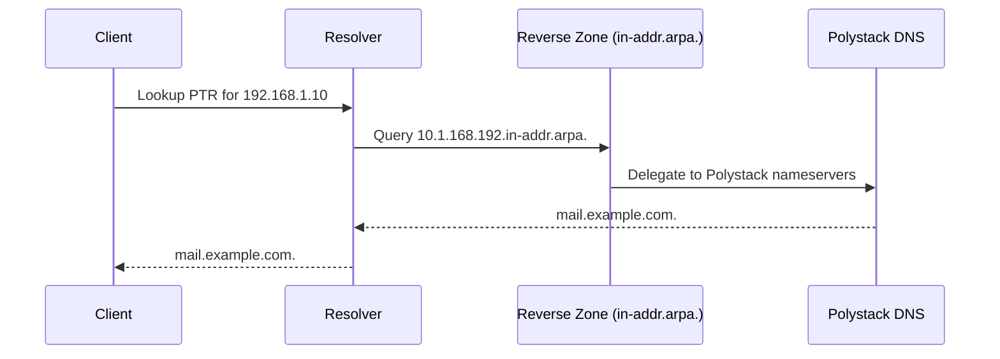

import PrerequisitesAuth from '/snippets/prerequisites-auth.mdx';

## Overview

Reverse DNS maps IP addresses back to hostnames using PTR records. This is distinct from
forward DNS (hostname to IP). Reverse DNS is required by mail servers for spam
reputation checks, improves audit log readability, and is a compliance requirement for
many security frameworks.

The Dashboard provides a dedicated **DNS Reverse** interface for managing PTR records
on your floating IPs without manually creating reverse zones.

<PrerequisitesAuth />

---

## How Reverse DNS Works



---

## View Reverse DNS Entries

<Tabs>
  <Tab title="Dashboard" icon="gauge">
    Navigate to **Network > DNS Reverse**. The list shows all floating
    IPs in your project with their PTR status.

    | Column | Description |
    |--------|-------------|
    | **Address** | The IP address (clickable to view details) |
    | **PTR Domain Name** | The hostname this IP resolves to, or empty if not set |
    | **Status** | Active, Pending, or Error |
  </Tab>
  <Tab title="CLI" icon="terminal">
    ```bash title="List PTR records"
    openstack ptr record list
    ```
  </Tab>
</Tabs>

---

## Set a PTR Record

<Tabs>
  <Tab title="Dashboard" icon="gauge">
    <Steps titleSize="h3">
      <Step title="Navigate to DNS Reverse">
        Navigate to **Network > DNS Reverse**. Find the IP address
        you want to configure.

        Click the **More** dropdown in the row actions, then select **Set**.
        The Set action is always available and can be used to create a new PTR
        record or update an existing one.
      </Step>
      <Step title="Enter the domain name">
        In the **Set Domain Name PTR** dialog, enter the **Domain Name** — the
        fully qualified hostname this IP should resolve to.

        | Field | Details |
        |-------|---------|
        | **Domain Name** (required) | FQDN ending with a dot (e.g., `smtp.example.com.`) |
        | **Description** (optional) | Notes about this PTR record |
        | **TTL (Time To Live)** (optional) | Cache duration in seconds. Minimum: `0`. Default placeholder: `3600` |

        <Tip>
          The domain name should match an A record in your forward DNS zone. Mismatched
          forward and reverse DNS can cause mail delivery failures and security audit
          warnings.
        </Tip>
      </Step>
      <Step title="Confirm the PTR record">
        Click **Confirm**. The PTR record enters **Pending** briefly and transitions
        to **Active**.

        <Check>The PTR Domain Name column shows your configured hostname with Active status.</Check>
      </Step>
    </Steps>
  </Tab>
  <Tab title="CLI" icon="terminal">
    <Steps titleSize="h3">
      <Step title="Authenticate">
        ```bash title="Load credentials"
        source openrc.sh
        ```
      </Step>
      <Step title="Set a PTR record for a floating IP">
        ```bash title="Set PTR record"
        openstack ptr record set \
          --description "Mail server reverse DNS" \
          --ttl 3600 \
          <region>:<floating-ip-id> \
          mail.example.com.
        ```

        Replace `<region>` with your region name (e.g., `RegionOne`) and
        `<floating-ip-id>` with the UUID of the floating IP.
      </Step>
      <Step title="Verify the PTR record">
        ```bash title="Show PTR record"
        openstack ptr record show <region>:<floating-ip-id>
        ```

        <Check>Output shows the PTR record value as `mail.example.com.` with status `ACTIVE`.</Check>
      </Step>
    </Steps>
  </Tab>
</Tabs>

---

## Unset a PTR Record

<Tabs>
  <Tab title="Dashboard" icon="gauge">
    <Steps titleSize="h3">
      <Step title="Find the PTR record">
        Navigate to **Network > DNS Reverse**. Find the IP address
        with the PTR record you want to remove.

        <Note>
          The **Unset** action is only available when a PTR domain name is
          configured and the status is **Active**.
        </Note>
      </Step>
      <Step title="Unset the PTR record">
        Click the **More** dropdown in the row actions, then select **Unset**.
        Confirm the action in the dialog.

        The PTR domain name is removed and the column returns to empty.
      </Step>
    </Steps>
  </Tab>
  <Tab title="CLI" icon="terminal">
    ```bash title="Delete PTR record"
    openstack ptr record delete <region>:<floating-ip-id>
    ```
  </Tab>
</Tabs>

---

## View PTR Record Details

<Tabs>
  <Tab title="Dashboard" icon="gauge">
    Click an IP address in the DNS Reverse list to open the detail page.

    | Field | Description |
    |-------|-------------|
    | **Address** | The IP address |
    | **PTR Domain Name** | The configured hostname |
    | **Description** | Notes about this PTR record |
    | **ID** | Unique identifier |
    | **Time To Live** | TTL in seconds |
    | **Status** | Active, Pending, or Error |
    | **Action** | Current action type |

    From the detail page, you can **Set** (to update) or **Unset** the PTR record
    using the **More** dropdown in the actions menu.
  </Tab>
  <Tab title="CLI" icon="terminal">
    ```bash title="Show PTR record details"
    openstack ptr record show <region>:<floating-ip-id>
    ```
  </Tab>
</Tabs>

---

## IPv6 Reverse DNS

IPv6 PTR records follow the same process as IPv4. The DNS service automatically
manages the `ip6.arpa.` reverse zones for your allocated IPv6 prefixes.

```bash title="Set PTR record for an IPv6 floating IP"
openstack ptr record set \
  <region>:<ipv6-floating-ip-id> \
  ipv6-host.example.com.
```

<Tip>
  IPv6 reverse zones are automatically delegated for your allocated prefix. No manual
  zone creation is required.
</Tip>

---

## Next Steps

<CardGroup cols={2}>
  <Card title="Manage Records" href="/services/dns/manage-records" color="#197560">
    Add forward DNS records to complement your PTR configuration
  </Card>
  <Card title="Record Types Reference" href="/services/dns/record-types" color="#197560">
    Reference for all supported DNS record types
  </Card>
  <Card title="Troubleshooting" href="/services/dns/troubleshooting" color="#197560">
    Resolve PTR record failures and zone delegation issues
  </Card>
  <Card title="DNS Admin Guide" href="/services/dns/admin-guide" color="#197560">
    Administer reverse zone pools and nameserver delegation
  </Card>
</CardGroup>
