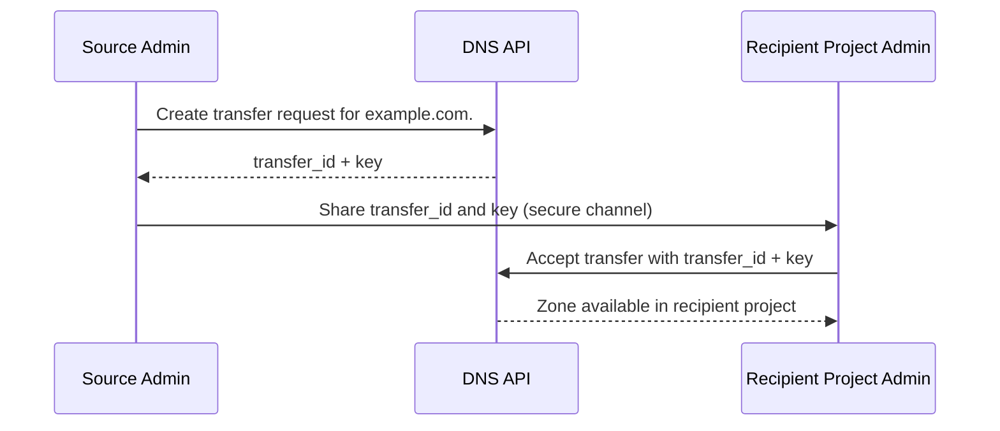

import AdminWarning from '/snippets/admin-warning.mdx';

## Overview

Zone transfers replicate zone data from the Polystack DNS service to secondary nameservers
or other projects. Administrators control which destinations are permitted to perform
zone transfers. Transfer requests use a one-time key mechanism — the requesting admin
generates the request and shares the key with the recipient through a secure channel.

<AdminWarning />

---

## Zone Transfer Workflow



---

## Create a Transfer Request

<Tabs>
  <Tab title="Create and share" icon="plus">
    <Steps titleSize="h3">
      <Step title="Create transfer request as admin">
        ```bash title="Create zone transfer request"
        openstack zone transfer request create \
          --target-project-id <project-id> \
          --description "Transfer to DR nameserver" \
          example.com.
        ```
        This generates a `key` that the recipient uses to accept the transfer.
      </Step>
      <Step title="Share the transfer key">
        Share the `id` and `key` from the output with the recipient project administrator
        through a secure channel (e.g., encrypted email, secrets manager).

        <Warning>
          Never share transfer keys over unencrypted channels. A compromised key allows
          unauthorized zone transfer.
        </Warning>
      </Step>
      <Step title="Recipient accepts the transfer">
        The recipient project accepts the transfer using the provided credentials:
        ```bash title="Accept zone transfer"
        openstack zone transfer accept request \
          --transfer-id <transfer-id> \
          --key <transfer-key>
        ```

        <Check>Zone becomes available in the recipient project.</Check>
      </Step>
    </Steps>
  </Tab>
  <Tab title="Manage transfer requests" icon="list">
    <CodeGroup>
    ```bash title="List pending transfer requests"
    openstack zone transfer request list
    ```
    ```bash title="Show transfer request detail"
    openstack zone transfer request show <transfer-id>
    ```
    ```bash title="Delete a transfer request"
    openstack zone transfer request delete <transfer-id>
    ```
    ```bash title="List accepted transfers"
    openstack zone transfer accept list
    ```
    </CodeGroup>

    <Tip>
      Delete stale transfer requests that were not accepted within 24 hours to prevent
      unauthorized zone transfers if keys are later compromised.
    </Tip>
  </Tab>
</Tabs>

---

## Security Best Practices

| Practice | Description |
|----------|-------------|
| **Target-specific requests** | Always specify `--target-project-id` — never create open transfers |
| **Short expiration** | Set 24-hour expiration windows on all transfer requests |
| **Secure key delivery** | Deliver transfer keys via encrypted channel only |
| **Regular audit** | Review accepted transfers monthly and revoke unnecessary ones |

```bash title="Audit all accepted zone transfers (admin)"
openstack zone transfer accept list --all-projects
```

---

## Next Steps

<CardGroup cols={2}>
  <Card title="Pool Management" href="/services/dns/pool-management" color="#bf9667">
    Manage nameserver pools that receive transferred zone data
  </Card>
  <Card title="Security" href="/services/dns/security" color="#bf9667">
    Full DNS security hardening guidelines
  </Card>
  <Card title="Backend Configuration" href="/services/dns/backend-config" color="#bf9667">
    Configure `also_notifies` for AXFR consumer nameservers
  </Card>
  <Card title="Admin Troubleshooting" href="/services/dns/admin-troubleshooting" color="#bf9667">
    Diagnose zone transfer failures and key errors
  </Card>
</CardGroup>
