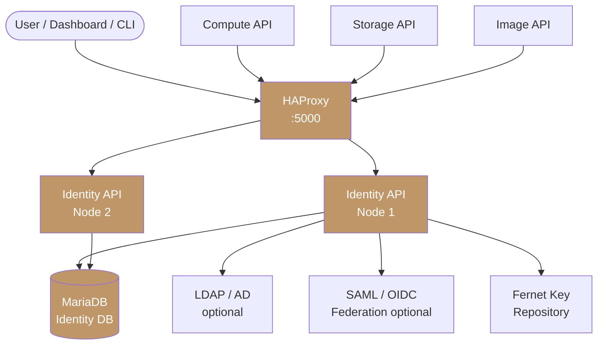
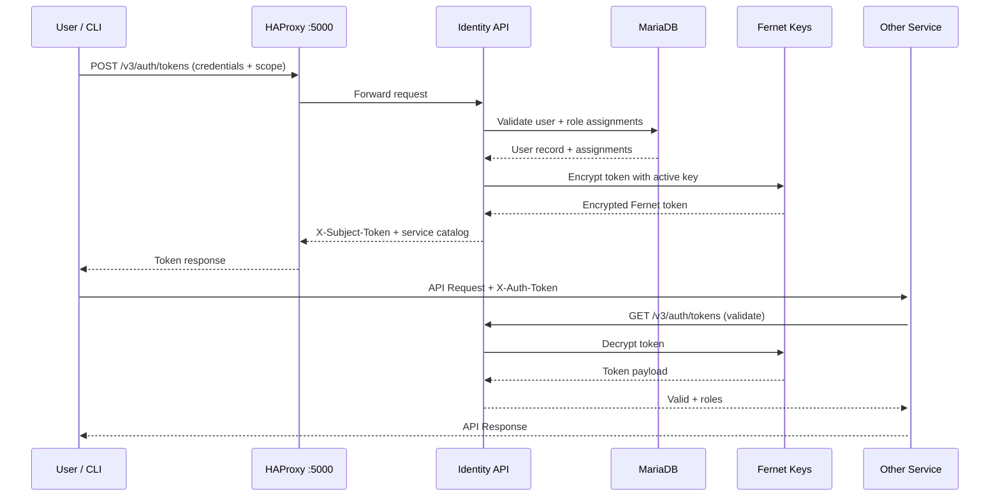

import AdminWarning from '/snippets/admin-warning.mdx';

## Overview

Polystack Identity runs as a distributed service with API endpoints fronted by HAProxy. The
token validation path is on every service's critical path — all Polystack services call the
Identity API to validate incoming requests. Understanding the architecture is essential
for sizing, high availability planning, and troubleshooting.

<AdminWarning />

---

## Service Topology



---

## Component Reference

| Component | Port | Description |
|-----------|------|-------------|
| Identity API (v3) | 5000 | Authentication, token issuance, and service catalog |
| HAProxy | 5000 | Load balances API requests across all Identity API nodes |
| MariaDB | 3306 | Persistent storage for users, projects, roles, domains, and catalog |
| Fernet Key Repository | — | Symmetric keys for stateless token signing and encryption |
| LDAP (optional) | 389/636 | External user directory for enterprise AD/LDAP integration |
| Federation (optional) | — | SAML 2.0 or OIDC IdP integration |

---

## Authentication Flow



---

## High Availability Considerations

<AccordionGroup>
  <Accordion title="Stateless token validation" icon="key" defaultOpen>
    Fernet tokens are stateless — no database lookup is needed to validate them. The
    Identity API decrypts the token locally using the Fernet key repository. This means
    token validation scales horizontally without database pressure, and any Identity
    API node can validate any token as long as all nodes share the same Fernet key set.
  </Accordion>
  <Accordion title="Fernet key synchronization" icon="rotate-right">
    All Identity API nodes must have identical Fernet key sets. the deployment console manages
    key distribution automatically during rotation. If nodes become out of sync,
    tokens signed by one node cannot be validated by another.

    Verify key consistency:
    ```bash title="Check key file count on all nodes"
    ls -1 /var/lib/kolla/config_files/fernet-keys/ | wc -l
    ```
    All nodes must report the same count and file timestamps.
  </Accordion>
  <Accordion title="Database redundancy" icon="database">
    The Identity database is a MariaDB Galera cluster in a multi-node deployment.
    Identity writes (user creation, role assignments) are replicated synchronously
    across all MariaDB nodes. HAProxy in front of MariaDB distributes read operations.
  </Accordion>
</AccordionGroup>

---

## Deployment Footprint

<Tree>
  <Tree.Folder name="Identity API container" defaultOpen>
    <Tree.Folder name="/etc/keystone" defaultOpen>
      <Tree.File name="keystone.conf" />
      <Tree.File name="policy.yaml" />
    </Tree.Folder>
    <Tree.Folder name="/etc/keystone/fernet-keys">
      <Tree.File name="0 (staged key)" />
      <Tree.File name="1 (primary key)" />
      <Tree.File name="2 (secondary key)" />
    </Tree.Folder>
  </Tree.Folder>
</Tree>

---

## Next Steps

<CardGroup cols={2}>
  <Card title="Authentication Backends" href="/services/identity/auth-backends" color="#bf9667">
    Configure SQL, LDAP, and federation authentication drivers.
  </Card>
  <Card title="Token Configuration" href="/services/identity/token-config" color="#bf9667">
    Set Fernet key rotation schedules and token lifetime policies.
  </Card>
  <Card title="Security Hardening" href="/services/identity/security" color="#bf9667">
    Enforce MFA, audit assignments, and apply hardening best practices.
  </Card>
  <Card title="Admin Troubleshooting" href="/services/identity/admin-troubleshooting" color="#bf9667">
    Diagnose token validation failures and service communication issues.
  </Card>
</CardGroup>
