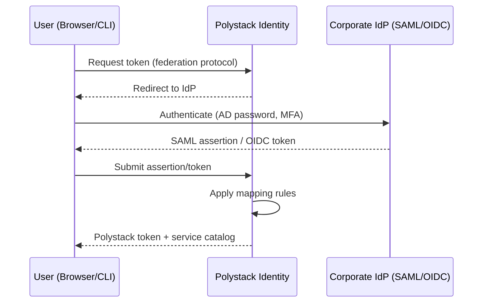

import AdminWarning from '/snippets/admin-warning.mdx';

## Overview

Federation allows enterprise users to authenticate with Polystack using their existing
corporate identity provider (IdP) — no separate Polystack password required. Polystack Identity
supports SAML 2.0 and OpenID Connect (OIDC) protocols. Users authenticate at the IdP
and receive Polystack tokens mapped from their IdP attributes, inheriting project membership
and roles through attribute mapping rules.

<AdminWarning />

---

## Federation Architecture



---

## SAML 2.0 Setup

<Steps titleSize="h3">
  <Step title="Register Polystack as SP in your IdP" icon="building">
    Provide your IdP with the Polystack SAML SP metadata URL:
    ```
    https://api.<your-domain>:5000/v3/OS-FEDERATION/identity_providers/<IDP_ID>/protocols/saml2/auth
    ```
    Configure the IdP to send the following SAML attributes:
    - `ADFS_LOGIN` or `mail` — the user's login name
    - `memberOf` — group membership for role mapping
  </Step>
  <Step title="Register the IdP in Polystack" icon="plus">
    ```bash title="Create identity provider"
    openstack identity provider create \
      --remote-id https://idp.example.com/sso/saml \
      --description "Corporate Active Directory Federation" \
      corporate-idp
    ```
  </Step>
  <Step title="Create attribute mapping rules" icon="route">
    Mapping rules translate IdP attributes into Polystack group memberships:

    ```json title="mapping-rules.json"
    [
      {
        "local": [
          {"user": {"name": "{0}", "domain": {"name": "Default"}}},
          {"group": {"id": "<POLYSTACK_GROUP_ID>"}}
        ],
        "remote": [
          {"type": "ADFS_LOGIN"},
          {
            "type": "memberOf",
            "any_one_of": ["CN=cloud-users,OU=Groups,DC=example,DC=com"]
          }
        ]
      }
    ]
    ```

    ```bash title="Upload mapping rules"
    openstack mapping create \
      --rules mapping-rules.json \
      corporate-mapping
    ```
  </Step>
  <Step title="Create the federation protocol" icon="link">
    ```bash title="Link IdP, mapping, and SAML protocol"
    openstack federation protocol create saml2 \
      --identity-provider corporate-idp \
      --mapping corporate-mapping
    ```
    <Check>Federation protocol is active. Test by authenticating via the SSO URL.</Check>
  </Step>
</Steps>

---

## OpenID Connect Setup

<Steps titleSize="h3">
  <Step title="Register Polystack as OIDC client in your IdP" icon="building">
    Register a new application in your OIDC provider (Keycloak, Azure AD, Okta):
    - **Redirect URI**: `https://api.<your-domain>:5000/v3/OS-FEDERATION/identity_providers/<IDP_ID>/protocols/openid/auth/callback`
    - **Grant type**: Authorization Code
    - **Scopes**: `openid`, `profile`, `email`, `groups`
  </Step>
  <Step title="Register the OIDC IdP in Polystack" icon="plus">
    ```bash title="Create OIDC identity provider"
    openstack identity provider create \
      --remote-id https://accounts.google.com \
      --description "Google Workspace SSO" \
      google-oidc
    ```
  </Step>
  <Step title="Create OIDC mapping rules" icon="route">
    ```json title="oidc-mapping-rules.json"
    [
      {
        "local": [
          {"user": {"name": "{0}"}},
          {"group": {"id": "<POLYSTACK_GROUP_ID>"}}
        ],
        "remote": [
          {"type": "email"},
          {"type": "groups", "any_one_of": ["polystack-admins@example.com"]}
        ]
      }
    ]
    ```

    ```bash title="Create OIDC mapping"
    openstack mapping create \
      --rules oidc-mapping-rules.json \
      google-mapping
    ```
  </Step>
  <Step title="Create the OIDC protocol" icon="link">
    ```bash title="Create OIDC federation protocol"
    openstack federation protocol create openid \
      --identity-provider google-oidc \
      --mapping google-mapping
    ```
  </Step>
</Steps>

---

## Mapping Rule Reference

| Mapping Field | Description |
|--------------|-------------|
| `local.user.name` | Maps to the Polystack username for the federated session |
| `local.group.id` | Assigns the user to an Polystack group (inherits group's role assignments) |
| `remote.type` | The IdP attribute name to match |
| `remote.any_one_of` | User must belong to at least one of these values |
| `remote.not_any_of` | User must not belong to any of these values |

---

## Next Steps

<CardGroup cols={2}>
  <Card title="Authentication Backends" href="/services/identity/auth-backends" color="#bf9667">
    Compare federation with LDAP and SQL backend options.
  </Card>
  <Card title="Domain Management" href="/services/identity/domain-management" color="#bf9667">
    Assign federation backends to specific organizational domains.
  </Card>
  <Card title="Security Hardening" href="/services/identity/security" color="#bf9667">
    Secure federation endpoints and enforce MFA for federated sessions.
  </Card>
  <Card title="Admin Troubleshooting" href="/services/identity/admin-troubleshooting" color="#bf9667">
    Debug SAML assertion errors and OIDC token mapping failures.
  </Card>
</CardGroup>
