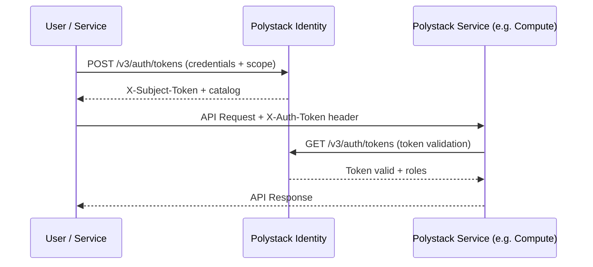

import VersionBadge from '/snippets/version-badge.mdx';

Overview

Polystack Identity is the authentication and authorization backbone of the Polystack Cloud Platform.
Every API request, Dashboard login, and CLI command is validated against Polystack Identity before
any resource operation proceeds. It manages the complete access control lifecycle — from
issuing scoped tokens to enforcing fine-grained role-based policies across every service.

<Note>
  **Prerequisites**
  - An active Polystack account with admin or project-member privileges
  - Access to the **Polystack Dashboard** (`https://connect.<your-domain>`) or `openstack` CLI
  - For administration tasks: XDeploy access and admin credentials
</Note>

---

What Polystack Identity Provides

<CardGroup cols={3}>
  <Card title="Authentication" icon="key" href="/services/identity/auth-backends" color="#197560">
    Token-based authentication with configurable backends — local SQL, LDAP, and federated
    identity providers.
  </Card>
  <Card title="Authorization" icon="shield" href="/services/identity/policy-management" color="#197560">
    Role-based access control (RBAC) with fine-grained policy rules governing every
    service operation across all projects.
  </Card>
  <Card title="Multi-Domain Tenancy" icon="building" href="/services/identity/domain-management" color="#197560">
    Hierarchical domain and project structure supporting full organizational separation
    across teams, departments, and customers.
  </Card>
  <Card title="Federation" icon="link" href="/services/identity/federation" color="#197560">
    Single sign-on integration with SAML 2.0 and OpenID Connect identity providers for
    enterprise directory integration.
  </Card>
  <Card title="Application Credentials" icon="terminal" href="/services/identity/application-credentials" color="#197560">
    Non-interactive, scoped credentials for automation pipelines, CI/CD, and service
    accounts — without exposing user passwords.
  </Card>
  <Card title="Service Catalog" icon="list" href="/services/identity/service-catalog" color="#197560">
    Centralized registry of all Polystack service endpoints, enabling clients to discover
    the correct API address for each region and interface.
  </Card>
</CardGroup>

---

Core Concepts

| Concept | Description |
|---------|-------------|
| **Domain** | Top-level administrative boundary. Contains projects, users, and groups. The `Default` domain is created during deployment. |
| **Project** | Resource namespace for billing, quotas, and access isolation. All cloud resources belong to a project. |
| **User** | A human or service account identity. Users authenticate and receive tokens scoped to a project or domain. |
| **Role** | Named set of permissions. Roles are assigned to users or groups within a project or domain. |
| **Token** | A time-limited bearer credential issued after successful authentication. Tokens encode the scope (project/domain) and role assignments. |
| **Group** | A collection of users. Role assignments on a group propagate to all members. |
| **Application Credential** | A delegated credential bound to a user's roles, used for non-interactive automation without password exposure. |

---

How Authentication Works

Every token carries a <Tooltip tip="The project or domain context in which the token grants access. A token cannot access resources outside its scope.">scope</Tooltip> and a set of role assignments. Services validate the token on every request and enforce the platform's RBAC policies before executing any operation.

---

Guides

<CardGroup cols={2}>
  <Card title="User Guide" icon="book-open" href="/services/identity/user-guide" color="#197560">
    Manage projects, users, roles, application credentials, and multi-factor authentication
    from the Dashboard and CLI.
  </Card>
  <Card title="Admin Guide" icon="settings" href="/services/identity/admin-guide" color="#197560">
    Configure authentication backends, domains, token policies, federation, and security
    hardening for production deployments.
  </Card>
  <Card title="Authentication & CLI" icon="terminal" href="/services/identity/cli-reference" color="#197560">
    Source credentials, configure the `openstack` CLI, and authenticate to the Polystack
    Dashboard.
  </Card>
  <Card title="Compute Service" icon="server" href="/services/compute" color="#197560">
    Learn how Polystack Identity tokens authorize access to compute resources and instances.
  </Card>
</CardGroup>
