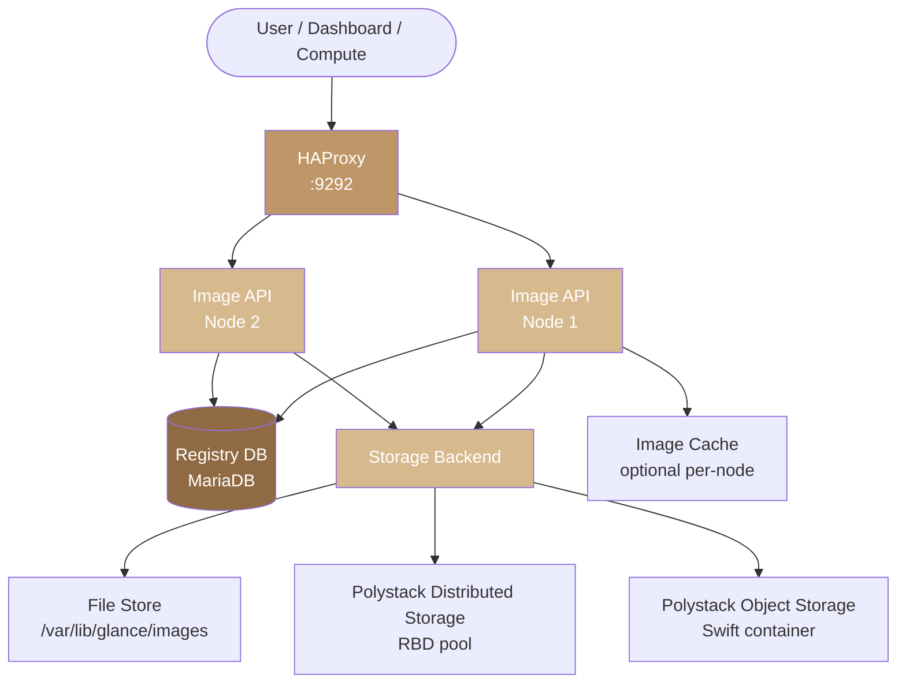
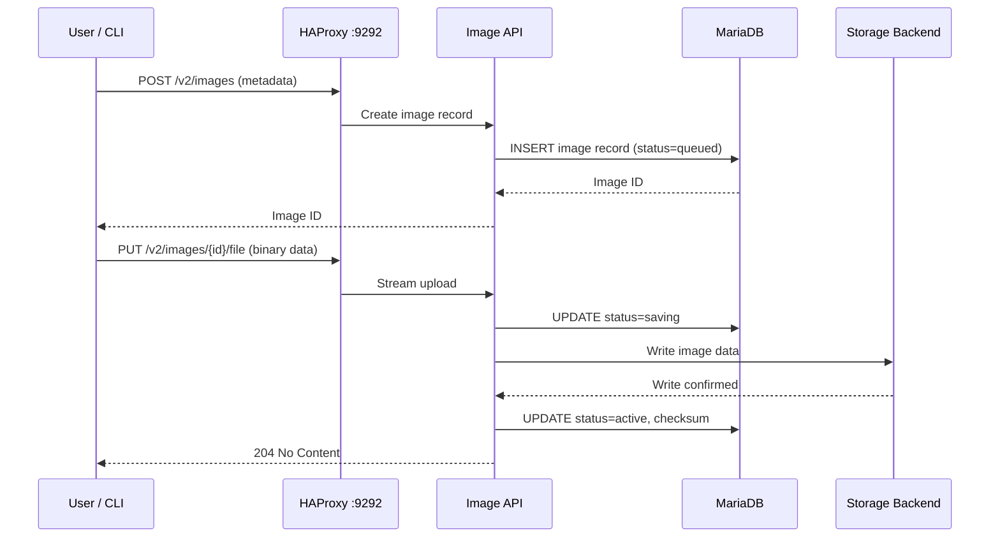

import AdminWarning from '/snippets/admin-warning.mdx';

## Overview

The Polystack Image Service consists of an API tier, a registry database, and a pluggable
storage backend. Upload and download traffic flows through the API, while metadata queries
are handled by the registry backed by MariaDB. Understanding the architecture is essential
for sizing deployments, selecting the right storage backend, and troubleshooting
performance issues.

<AdminWarning />

---

## Service Topology

---

## Component Reference

| Component | Port | Description |
|-----------|------|-------------|
| Image API | 9292 | REST API for image CRUD operations and data streaming |
| HAProxy | 9292 | Load balances requests across all Image API nodes |
| Registry | Internal | Stores image metadata in MariaDB |
| File Store | — | Local filesystem storage (single-node or NFS) |
| RBD Store | — | Polystack Distributed Storage (Ceph RBD) — recommended for HA |
| Object Store | — | Polystack Object Storage (Swift) |
| Image Cache | — | Optional local cache of frequently used image data |

---

## Upload Data Flow

---

## Storage Backend Selection

| Backend | HA | Performance | Use Case |
|---------|-----|-------------|---------|
| **RBD (Ceph)** | Yes | Highest | Production HA deployments |
| **File Store** | Single-node only | Good | Single-node dev/test or NFS-backed |
| **Object Storage** | Yes | Moderate | When Swift is already deployed |

<Tip>
  For production deployments with Polystack Distributed Storage, use RBD as both the image
  and volume backend. This enables zero-copy RBD cloning — instances launch in seconds
  regardless of image size.
</Tip>

---

## High Availability Considerations

<AccordionGroup>
  <Accordion title="Multiple API nodes" icon="server" defaultOpen>
    Deploy two or more Image API nodes for redundancy. HAProxy distributes upload and
    download requests across all healthy nodes. All nodes must share the same storage
    backend — RBD or Swift — to ensure images uploaded to one node are readable from
    another.
  </Accordion>
  <Accordion title="File store limitations" icon="circle-x">
    The file store writes to a local directory. In a multi-node Image API deployment,
    all nodes must mount the same NFS directory. If NFS is unavailable, all image
    operations fail. Use RBD for true HA without NFS dependencies.
  </Accordion>
</AccordionGroup>

---

## Next Steps

<CardGroup cols={2}>
  <Card title="Storage Backends" href="/services/images/storage-backends" color="#bf9667">
    Configure RBD, file store, or Swift as the image storage backend.
  </Card>
  <Card title="Image Cache" href="/services/images/image-cache" color="#bf9667">
    Enable per-node caching to accelerate instance launch times.
  </Card>
  <Card title="Admin Troubleshooting" href="/services/images/admin-troubleshooting" color="#bf9667">
    Diagnose backend connectivity and API-level failures.
  </Card>
  <Card title="Security" href="/services/images/image-security" color="#bf9667">
    Configure image signing and property protections.
  </Card>
</CardGroup>
