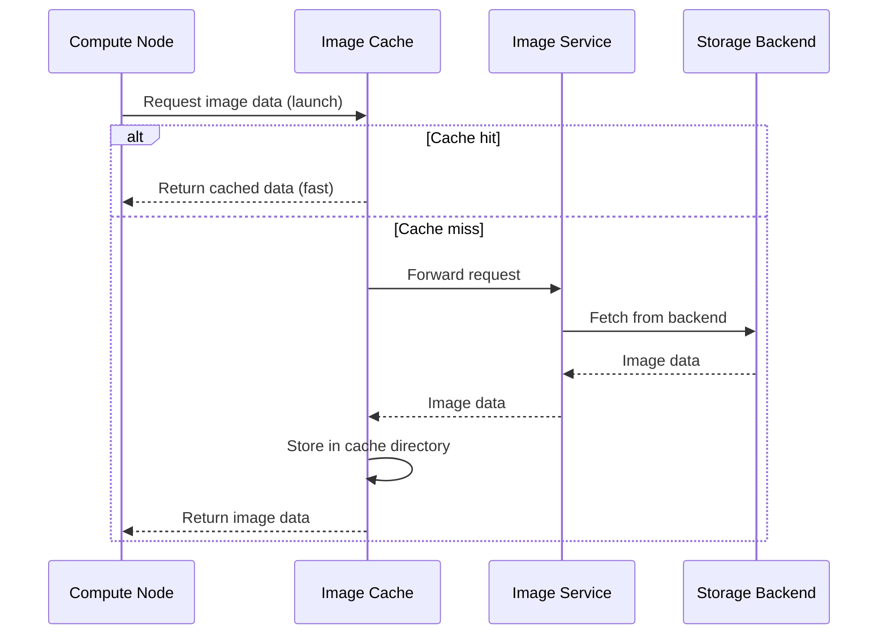

import AdminWarning from '/snippets/admin-warning.mdx';

## Overview

The image cache stores a local copy of frequently-used images on each compute node,
eliminating repeated downloads from the central image service at instance launch time.
Enabling the cache is most impactful when the same image is used to launch many instances
on the same compute node — typical in auto-scaling and cluster workloads.

<AdminWarning />

---

## Cache Configuration

Configure cache settings via the deployment console globals before deploying:

| Setting | Default | Description |
|---------|---------|-------------|
| `glance_enable_image_cache` | `no` | Enable the image cache |
| `glance_cache_max_size` | 10 GB | Maximum total size of the cache directory |
| `glance_cache_staleness_seconds` | 86400 | How long a cached entry remains fresh (seconds) |
| `glance_cache_prefetcher_delay` | 300 | Seconds between pre-fetch sweep runs |

```yaml title="Image cache configuration in the deployment console globals"
glance_enable_image_cache: "yes"
glance_cache_max_size: 10737418240      # 10 GB in bytes
glance_cache_staleness_seconds: 86400   # 24 hours
glance_cache_prefetcher_delay: 300      # 5 minutes
```

Deploy after configuring:
```bash title="Apply image cache configuration"
ironcore-ansible deploy --tags glance
```

---

## How the Cache Works



---

## Verify Cache Status

```bash title="Check cache directory on Image API node"
docker exec glance_api ls -lh /var/lib/glance/image-cache/
```

```bash title="View cached image entries"
docker exec glance_api glance-cache-manage list-cached
```

```bash title="View pending pre-fetch queue"
docker exec glance_api glance-cache-manage list-queued
```

---

## Manual Cache Management

<Tabs>
  <Tab title="Pre-fetch an image" icon="download">
    Queue an image for pre-caching before its first use:
    ```bash title="Queue image for pre-fetch"
    docker exec glance_api glance-cache-manage queue-image <IMAGE_ID>
    ```
    The pre-fetcher picks it up on the next sweep interval.
  </Tab>
  <Tab title="Clear the cache" icon="trash">
    Remove all cached entries to free disk space:
    ```bash title="Clear the image cache"
    docker exec glance_api glance-cache-manage delete-all-cached-images
    ```
    <Warning>
      Clearing the cache causes the next instance launch from each image to download
      from the storage backend. This temporarily increases launch times.
    </Warning>
  </Tab>
  <Tab title="Trigger pre-fetch manually" icon="play">
    Run the pre-fetcher outside its scheduled interval:
    ```bash title="Trigger cache pre-fetch"
    docker exec glance_api glance-cache-prefetcher
    ```
  </Tab>
</Tabs>

---

## When to Use the Cache

<AccordionGroup>
  <Accordion title="Best case: Many instances from same image" icon="bolt" defaultOpen>
    The cache provides the greatest benefit when the same image is repeatedly used on
    the same compute node — typical patterns include:
    - Auto-scaling groups launching many identical instances
    - Development clusters where all developers use the same base image
    - CI/CD pipelines that launch many ephemeral test instances

    After the first launch (cache miss), all subsequent launches are served from the
    local cache — typically 10-50x faster than fetching from the storage backend.
  </Accordion>
  <Accordion title="Limited benefit: RBD-to-RBD cloning" icon="database">
    When both the Image Service and Block Storage use Polystack Distributed Storage (RBD),
    instance launches use zero-copy RBD clones. This already achieves near-instantaneous
    boot times regardless of image size — the image cache provides minimal additional
    benefit in this configuration.
  </Accordion>
</AccordionGroup>

<Tip>
  Enable the image cache on compute nodes with SSD-backed local storage. Storing the
  cache on slow HDDs may actually increase launch latency compared to fetching from
  a fast Ceph cluster.
</Tip>

---

## Next Steps

<CardGroup cols={2}>
  <Card title="Storage Backends" href="/services/images/storage-backends" color="#bf9667">
    Configure the primary storage backend that feeds the cache.
  </Card>
  <Card title="Architecture" href="/services/images/architecture" color="#bf9667">
    Understand where the cache fits in the overall Image Service topology.
  </Card>
  <Card title="Admin Troubleshooting" href="/services/images/admin-troubleshooting" color="#bf9667">
    Diagnose cache effectiveness and storage issues.
  </Card>
  <Card title="Quotas" href="/services/images/quotas" color="#bf9667">
    Control storage consumption to ensure cache space is not exhausted.
  </Card>
</CardGroup>
