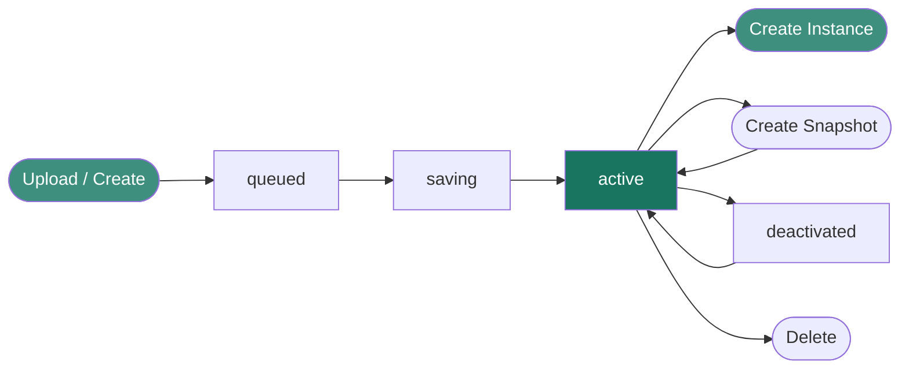

Overview

The Xloud Image Service is the centralized catalog for virtual machine images and instance
snapshots. Every new instance launched on the platform boots from an image registered here.
Images can be public (shared across all projects), private (scoped to your project), or
community-shared with specific projects — giving you full control over your image library.

<Note>
  **Prerequisites**
  - An active Xloud account with project-member privileges or higher
  - Access to the **Xloud Dashboard** or `openstack` CLI
  - For uploading images: image data in a supported format (QCOW2, RAW, VHD, or VMDK)
</Note>

---

What the Image Service Provides

<CardGroup cols={3}>
  <Card title="Image Catalog" icon="layers" href="/services/images/get-images" color="#197560">
    Centralized storage and discovery of OS images, application images, and snapshots
    available across your Xloud environment.
  </Card>
  <Card title="Multiple Formats" icon="file-code" href="/services/images/image-formats" color="#197560">
    Native support for QCOW2, RAW, VHD, and VMDK formats with automatic metadata
    detection and validation on upload.
  </Card>
  <Card title="Visibility Controls" icon="eye" href="/services/images/share-images" color="#197560">
    Per-image visibility settings — public, private, shared, or community — controlling
    who can discover and use each image.
  </Card>
  <Card title="Instance Snapshots" icon="camera" href="/services/images/create-snapshot" color="#197560">
    Capture a running or stopped instance as an image snapshot. Use snapshots for
    backups, cloning, and golden image workflows.
  </Card>
  <Card title="Image Sharing" icon="share-2" href="/services/images/share-images" color="#197560">
    Share specific images with other projects without making them globally public,
    enabling controlled cross-team image distribution.
  </Card>
  <Card title="Rich Metadata" icon="tag" href="/services/images/image-properties" color="#197560">
    Attach structured properties to images — OS type, version, minimum disk, hardware
    requirements — enabling the scheduler to make informed placement decisions.
  </Card>
</CardGroup>

---

Image Lifecycle

| State | Description |
|-------|-------------|
| `queued` | Image record created; data upload not yet started |
| `saving` | Image data is being uploaded and stored |
| `active` | Image is ready and available for instance launches |
| `deactivated` | Image has been disabled by an administrator; cannot be used for new instances |
| `deleted` | Image has been removed; the record is retained temporarily before permanent purge |

---

Supported Formats

| Format | Extension | Best For |
|--------|-----------|----------|
| **QCOW2** | `.qcow2` | Default format. Supports copy-on-write, compression, and snapshots. Recommended for most workloads. |
| **RAW** | `.img` | Maximum performance. No overhead. Preferred when storage backend handles copy-on-write natively. |
| **VHD / VHDX** | `.vhd`, `.vhdx` | Images exported from Hyper-V environments. |
| **VMDK** | `.vmdk` | Images exported from VMware environments. |

---

Guides

<CardGroup cols={2}>
  <Card title="User Guide" icon="book-open" href="/services/images/user-guide" color="#197560">
    Upload images, manage snapshots, configure visibility, and share images with other
    projects from the Dashboard and CLI.
  </Card>
  <Card title="Admin Guide" icon="settings" href="/services/images/admin-guide" color="#197560">
    Configure storage backends, metadata schemas, image signing, caching, and quotas
    for production image service deployments.
  </Card>
  <Card title="Compute User Guide" icon="monitor" href="/services/compute/user-guide" color="#197560">
    Learn how images are used when launching compute instances and creating snapshots.
  </Card>
  <Card title="Authentication & CLI" icon="terminal" href="/services/images/cli-reference" color="#197560">
    Configure CLI credentials to manage images from the command line.
  </Card>
</CardGroup>
