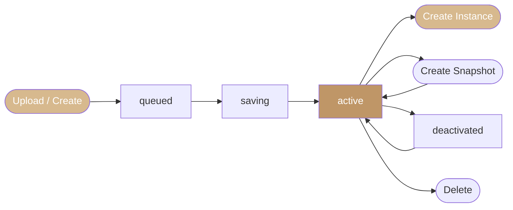

Overview

The Polystack Image Service stores and delivers virtual machine images to the compute service
at instance launch time. Use the guides below to upload images, capture snapshots, share
images with other projects, set metadata properties, and troubleshoot common issues.

<CardGroup cols={4}>
  <Card title="Upload an Image" icon="upload" href="/services/images/upload-image" color="#bf9667">
    Upload OS images and VM disk files from your workstation or via URL import.
  </Card>
  <Card title="Create a Snapshot" icon="camera" href="/services/images/create-snapshot" color="#bf9667">
    Capture a running or stopped instance as a reusable image snapshot.
  </Card>
  <Card title="Share Images" icon="share-2" href="/services/images/share-images" color="#bf9667">
    Share private images with specific projects without making them globally public.
  </Card>
  <Card title="Image Properties" icon="tag" href="/services/images/image-properties" color="#bf9667">
    Set hardware requirements, OS metadata, and scheduler hints on images.
  </Card>
  <Card title="Image Formats" icon="file-code" href="/services/images/image-formats" color="#bf9667">
    Compare QCOW2, RAW, VHD, and VMDK formats and choose the right one for your workload.
  </Card>
  <Card title="Troubleshooting" icon="wrench" href="/services/images/troubleshooting" color="#bf9667">
    Resolve upload failures, stuck images, and launch errors caused by image issues.
  </Card>
  <Card title="Get Images" icon="download" href="/services/images/get-images" color="#bf9667">
    Download pre-built cloud images for Ubuntu, AlmaLinux, Rocky Linux, and more.
  </Card>
  <Card title="Image Requirements" icon="circle-check" href="/services/images/image-requirements" color="#bf9667">
    Understand cloud-init, SSH, and disk requirements for Polystack-compatible images.
  </Card>
  <Card title="Modify Images" icon="edit" href="/services/images/modify-images" color="#bf9667">
    Customize images offline using virt-customize, guestfish, and guestmount.
  </Card>
  <Card title="Convert Formats" icon="repeat" href="/services/images/convert-formats" color="#bf9667">
    Convert VMDK, VHD, or RAW images to QCOW2 using qemu-img.
  </Card>
</CardGroup>

---

Key Concepts

| Concept | Description |
|---------|-------------|
| **Image** | A file containing a virtual disk with a pre-installed operating system or application. Used as the boot source for new instances. |
| **Snapshot** | An image captured from a running or stopped instance. Preserves the instance disk state at the moment of capture. |
| **Metadata / Properties** | Key-value pairs attached to an image. Describe OS type, version, minimum hardware requirements, and custom attributes. |
| **Visibility** | Access scope for the image. Options: `public` (all projects), `private` (owner only), `shared` (specific projects), `community` (discoverable but not pushed). |
| **Disk Format** | The storage format of the image file (QCOW2, RAW, VHD, VMDK). |
| **Min Disk / Min RAM** | Minimum flavor requirements enforced at instance launch. |

---

Image Lifecycle

---

Next Steps

<CardGroup cols={4}>
  <Card title="Image Admin Guide" icon="settings" href="/services/images/admin-guide" color="#bf9667">
    Configure storage backends, metadata schemas, image caching, and access policies.
  </Card>
  <Card title="Compute User Guide" icon="server" href="/services/compute/user-guide" color="#bf9667">
    Launch instances from the images you upload and manage.
  </Card>
</CardGroup>
