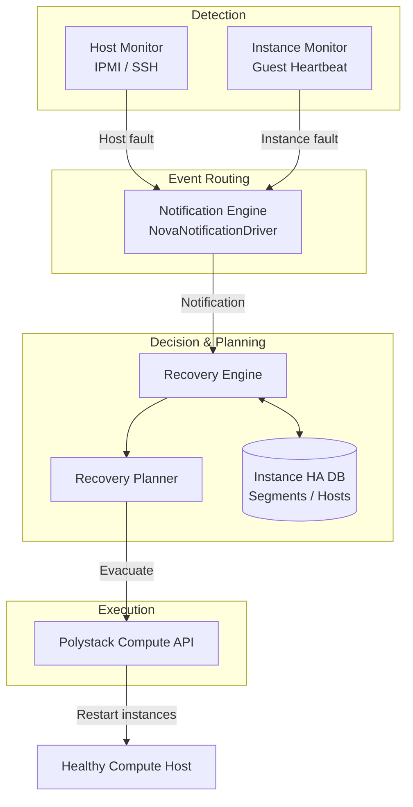
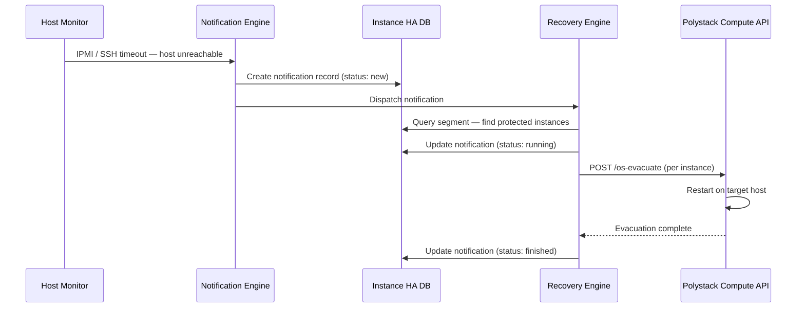

## Overview

Polystack Instance HA is a fault-detection and automated recovery service deployed alongside
the compute cluster. Its architecture separates detection (monitors), event routing
(notification engine), decision-making (recovery engine), and execution (Compute API
calls) into independently scalable components. Understanding this separation helps
administrators plan deployments, diagnose failures, and tune recovery behaviour.

<Warning>
  This guide requires administrator privileges. Changes to the Instance HA deployment
  affect all active recovery workflows cluster-wide.
</Warning>

---

## Component Diagram

---

## Components

<AccordionGroup>
  <Accordion title="Host Monitor" icon="radar" defaultOpen>
    Polls each registered compute host at a configurable interval using IPMI or SSH.
    Declares a host unreachable after a configurable number of consecutive failures
    and emits a `COMPUTE_HOST` fault notification.

    Deployed as: `masakari-hostmonitor` service on the controller node.
  </Accordion>
  <Accordion title="Instance Monitor" icon="heart-pulse">
    Monitors running instances for guest-level heartbeat failures, independent of the
    host state. Emits `COMPUTE_INSTANCE` fault notifications when a guest stops
    responding.

    Deployed as: `masakari-instancemonitor` service on each compute host.
  </Accordion>
  <Accordion title="Notification Engine" icon="bell">
    Receives raw fault signals from monitors, deduplicates events within a configurable
    window, and routes structured notifications to the Recovery Engine via the message bus.

    The default driver is `NovaNotificationDriver`, which also listens to the Polystack
    Compute message bus for host and instance failure events.
  </Accordion>
  <Accordion title="Recovery Engine" icon="rotate">
    The central decision-making component. On receiving a notification, it:
    1. Queries the Instance HA database to identify the affected segment
    2. Retrieves all protected instances on the failed host
    3. Applies the segment's recovery method to select evacuation targets
    4. Invokes the Compute API to initiate evacuation

    Deployed as: `masakari-engine` service on the controller node.
  </Accordion>
  <Accordion title="Instance HA Database" icon="database">
    Stores all segment definitions, host registrations, reserved host flags, and
    notification history. Backed by the platform database (MySQL/MariaDB).

    Schema includes: `segments`, `hosts`, `notifications`, `vm_moves` tables.
  </Accordion>
</AccordionGroup>

---

## Deployment Topology

<Tree>
  <Tree.Folder name="Controller Nodes" defaultOpen>
    <Tree.File name="masakari-api — REST API for segment / host management" />
    <Tree.File name="masakari-engine — Recovery Engine + Notification Engine" />
    <Tree.File name="masakari-hostmonitor — Host Monitor daemon" />
  </Tree.Folder>
  <Tree.Folder name="Compute Nodes">
    <Tree.File name="masakari-instancemonitor — Per-host instance monitor daemon" />
  </Tree.Folder>
</Tree>

<Note>
  In XDeploy-managed deployments, all Instance HA components are deployed as Docker
  containers. Configuration files are managed via the `/etc/ironcore/instance-ha/` overlay
  directory.
</Note>

---

## Integration with Polystack Services

| Service | Integration | Purpose |
|---------|-------------|---------|
| Polystack Compute | Evacuation API (`/os-evacuate`) | Executes instance migrations to healthy hosts |
| Polystack Identity | Service account authentication | Authenticates Instance HA API calls |
| AMQP Message Bus | `NovaNotificationDriver` subscription | Receives host/instance failure events from the Compute message bus |
| Polystack Distributed Storage | Shared instance disk backend | Required for live evacuation — local disk instances cannot be moved |

---

## Data Flow: Host Failure to Recovery

---

## High Availability for Instance HA

To avoid a single point of failure in the recovery infrastructure:

<CardGroup cols={2}>
  <Card title="Active/Passive API" icon="server" color="#197560">
    Deploy multiple `masakari-api` instances behind the load balancer. The API is
    stateless — all state is in the database.
  </Card>
  <Card title="Engine Leader Election" icon="crown" color="#197560">
    Run `masakari-engine` on two controller nodes. The engine uses Tooz-based
    distributed locking to elect a leader — only one engine processes notifications
    at a time.
  </Card>
</CardGroup>

---

## Next Steps

<CardGroup cols={2}>
  <Card title="Failover Segments" href="/services/instance-ha/admin-guide/failover-segments" color="#197560">
    Create and manage failover segments and register compute hosts.
  </Card>
  <Card title="Host Monitors" href="/services/instance-ha/admin-guide/host-monitors" color="#197560">
    Configure IPMI and SSH host monitors for your compute nodes.
  </Card>
  <Card title="Engine Configuration" href="/services/instance-ha/admin-guide/engine-config" color="#197560">
    Tune recovery engine timing, retry intervals, and instance failure behaviour.
  </Card>
  <Card title="Security" href="/services/instance-ha/admin-guide/security" color="#197560">
    Configure RBAC policies and credential management for the Instance HA service.
  </Card>
</CardGroup>
