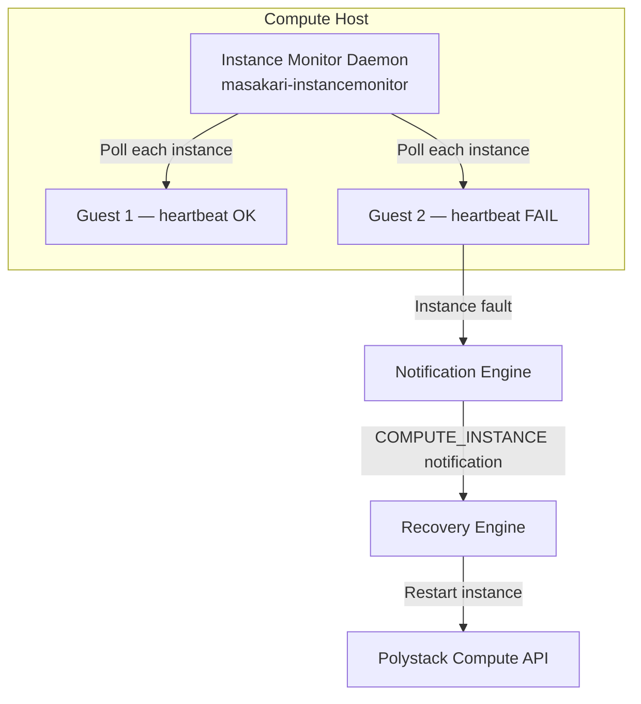

## Overview

Instance monitors detect failures at the guest level — independent of whether the
underlying compute host is healthy. When an instance stops responding to heartbeat
checks, an instance-level fault notification is generated and the recovery engine
attempts to restart the affected instance. This complements host monitoring by
handling scenarios such as OS crashes, guest kernel panics, and runaway processes
that consume all available resources without taking down the host.

<Note>
  **Prerequisites**
  - Administrator privileges
  - Instance HA service deployed and running
  - Ironcore Guest Agent or heartbeat capability enabled in the instance image
</Note>

---

## Instance Monitor Architecture



The instance monitor runs on each compute host and monitors all running instances.
It operates independently of the host monitor — both can run simultaneously.

---

## Notification Types

Instance HA distinguishes between host-level and instance-level faults using the
notification `type` field.

| Type | Source | Trigger |
|------|--------|---------|
| `COMPUTE_HOST` | Host Monitor | Host becomes unreachable (IPMI / SSH timeout) |
| `COMPUTE_INSTANCE` | Instance Monitor | Guest heartbeat stops responding |
| `COMPUTE_PROCESS` | Process Monitor | Critical compute process (nova-compute) dies |

---

## View Instance-Level Notifications

<Tabs>
  <Tab title="Dashboard" icon="gauge">
    Navigate to **Instance-HA > Notifications (admin view)**.

    Filter by **Type: COMPUTE_INSTANCE** to display only instance-level fault events.
    Each row shows the affected instance UUID, the source host, and the current recovery
    status.
  </Tab>
  <Tab title="CLI" icon="terminal">
    ```bash title="List instance-level notifications"
    openstack notification list --type COMPUTE_INSTANCE
    ```

    ```bash title="Show instance notification details"
    openstack notification show <notification-uuid>
    ```

    The detail view includes the `source_host_uuid`, `payload` (with instance UUID),
    `generated_time`, and `status`.
  </Tab>
</Tabs>

---

## Configure the Instance Monitor

The instance monitor daemon runs on each compute host. Configure it via the Instance
HA configuration overlay.

<Tree>
  <Tree.Folder name="etc" defaultOpen>
    <Tree.Folder name="ironcore" defaultOpen>
      <Tree.Folder name="instance-ha" defaultOpen>
        <Tree.File name="instance-ha.conf" />
      </Tree.Folder>
    </Tree.Folder>
  </Tree.Folder>
</Tree>

Key instance monitor parameters:

| Section | Parameter | Default | Description |
|---------|-----------|---------|-------------|
| `[instance_failure]` | `recover_ignoring_error_instances` | `False` | Attempt recovery for instances already in `ERROR` state |
| `[instance_failure]` | `recover_instance_failure_method` | `auto` | Recovery method for instance-level faults |
| `[DEFAULT]` | `instance_check_interval` | `30` | Seconds between instance heartbeat polls |

<Tabs>
  <Tab title="XDeploy" icon="gauge">
    <Steps titleSize="h3">
      <Step title="Open Advanced Configuration" icon="settings">
        In XDeploy, navigate to **Advanced Configuration**. In the **Service Tree**,
        select **masakari**.
      </Step>
      <Step title="Edit instance monitor parameters" icon="file-code">
        Select or create `instance-ha.conf` in the Code Editor. Add or modify the
        instance monitor parameters:

        ```ini title="Instance monitor settings in XDeploy Advanced Configuration"
        [instance_failure]
        recover_ignoring_error_instances = False
        recover_instance_failure_method = auto

        [DEFAULT]
        instance_check_interval = 30
        ```

        Click **Save Current File**.
      </Step>
      <Step title="Apply changes" icon="play">
        Navigate to **Operations** and run a **reconfigure** action. The instance
        monitor restarts automatically on each compute host with the updated parameters.

        <Check>Instance monitor is running on all compute hosts with the new configuration.</Check>
      </Step>
    </Steps>
  </Tab>
  <Tab title="CLI" icon="terminal">
    Edit the configuration file directly and restart the instance monitor on each
    compute host:

    ```ini title="/etc/ironcore/instance-ha/instance-ha.conf"
    [instance_failure]
    recover_ignoring_error_instances = False
    recover_instance_failure_method = auto

    [DEFAULT]
    instance_check_interval = 30
    ```

    ```bash title="Restart instance monitor on each compute host"
    docker restart masakari_instancemonitor
    ```
  </Tab>
</Tabs>

---

## Enable Guest Heartbeat in Instances

Instance-level detection requires the instance image to have the `masakari-instancemonitor`
Ironcore Guest Agent or a compatible heartbeat mechanism installed. The Ironcore Guest Agent includes a VSS provider for Windows application-consistent snapshots. Check whether the agent is running inside an instance:

```bash title="Verify Ironcore Guest Agent inside instance (SSH)"
systemctl status masakari-processmonitor
```

<Tip>
  For instances using the standard Polystack images, the guest heartbeat is enabled by default.
  For custom images, install the `python3-masakari` package and enable the
  `masakari-processmonitor` service at boot.
</Tip>

---

## Difference Between Host and Instance Recovery

| Scenario | Monitor Used | Recovery Scope |
|----------|-------------|----------------|
| Physical host failure, OS crash, power loss | Host Monitor | All instances on the failed host are evacuated |
| Single guest OS crash, kernel panic | Instance Monitor | Only the crashed instance is restarted |
| nova-compute process dies on a healthy host | Process Monitor | nova-compute restarted; instances remain on host |

---

## Validation

<Tabs>
  <Tab title="Dashboard" icon="gauge">
    Navigate to **Instance-HA > Notifications (admin view)** and confirm that
    instance-level notifications appear and transition to `finished` status when
    instance faults are detected and resolved.
  </Tab>
  <Tab title="CLI" icon="terminal">
    ```bash title="Check instance monitor service"
    docker ps --filter name=masakari_instancemonitor
    ```

    ```bash title="View instance monitor logs"
    docker logs -f masakari_instancemonitor
    ```

    <Check>Instance monitor is running on all compute hosts and logs confirm active polling.</Check>
  </Tab>
</Tabs>

---

## Next Steps

<CardGroup cols={2}>
  <Card title="Notification Drivers" href="/services/instance-ha/admin-guide/notification-drivers" color="#bf9667">
    Configure the notification driver that routes fault events to the recovery engine.
  </Card>
  <Card title="Host Monitors" href="/services/instance-ha/admin-guide/host-monitors" color="#bf9667">
    Configure IPMI and SSH host-level monitors for your compute nodes.
  </Card>
  <Card title="Recovery Methods" href="/services/instance-ha/admin-guide/recovery-methods" color="#bf9667">
    Select and configure the recovery method for each failover segment.
  </Card>
  <Card title="Troubleshooting" href="/services/instance-ha/admin-guide/troubleshooting" color="#bf9667">
    Diagnose monitor failures, notification delivery issues, and recovery errors.
  </Card>
</CardGroup>
