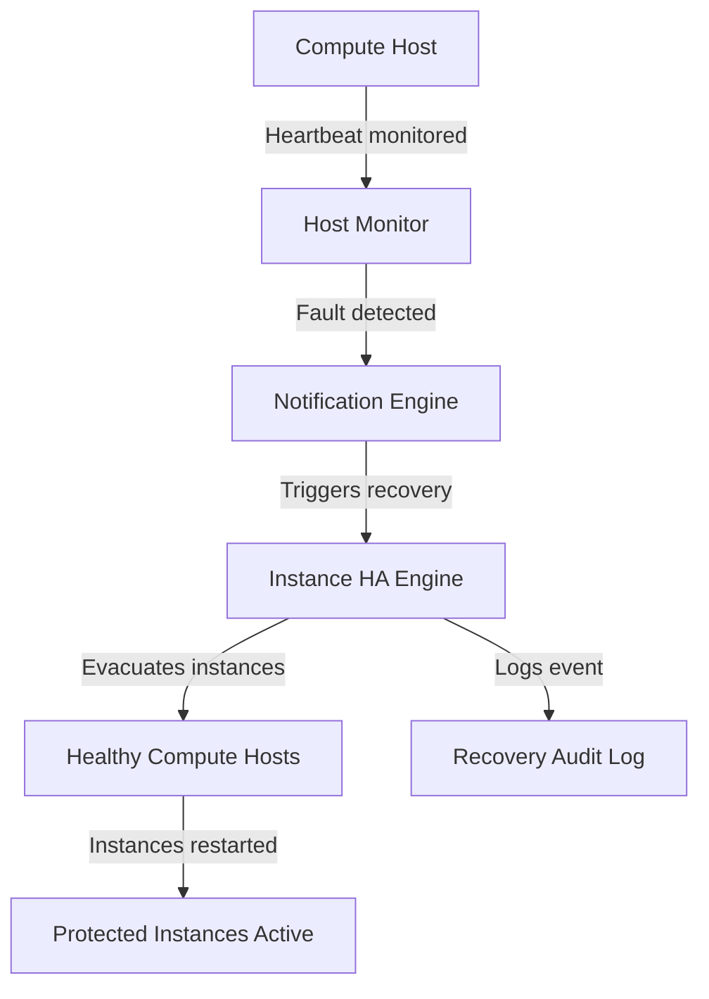

Protect your workloads from compute host failures with automatic detection and recovery.
Polystack Instance HA continuously monitors compute nodes and instances, triggering evacuation
and restart workflows the moment a fault is detected — without manual intervention.

<Card title="Ironcore — Advanced Virtualization Solutions" icon="external-link" href="https://polystack.tech/ironcore" color="#bf9667" horizontal>
  Product details on polystack.tech
</Card>

---

Instance High Availability

<CardGroup cols={2}>
  <Card title="User Guide" icon="book-open" href="/services/instance-ha/user-guide" color="#bf9667">
    Understand protection segments, instance protection policies, and how to monitor
    recovery workflows for your running workloads.
  </Card>
  <Card title="Admin Guide" icon="shield-check" href="/services/instance-ha/admin-guide" color="#bf9667">
    Configure failover segments, host and instance monitors, notification drivers, and
    integrate Instance HA with your compute cluster.
  </Card>
  <Card title="CLI Reference" icon="terminal" href="/services/instance-ha/cli-reference" color="#bf9667">
    Complete command reference for managing failover segments, hosts, and recovery
    notifications using the openstack CLI.
  </Card>
  <Card title="Compute Service" icon="server" href="/services/compute" color="#bf9667">
    Polystack Compute provides the hypervisor layer that Instance HA monitors and manages
    during host failover events.
  </Card>
</CardGroup>

---

Key Capabilities

<CardGroup cols={2}>
  <Card title="Host Failure Detection" icon="radar" href="/services/instance-ha/admin-guide/host-monitors" color="#bf9667">
    IPMI and SSH-based monitors detect unreachable hosts in seconds and immediately
    trigger evacuation of all protected instances.
  </Card>
  <Card title="Automatic Instance Recovery" icon="rotate" href="/services/instance-ha/user-guide/recovery-workflows" color="#bf9667">
    Failed instances are automatically restarted on healthy hosts within the same
    protection segment, respecting affinity rules.
  </Card>
  <Card title="Reserved Host Failover" icon="server" href="/services/instance-ha/admin-guide/failover-segments" color="#bf9667">
    Designate standby compute hosts that remain idle until a failover event occurs —
    guaranteeing resource availability for recovery.
  </Card>
  <Card title="Protection Segments" icon="shield-check" href="/services/instance-ha/user-guide/protection-segments" color="#bf9667">
    Group hosts and instances into logical fault domains. Each segment has its own
    recovery policy, monitors, and notification targets.
  </Card>
  <Card title="Notification Drivers" icon="bell" href="/services/instance-ha/admin-guide/notification-drivers" color="#bf9667">
    Integrate with IPMI, SSH, and custom notification sources to receive precise
    fault signals from infrastructure monitoring tools.
  </Card>
  <Card title="Audit Trail" icon="clipboard-list" href="/services/instance-ha/user-guide/monitoring-status" color="#bf9667">
    Every recovery event is logged with timestamps, affected instances, and resolution
    outcomes — fully queryable via the Dashboard and CLI.
  </Card>
</CardGroup>

---

How It Works

---

Platform Resilience

<CardGroup cols={2}>
  <Card title="VM High Availability" icon="heart-pulse" color="#bf9667">
    Automatic instance restart on host failure. Configurable per-instance priority. Failover segments for per-group recovery policies. Requires Ironcore.
  </Card>
  <Card title="Power Recovery Automation" icon="bolt" color="#bf9667">
    9-phase automated recovery playbook. Target recovery time: 7-13 minutes. Sequential service startup with health gates between each phase. Requires Ironcore.
  </Card>
  <Card title="Container Self-Healing" icon="rotate" color="#bf9667">
    Three-tier autoheal daemon with dependency-aware restart ordering. Circuit breaker pattern prevents restart loops. Exponential backoff. Requires Ironcore.
  </Card>
  <Card title="Proactive Monitoring" icon="bell" color="#bf9667">
    Pre-configured alert rules across 13 groups covering storage, database, message queue, compute, networking, containers, APIs, system resources, disk, memory, security, and capacity. Predictive alerts for capacity forecasting. Requires Ironcore.
  </Card>
  <Card title="Network Resilience" icon="network" color="#bf9667">
    L3 high availability and DHCP high availability with sub-3-second failover. Automatic ARP gratuitous announcements for fast VIP convergence. Requires Ironcore.
  </Card>
  <Card title="Rolling Upgrades with Rollback" icon="arrow-up-circle" color="#bf9667">
    Per-service container upgrades with 2-10 second swap time. Canary deployment (first node only). Image tag rollback mechanism. Previous images cached locally. Requires Ironcore.
  </Card>
</CardGroup>

---

Related Services

<CardGroup cols={3}>
  <Card title="Polystack Compute" icon="server" href="/services/compute" color="#bf9667">
    The hypervisor layer monitored and managed by Instance HA
  </Card>
  <Card title="Resource Optimizer" icon="trending-up" href="/services/optimization/index" color="#bf9667">
    Rebalances workloads after recovery to restore cluster efficiency
  </Card>
  <Card title="Polystack Block Storage" icon="hard-drive" href="/services/storage/index" color="#bf9667">
    Persistent volumes that survive host failover when using shared storage
  </Card>
</CardGroup>
