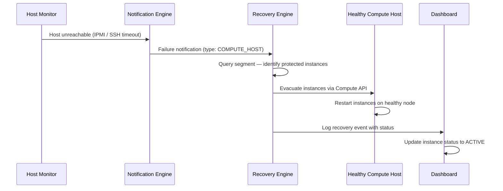
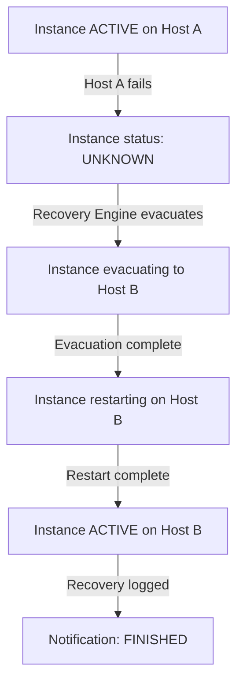

## Overview

Polystack Instance HA delivers zero-touch recovery for protected compute workloads. When a
compute host becomes unreachable, the service detects the fault, identifies all protected
instances on that host, and automatically evacuates them to healthy nodes — without any
manual intervention. This page explains the end-to-end detection and recovery flow.

<Note>
  **Prerequisites**
  - An active Polystack account
  - Instance HA enabled on your platform by an administrator
  - At least one failover segment configured with registered compute hosts
</Note>

---

## Core Components

<CardGroup cols={2}>
  <Card title="Host Monitor" color="#197560">
    Continuously polls compute hosts using IPMI out-of-band management or SSH.
    Declares a host unreachable when it fails to respond within the configured timeout.
  </Card>
  <Card title="Notification Engine" color="#197560">
    Receives fault signals from monitors, deduplicates events, and routes them to
    the Recovery Engine as structured notifications.
  </Card>
  <Card title="Recovery Engine" color="#197560">
    The decision-making core. Identifies protected instances on the failed host and
    determines the evacuation target based on the segment's recovery method.
  </Card>
  <Card title="Compute API" color="#197560">
    Executes the evacuation. Instances are restarted on the selected healthy host
    using the same image, volume, and network configuration.
  </Card>
</CardGroup>

---

## Recovery Flow

The recovery process starts within seconds of fault detection. No human action is
required for instances enrolled in an active protection segment.

---

## Detection Methods

<AccordionGroup>
  <Accordion title="IPMI (Out-of-Band)" defaultOpen>
    The preferred detection method. The host monitor connects to the server's IPMI
    interface — which operates independently of the host OS — to verify whether the
    physical node is powered and responsive.

    IPMI detection is more reliable than SSH because it does not depend on the host
    network stack or OS. A host that has kernel-panicked or lost all network interfaces
    is still detectable via IPMI.

    | Advantage | Disadvantage |
    |-----------|-------------|
    | Works even when OS is unresponsive | Requires IPMI hardware and network access |
    | Detects power failures | Requires IPMI credentials per host |
  </Accordion>
  <Accordion title="SSH (In-Band)">
    The SSH monitor attempts a TCP connection to the host on port 22. Use this method
    when IPMI hardware is unavailable.

    SSH monitoring is susceptible to false positives caused by SSH service restarts,
    temporary network partitions, or high host load. The monitor implements a configurable
    retry interval to reduce spurious alerts.

    | Advantage | Disadvantage |
    |-----------|-------------|
    | No special hardware required | Dependent on host network and OS |
    | Easy to deploy | May miss physical hardware failures |
  </Accordion>
  <Accordion title="Pacemaker">
    Uses Pacemaker cluster monitoring to detect node failures. Pacemaker tracks cluster
    membership and triggers a notification when a node is fenced or goes offline.

    This method integrates with existing Pacemaker/Corosync clusters and leverages
    STONITH fencing for reliable failure detection.

    | Advantage | Disadvantage |
    |-----------|-------------|
    | Integrates with existing cluster infrastructure | Requires Pacemaker/Corosync setup |
    | Reliable fencing-based detection | More complex configuration |
  </Accordion>
</AccordionGroup>

---

## Recovery Methods

Each failover segment uses one of four recovery methods. The method is selected when
creating the segment.

| Method | Behaviour | Best Suited For |
|--------|-----------|----------------|
| `auto` | Evacuate to any healthy host in the segment | General workloads |
| `auto_priority` | Evacuate using priority-based host selection | Workloads with preferred targets |
| `reserved_host` | Evacuate only to pre-designated standby hosts | SLA-critical workloads |
| `rh_priority` | Prefer reserved hosts, fall back to any host | Mixed environments |

<Info>
  The recovery method is configured per segment by your administrator. Contact your
  administrator to understand which method applies to your protection segment. Your
  administrator can configure this through [XDeploy](/deployment).
</Info>

---

## Notification Types

Instance HA generates different notification types depending on the source of the failure:

| Type | Color | Description |
|------|-------|-------------|
| **COMPUTE_HOST** | Red | Physical compute host failure detected by the host monitor |
| **VM** | Orange | Individual VM failure detected by the instance monitor |
| **PROCESS** | Blue | Service process failure (e.g., nova-compute crash) |
| **pacemaker** | Purple | Failure detected by Pacemaker cluster monitoring |

---

## Instance Lifecycle During Recovery

The instance `ID`, `name`, attached volumes, and network configuration are preserved
across the recovery. Only the physical host changes.

---

## Monitoring in the Dashboard

The Polystack Dashboard provides dedicated pages for monitoring Instance HA:

| Page | Path | Purpose |
|------|------|---------|
| **Segments** | Instance HA > Segments | View and manage failover segments and hosts |
| **Hosts** | Instance HA > Hosts | View all registered hosts across all segments |
| **Notifications** | Instance HA > Notifications | Track recovery events with real-time progress |
| **VM Moves** | Instance HA > VM Moves | View all VM evacuations across all notifications |

<Tip>
  The **Notifications** detail page includes a **Recovery Progress** tab that shows
  real-time VM evacuation status with auto-refresh every 5 seconds during active
  recovery. See [Monitoring Status](/services/instance-ha/user-guide/monitoring-status)
  for details.
</Tip>

---

## Next Steps

<CardGroup cols={2}>
  <Card title="Protection Segments" href="/services/instance-ha/user-guide/protection-segments" color="#197560">
    Create segments, add hosts, and configure recovery methods
  </Card>
  <Card title="Recovery Workflows" href="/services/instance-ha/user-guide/recovery-workflows" color="#197560">
    Understand recovery methods and how the engine selects evacuation targets
  </Card>
  <Card title="Monitoring Status" href="/services/instance-ha/user-guide/monitoring-status" color="#197560">
    Track active and historical recovery events in the Dashboard
  </Card>
  <Card title="Instance HA Overview" href="/services/instance-ha/index" color="#197560">
    Return to the Instance HA service overview page
  </Card>
</CardGroup>
