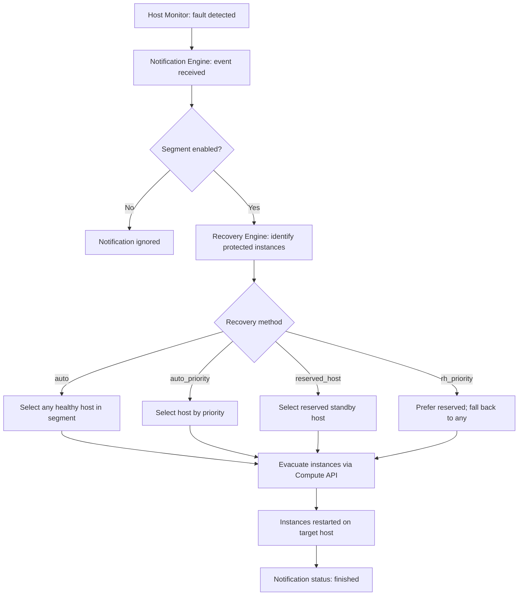

## Overview

A recovery workflow is the ordered sequence of actions the Instance HA engine takes
after a host failure notification is received. The workflow covers instance evacuation,
restart on a healthy host, and post-recovery status reporting. The Dashboard provides
real-time tracking of each VM evacuation through the Recovery Progress tab and a
consolidated VM Moves page.

<Note>
  **Prerequisites**
  - Instance HA protection enabled on your instances
  - At least one failover segment configured with registered hosts
</Note>

---

## Recovery Workflow Stages



---

## Recovery Progress — Real-Time Tracking

When a recovery is in progress, the Dashboard provides real-time tracking of each
individual VM evacuation through the **Recovery Progress** tab on the notification
detail page.

<Tabs>
  <Tab title="Dashboard" icon="gauge">
    <Steps titleSize="h3">
      <Step title="Open the notification detail">
        Navigate to **Instance HA > Notifications**. Click a notification UUID
        to open the detail page.
      </Step>
      <Step title="View the Recovery Progress tab">
        Click the **Recovery Progress** tab. This tab shows:

        **Summary card** at the top:

        | Field | Description |
        |-------|-------------|
        | **Notification Status** | Current status as a colored tag |
        | **Total VMs** | Total number of VMs being evacuated |
        | **Succeeded** | Count of successfully recovered VMs (green) |
        | **Failed** | Count of failed evacuations (red, if any) |
        | **Progress** | Circular progress indicator showing completion |

        **VM Evacuations table** below the summary:

        | Column | Description |
        |--------|-------------|
        | **VM Name** | Instance name (falls back to UUID if no name) |
        | **Source Host** | The failed compute host |
        | **Destination Host** | Target recovery host ("Pending" if not yet assigned) |
        | **Type** | Evacuation type (typically `evacuation`) |
        | **Status** | Evacuation status with icon |
        | **Start Time** | When the evacuation started |
        | **End Time** | When the evacuation completed |
        | **Message** | Error message if the evacuation failed (red text) |

        **VM evacuation status values**:

        | Status | Color | Icon | Meaning |
        |--------|-------|------|---------|
        | **Pending** | Grey | Clock | Evacuation queued, not yet started |
        | **Running** | Blue | Loading spinner | Evacuation in progress |
        | **Succeeded** | Green | Check circle | VM successfully recovered |
        | **Failed** | Red | Close circle | Evacuation failed — manual intervention needed |

        <Tip>
          When a notification is in **Running** status, the Recovery Progress tab
          **auto-refreshes every 5 seconds**, showing a "Auto-refreshing every 5s"
          indicator. You can watch evacuations complete in real time.
        </Tip>
      </Step>
    </Steps>
  </Tab>
  <Tab title="CLI" icon="terminal">
    ```bash title="Source credentials"
    source openrc.sh
    ```

    <CodeGroup>
    ```bash title="Show notification detail"
    openstack notification show <notification-uuid>
    ```
    ```bash title="List VM moves for a notification"
    # VM moves are available via the Masakari API
    curl -s -H "X-Auth-Token: $TOKEN" \
      $MASAKARI_ENDPOINT/v1/notifications/<notification-uuid>/vmoves | python3 -m json.tool
    ```
    </CodeGroup>
  </Tab>
</Tabs>

---

## VM Moves — Consolidated View

The VM Moves page provides a single view of all VM evacuations across all
notifications, making it easy to review recovery history.

<Tabs>
  <Tab title="Dashboard" icon="gauge">
    <Steps titleSize="h3">
      <Step title="Navigate to VM Moves">
        Navigate to **Instance HA > VM Moves** in the sidebar.
      </Step>
      <Step title="Review the VM moves list">
        The page displays all VM evacuations from recent notifications (up to the
        last 50 notifications), sorted by start time.

        | Column | Description |
        |--------|-------------|
        | **VM Name** | Instance name (falls back to UUID) |
        | **Instance ID** | VM UUID (copyable, truncated display) |
        | **Notification** | Parent notification UUID (copyable, truncated display) |
        | **Source Host** | The failed compute host |
        | **Destination Host** | Target recovery host, or `-` if pending |
        | **Type** | Evacuation type (typically `evacuation`) |
        | **Status** | Colored tag with icon (Succeeded/Failed/Running/Pending) |
        | **Start Time** | When the evacuation started (default sort, descending) |
        | **End Time** | When the evacuation completed, or `-` |
        | **Message** | Error message if failed (red text) |

        Use the **Refresh** button to reload the latest data.

        <Note>
          The VM Moves page is read-only — it provides a consolidated view for
          monitoring and auditing. No actions are available on individual VM moves.
        </Note>
      </Step>
    </Steps>
  </Tab>
  <Tab title="CLI" icon="terminal">
    ```bash title="List VM moves across all recent notifications"
    for notif in $(curl -s -H "X-Auth-Token: $TOKEN" \
      "$MASAKARI_ENDPOINT/v1/notifications?sort_key=updated_at&sort_dir=desc&limit=10" \
      | python3 -c "import sys,json; [print(n['notification_uuid']) for n in json.load(sys.stdin)['notifications']]"); do
      echo "=== Notification: $notif ==="
      curl -s -H "X-Auth-Token: $TOKEN" \
        "$MASAKARI_ENDPOINT/v1/notifications/$notif/vmoves" | python3 -m json.tool
    done
    ```
  </Tab>
</Tabs>

---

## Recovery Methods in Detail

<AccordionGroup>
  <Accordion title="auto — Evacuate to Any Host" defaultOpen>
    The `auto` method selects the healthiest available host in the segment based on
    current vCPU and memory availability. Instances are distributed across multiple
    target hosts if no single host has sufficient capacity for all evacuees.

    **Characteristics**:
    - No pre-reserved capacity required
    - Recovery succeeds as long as aggregate free capacity in the segment is sufficient
    - Most flexible option for mixed workloads

    **Risk**: Recovery may fail if all remaining hosts are near capacity when the fault
    occurs. Maintain a minimum headroom of 20-30% unused capacity across the segment.
  </Accordion>

  <Accordion title="auto_priority — Priority-Based Selection">
    Similar to `auto`, but uses priority-based host selection. The engine evaluates
    hosts based on configured priority attributes and selects the highest-priority
    available host for each evacuation.

    **Characteristics**:
    - Allows administrators to influence target host selection
    - Still best-effort — no guaranteed standby capacity
    - Useful when certain hosts are preferred targets
  </Accordion>

  <Accordion title="reserved_host — Dedicated Standby">
    One or more hosts in the segment are designated as reserved standby nodes. These
    hosts remain idle until a failover event occurs, ensuring guaranteed capacity for
    recovery.

    **Characteristics**:
    - Guaranteed recovery capacity regardless of current cluster load
    - Reserved hosts do not accept regular instance scheduling
    - Higher infrastructure cost (idle nodes consume resources)

    **Best for**: Mission-critical applications, financial systems, and workloads with
    strict RTO requirements.
  </Accordion>

  <Accordion title="rh_priority — Prefer Reserved, Fall Back">
    The engine attempts recovery to reserved hosts first. If reserved hosts are full,
    it falls back to the `auto` behaviour and selects any available host in the segment.

    **Characteristics**:
    - Balances guaranteed capacity for high-priority workloads with flexibility
    - Works well in mixed segments that contain both critical and standard workloads
    - Requires at least one reserved host in the segment

    **Best for**: Environments with heterogeneous workloads where some instances need
    guaranteed failover and others can tolerate best-effort recovery.
  </Accordion>
</AccordionGroup>

---

## Instance State During Recovery

| Phase | Instance Status | Description |
|-------|----------------|-------------|
| Normal operation | `ACTIVE` | Instance running on original host |
| Fault detected | `UNKNOWN` | Host unreachable; compute service cannot confirm instance state |
| Evacuation in progress | `MIGRATING` | Instance being moved to target host |
| Restarting | `BUILD` | Instance starting up on target host |
| Recovery complete | `ACTIVE` | Instance fully operational on new host |
| Recovery failed | `ERROR` | Manual intervention required |

<Warning>
  Instances in `ERROR` or `SHUTOFF` state at the time of the host failure may not be
  automatically recovered, depending on your administrator's configuration.
</Warning>

---

## Notification Status Reference

Every recovery event creates a notification record. The notification `status` field
tracks progress through the workflow.

| Status | Color | Meaning |
|--------|-------|---------|
| `new` | Blue | Fault notification received; recovery not yet started |
| `running` | Orange | Recovery workflow in progress |
| `finished` | Green | All instances recovered successfully |
| `error` | Red | Recovery encountered errors |
| `failed` | Red | Recovery failed completely |
| `ignored` | Grey | Notification was de-duplicated or the segment was disabled |

---

## Recovery Time Expectations

Recovery time depends on several factors:

| Factor | Typical Impact |
|--------|---------------|
| Host monitor detection timeout | 30-120 seconds to declare host unreachable |
| Instance count on failed host | Each instance adds 30-120 seconds to total recovery time |
| Instance disk size (shared storage) | Minimal — shared storage volumes are reattached, not copied |
| Target host boot overhead | Constant per instance — determined by instance flavor and image |

<Tip>
  Use shared storage (Polystack Distributed Storage) for all protected instances. Instances
  backed by local ephemeral disk cannot be evacuated and will be lost on host failure.
</Tip>

---

## Next Steps

<CardGroup cols={2}>
  <Card title="Monitoring Status" href="/services/instance-ha/user-guide/monitoring-status" color="#197560">
    View notifications, hosts, and VM moves in the Dashboard
  </Card>
  <Card title="Troubleshooting" href="/services/instance-ha/user-guide/troubleshooting" color="#197560">
    Resolve stuck or failed recovery workflows
  </Card>
  <Card title="Protection Segments" href="/services/instance-ha/user-guide/protection-segments" color="#197560">
    Create segments and manage host registrations
  </Card>
  <Card title="Instance HA Admin Guide" href="/services/instance-ha/admin-guide" color="#197560">
    Configure recovery policies, monitors, and engine settings
  </Card>
</CardGroup>
