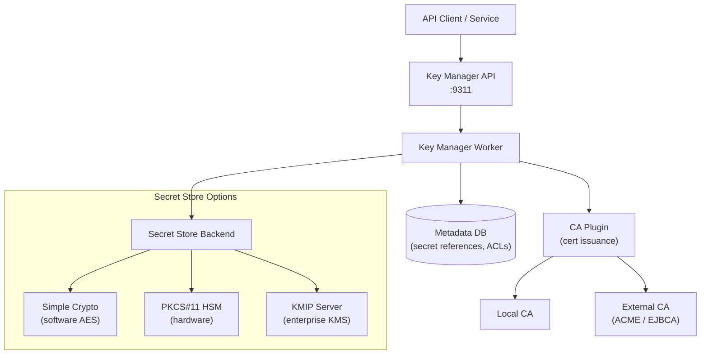
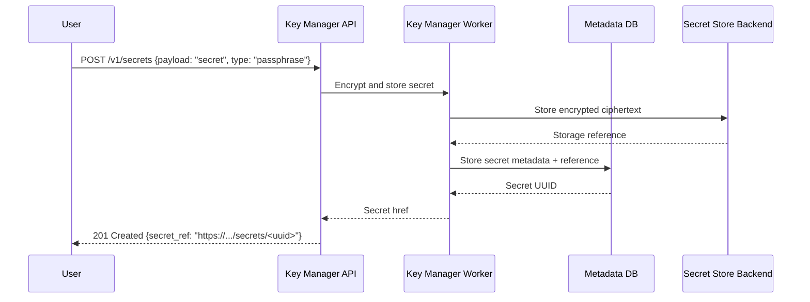

## Overview

The Key Manager service separates the API layer from the secret store backend, allowing
the encryption backend to be swapped or scaled independently. Secret payloads are never
stored in the metadata database — only encrypted references. The actual ciphertext
resides exclusively in the configured secret store backend.

---

## Service Topology

---

## Component Descriptions

| Component | Role | Port |
|-----------|------|------|
| **Key Manager API** | REST API for secrets, containers, orders, ACLs | 9311 |
| **Key Manager Worker** | Orchestrates secret lifecycle and CA plugin communication | Internal |
| **Metadata DB** | Stores secret references, container metadata, ACLs — no secret payloads | Internal |
| **Secret Store Backend** | Stores encrypted secret ciphertext | Varies by backend |
| **CA Plugin** | Integrates with Certificate Authorities for automated certificate issuance | Internal |

---

## Secret Storage Flow

---

## Security Separation

<Info>
  The metadata database contains only encrypted references and ACL metadata — never
  plaintext secret payloads. Even if the metadata database is compromised, secret
  payloads cannot be extracted without also compromising the secret store backend.
</Info>

| Data | Location | Contains |
|------|----------|---------|
| Secret metadata | Metadata DB | Name, type, content type, expiration, ACLs |
| Secret payload | Secret store backend | Encrypted ciphertext only |
| Encryption keys | Secret store backend | Master wrapping keys (HSM) or key files (simple) |

---

## Next Steps

<CardGroup cols={2}>
  <Card title="Backend Configuration" href="/services/key-manager/backend-config" color="#bf9667">
    Configure simple crypto, PKCS#11, and KMIP backends
  </Card>
  <Card title="Secret Stores" href="/services/key-manager/secret-stores" color="#bf9667">
    Manage multiple backends and per-project store assignments
  </Card>
  <Card title="Security" href="/services/key-manager/security" color="#bf9667">
    Harden the Key Manager service and protect master keys
  </Card>
  <Card title="Troubleshooting" href="/services/key-manager/admin-troubleshooting" color="#bf9667">
    Diagnose and resolve Key Manager platform issues
  </Card>
</CardGroup>
