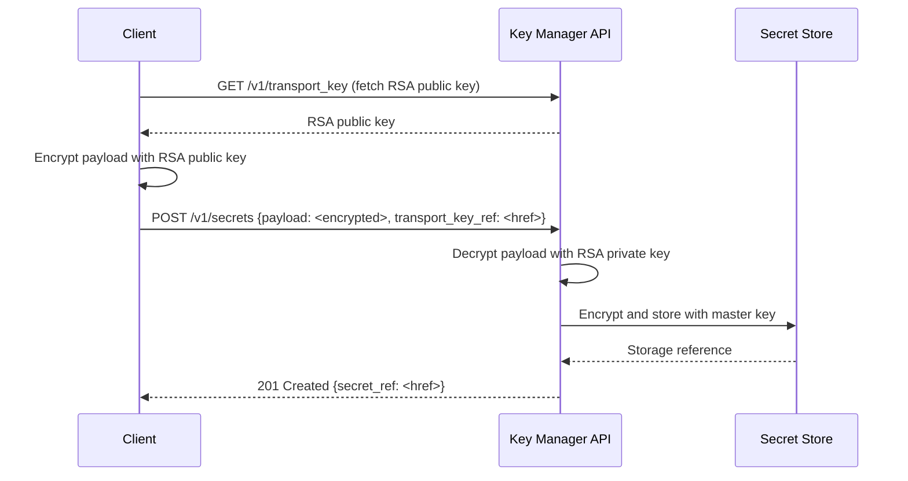

import AdminWarning from '/snippets/admin-warning.mdx';

## Overview

Transport keys enable clients to encrypt secret payloads before transmission,
ensuring secrets never appear in plaintext on the network or in intermediary processes.
The transport key is an RSA public key published by the Key Manager API. Clients
encrypt their secret payload with this key before POSTing to the API — the Key Manager
service uses its corresponding private key to unwrap the payload on the server side.

<AdminWarning />

---

## How Transport Keys Work



<Info>
  Transport keys only protect secrets in transit. Stored secrets are encrypted using
  the secret store backend's master key, not the transport key.
</Info>

---

## View the Transport Key

```bash title="Get the current transport key"
openstack secret transport key get
```

The output contains an RSA public key in PEM format. API clients use this to wrap
(encrypt) their secret payload before submission.

---

## Use a Transport Key in Secret Creation

```bash title="Create secret with transport key wrapping"
# Fetch transport key
TRANSPORT_KEY_REF=$(openstack secret transport key get -c "Transport Key href" -f value)

# Encrypt payload with the transport key
WRAPPED_PAYLOAD=$(echo -n "S3cur3P@ss" | \
  openssl rsautl -encrypt -pubin -inkey <(openstack secret transport key get --payload) | \
  base64 -w 0)

# Submit encrypted payload
openstack secret store \
  --transport-key-ref "$TRANSPORT_KEY_REF" \
  --payload-content-encoding base64 \
  --payload "$WRAPPED_PAYLOAD" \
  --name secure-credential
```

---

## Transport Key Rotation

Transport key rotation is managed through XDeploy service configuration. After
generating a new RSA key pair:

<Steps titleSize="h3">
  <Step title="Generate a new RSA key pair">
    Generate a new RSA key pair for the transport key in XDeploy Key Manager configuration.
  </Step>
  <Step title="Update Key Manager configuration">
    Update the Key Manager configuration to reference the new key pair.
  </Step>
  <Step title="Deploy the updated configuration">
    ```bash title="Deploy Key Manager configuration"
    ironcore-ansible deploy -t barbican
    ```
  </Step>
  <Step title="Notify API clients">
    Notify API clients that use transport key wrapping to retrieve the new transport key
    from the API:
    ```bash title="Fetch updated transport key"
    openstack secret transport key get
    ```
  </Step>
</Steps>

<Warning>
  Existing secrets encrypted with the old transport key remain accessible — they are
  stored using the secret store backend encryption, not the transport key. Transport keys
  only protect secrets in transit during the creation request.
</Warning>

---

## Next Steps

<CardGroup cols={2}>
  <Card title="Backend Configuration" href="/services/key-manager/backend-config" color="#197560">
    Configure the backend that stores encrypted secret payloads
  </Card>
  <Card title="Security" href="/services/key-manager/security" color="#197560">
    Full Key Manager security hardening guidelines
  </Card>
  <Card title="Secret Stores" href="/services/key-manager/secret-stores" color="#197560">
    Manage multiple secret store backends
  </Card>
  <Card title="Admin Troubleshooting" href="/services/key-manager/admin-troubleshooting" color="#197560">
    Diagnose transport key and backend connectivity issues
  </Card>
</CardGroup>
