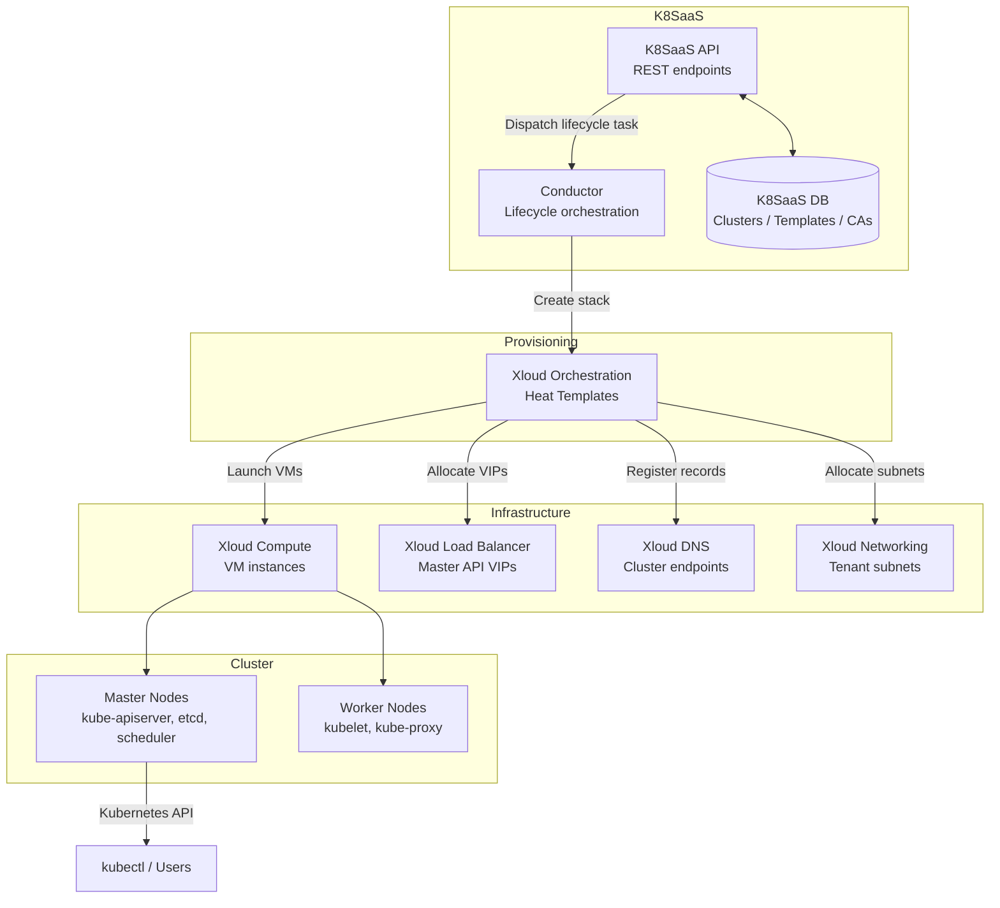
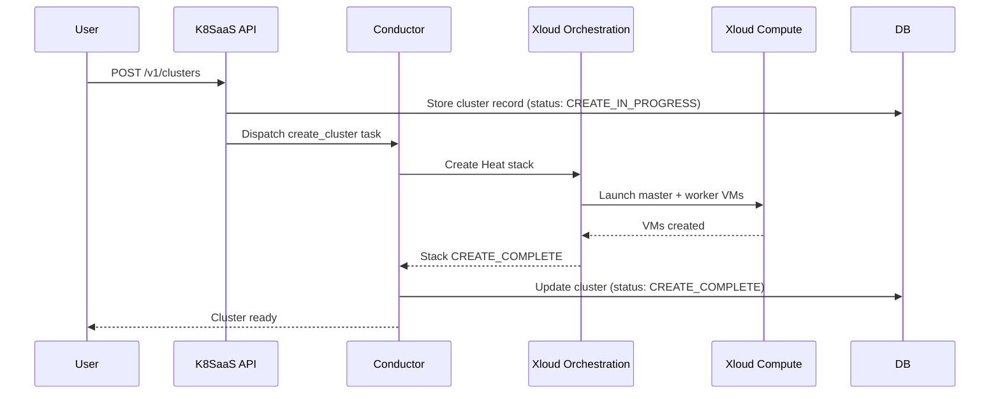

## Overview

Xloud Kubernetes as a Service (K8SaaS) automates the full lifecycle of Kubernetes clusters
on top of Xloud infrastructure services. The platform is built around a Conductor that
orchestrates cluster create, update, delete, and upgrade operations by composing calls to
Compute, Load Balancer, DNS, and Networking services through Xloud Orchestration templates.

<Warning>
  This guide requires administrator privileges. Misconfiguring the cluster driver or
  Orchestration integration affects all clusters across the platform.
</Warning>

---

## Component Architecture

---

## Components

<AccordionGroup>
  <Accordion title="K8SaaS API" icon="code" defaultOpen>
    RESTful API that accepts cluster lifecycle requests (create, update, delete, upgrade,
    config). Validates requests, stores state in the K8SaaS database, and dispatches
    async tasks to the Conductor.

    Deployed as: `magnum_api` container on controller nodes, behind the load balancer.
  </Accordion>
  <Accordion title="Conductor" icon="cpu">
    Long-running worker that executes cluster lifecycle operations. For each operation,
    it creates or updates an Orchestration stack, monitors stack progress, and updates
    cluster status in the database.

    Deployed as: `magnum_conductor` container on controller nodes. Multiple conductors
    can run for horizontal scaling — each claims tasks from the queue.
  </Accordion>
  <Accordion title="Cluster Database" icon="database">
    Stores cluster definitions, template configurations, node group state, and cluster
    CA private keys. Backed by the platform MariaDB instance.

    Schema includes: `cluster`, `cluster_template`, `nodegroup`, `x509keypair` tables.
  </Accordion>
  <Accordion title="Orchestration Templates" icon="layers">
    Each cluster driver (kubernetes) ships Heat templates that describe the full cluster
    resource stack: VM instances, network ports, floating IPs, security groups, LB members,
    and node bootstrap scripts.

    Template location: `/usr/lib/python3/dist-packages/magnum/drivers/k8s_fedora_coreos_v1/templates/`
  </Accordion>
</AccordionGroup>

---

## Cluster Provisioning Flow

---

## Infrastructure Dependencies

| Service | Role | Minimum Version |
|---------|------|----------------|
| Xloud Compute | VM instances for master and worker nodes | 2025.1 |
| Xloud Orchestration | Stack management for cluster resources | 2025.1 |
| Xloud Load Balancer | API server VIP and Kubernetes service LBs | 2025.1 |
| Xloud Networking | Tenant subnet allocation for cluster nodes | 2025.1 |
| Xloud DNS | Endpoint records for ingress and services | Optional |
| Xloud Block Storage | Persistent volume claims for stateful workloads | 2025.1 |
| Xloud Key Management | Cluster CA private key storage (optional) | Optional |

---

## Deployment Topology

<Tree>
  <Tree.Folder name="Controller Nodes" defaultOpen>
    <Tree.File name="magnum_api — REST API" />
    <Tree.File name="magnum_conductor — Lifecycle orchestration" />
  </Tree.Folder>
  <Tree.Folder name="Cluster Nodes (per cluster)" defaultOpen>
    <Tree.Folder name="Master Nodes">
      <Tree.File name="kube-apiserver" />
      <Tree.File name="etcd" />
      <Tree.File name="kube-scheduler" />
      <Tree.File name="kube-controller-manager" />
    </Tree.Folder>
    <Tree.Folder name="Worker Nodes">
      <Tree.File name="kubelet" />
      <Tree.File name="kube-proxy" />
      <Tree.File name="CNI plugin (calico or flannel)" />
    </Tree.Folder>
  </Tree.Folder>
</Tree>

---

## Next Steps

<CardGroup cols={2}>
  <Card title="Cluster Drivers" href="/services/kubernetes/admin-guide/cluster-drivers" color="#197560">
    Configure and verify the Kubernetes cluster driver.
  </Card>
  <Card title="Template Management" href="/services/kubernetes/admin-guide/template-management" color="#197560">
    Create and manage public cluster templates for project teams.
  </Card>
  <Card title="Quotas" href="/services/kubernetes/admin-guide/quotas" color="#197560">
    Set per-project cluster and node count limits.
  </Card>
  <Card title="Security" href="/services/kubernetes/admin-guide/security" color="#197560">
    Configure TLS, RBAC, and node security groups.
  </Card>
</CardGroup>
