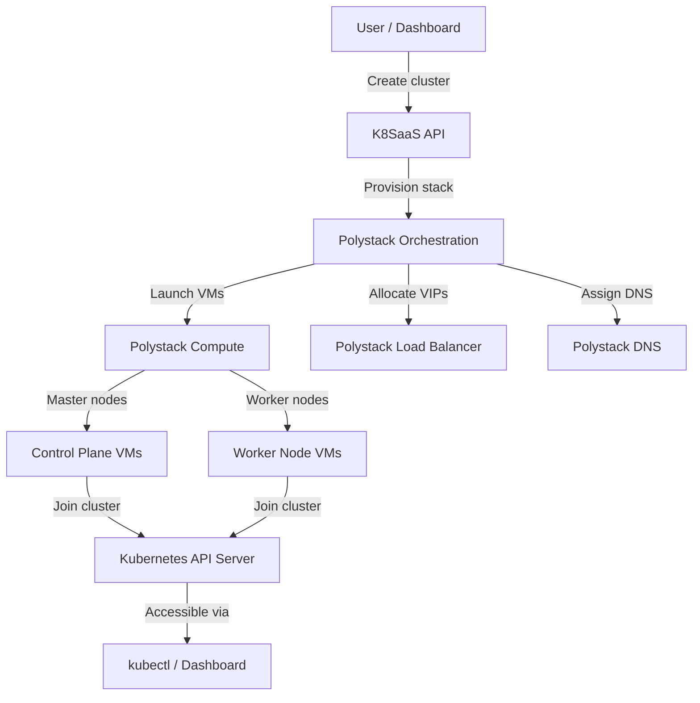

Deploy and manage production-grade Kubernetes clusters directly on your Polystack private
cloud. Polystack Kubernetes as a Service (K8SaaS) automates cluster provisioning, node
scaling, certificate management, and upgrades — giving teams a fully managed Kubernetes
experience on dedicated infrastructure.

<Card title="Ironcore — Advanced Virtualization Solutions" icon="up-right-from-square" href="https://polystack.tech/ironflex-hci/" color="#bf9667" horizontal>
  Product details on polystack.tech
</Card>

---

Kubernetes as a Service

<CardGroup cols={2}>
  <Card title="User Guide" icon="book-open" href="/services/kubernetes/user-guide" color="#bf9667">
    Create cluster templates, deploy Kubernetes clusters, scale node groups, access
    clusters via kubectl, and manage the full cluster lifecycle.
  </Card>
  <Card title="Admin Guide" icon="shield-halved" href="/services/kubernetes/admin-guide" color="#bf9667">
    Configure cluster drivers, manage quotas, administer certificate authorities,
    choose container runtimes, and monitor cluster health across projects.
  </Card>
  <Card title="CLI Reference" icon="terminal" href="/services/kubernetes/cli-reference" color="#bf9667">
    Create cluster templates, provision clusters, manage node groups, and retrieve
    kubeconfig files using the openstack CLI.
  </Card>
  <Card title="Compute Service" icon="server" href="/services/compute" color="#bf9667">
    Polystack Compute provides the virtual machine instances that form Kubernetes master
    and worker nodes.
  </Card>
</CardGroup>

---

Key Capabilities

<CardGroup cols={2}>
  <Card title="One-Click Cluster Provisioning" icon="rocket" href="/services/kubernetes/user-guide/deploy-cluster" color="#bf9667">
    Deploy a fully configured Kubernetes cluster from a template in minutes — nodes,
    networking, certificates, and API access configured automatically.
  </Card>
  <Card title="Elastic Node Scaling" icon="up-right-and-down-left-from-center" href="/services/kubernetes/user-guide/scale-cluster" color="#bf9667">
    Scale worker node groups up or down on demand. Autoscaling policies adapt cluster
    capacity to workload pressure automatically.
  </Card>
  <Card title="Multi-Node-Group Clusters" icon="layer-group" href="/services/kubernetes/user-guide/node-groups" color="#bf9667">
    Create heterogeneous clusters with multiple node groups — differentiated by flavor,
    availability zone, or hardware profile — for GPU, memory-optimized, and general
    workloads.
  </Card>
  <Card title="Automated Certificate Management" icon="lock" href="/services/kubernetes/admin-guide/certificates" color="#bf9667">
    Cluster certificates are generated, rotated, and managed automatically. No manual
    PKI configuration required.
  </Card>
  <Card title="Network Plugin Choice" icon="network-wired" href="/services/kubernetes/admin-guide/network-drivers" color="#bf9667">
    Choose between Flannel (simple overlay) and Calico (network policy enforcement)
    at cluster template creation time. Switch plugins between clusters, not within.
  </Card>
  <Card title="Cluster Upgrades" icon="arrow-up" href="/services/kubernetes/user-guide/cluster-upgrades" color="#bf9667">
    Perform rolling Kubernetes version upgrades with zero downtime — master nodes
    upgraded first, worker nodes drained and replaced sequentially.
  </Card>
</CardGroup>

---

How It Works

---

Supported Kubernetes Versions

<Note>
  Supported Kubernetes versions are determined by the cluster templates deployed on
  your platform. Contact your administrator for the available version matrix.
</Note>

| Channel | Version | Status |
|---------|---------|--------|
| Stable | 1.29.x | <Badge color="green" size="sm" shape="pill">GA</Badge> |
| LTS | 1.28.x | <Badge color="green" size="sm" shape="pill">GA</Badge> |
| Preview | 1.30.x | <Badge color="blue" size="sm" shape="pill">Preview</Badge> |

---

Related Services

<CardGroup cols={3}>
  <Card title="Polystack Compute" icon="server" href="/services/compute" color="#bf9667">
    Virtual machine instances that run Kubernetes master and worker nodes
  </Card>
  <Card title="Polystack Load Balancer" icon="object-group" href="/services/load-balancer" color="#bf9667">
    API server and service load balancing for Kubernetes clusters
  </Card>
  <Card title="Polystack Networking" icon="network-wired" href="/services/networking/index" color="#bf9667">
    Tenant networks, floating IPs, and security groups for cluster nodes
  </Card>
  <Card title="Polystack Block Storage" icon="hard-drive" href="/services/storage/index" color="#bf9667">
    Persistent volume claims backed by Polystack block storage
  </Card>
  <Card title="Polystack DNS" icon="globe" href="/services/dns" color="#bf9667">
    DNS records for Kubernetes ingress and service endpoints
  </Card>
  <Card title="Polystack Key Management" icon="lock" href="/services/key-manager" color="#bf9667">
    Secrets management for cluster certificates and service credentials
  </Card>
</CardGroup>
