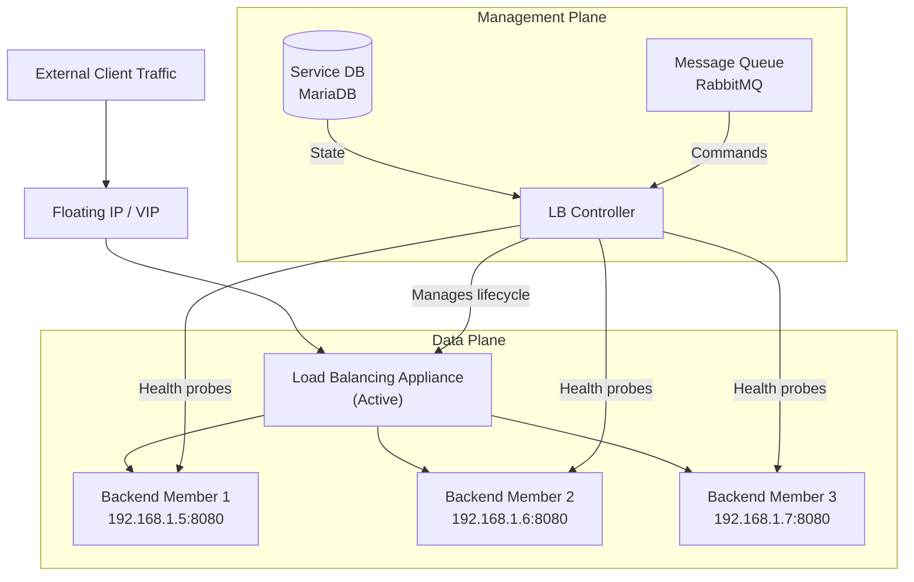

import AdminWarning from '/snippets/admin-warning.mdx';

## Overview

The Xloud Load Balancer service uses a controller-appliance model. The controller manages
the lifecycle of load balancing appliances and translates API requests into configuration.
The appliance processes all data-plane traffic — the controller does not handle production
traffic. Understanding this architecture is essential for capacity planning, HA configuration,
and troubleshooting.

<AdminWarning />

---

## Service Topology

---

## Component Reference

| Component | Description |
|-----------|-------------|
| **LB Controller** | Translates API requests into appliance configuration. Manages appliance lifecycle. Does not handle production traffic. |
| **Appliance** | A virtual machine instance running the load balancing software. Processes all data-plane traffic. Created per load balancer resource. |
| **Service DB** | MariaDB database storing load balancer resource state (listeners, pools, members, health monitors). |
| **Message Queue** | RabbitMQ queue for decoupled communication between the API and controller components. |
| **Management Network** | Dedicated network connecting the controller to appliances for configuration and health management. Isolated from tenant networks. |

---

## Data Plane vs Management Plane

<AccordionGroup>
  <Accordion title="Data plane" icon="zap" defaultOpen>
    The data plane carries production application traffic from clients to backend members.
    All data plane traffic flows through the appliance instance directly:
    - Client → Floating IP → Appliance VIP → Backend Member
    - The controller is **not** in the data path
    - Appliance failure = service interruption (use ACTIVE_STANDBY topology for HA)
  </Accordion>
  <Accordion title="Management plane" icon="settings">
    The management plane carries control traffic between the controller and appliances:
    - Configuration updates (new listeners, pool changes, member additions)
    - Health probe coordination
    - Appliance certificate management and renewal
    - TLS certificates on the management network prevent unauthorized appliance access
  </Accordion>
</AccordionGroup>

---

## High Availability Topologies

| Topology | Description | Use Case |
|----------|-------------|---------|
| `SINGLE` | One appliance instance per load balancer | Development and testing |
| `ACTIVE_STANDBY` | Active appliance + hot standby. Failover in seconds | Production workloads |

Configure the topology via a flavor profile. See [Flavor Profiles](/services/load-balancer/flavor-profiles).

---

## Deployment Considerations

<AccordionGroup>
  <Accordion title="Management network sizing" icon="network">
    The management network must provide enough IP addresses for all appliance instances
    plus spare capacity for concurrent provisioning. Size the management network DHCP
    pool at `(max concurrent LBs) × 2 + 10` addresses.
  </Accordion>
  <Accordion title="Compute resources for appliances" icon="server">
    Each load balancer appliance is a virtual machine consuming compute resources.
    In large deployments, ensure sufficient compute capacity is reserved for appliance
    instances. Consider a dedicated host aggregate for load balancer appliances.
  </Accordion>
</AccordionGroup>

---

## Next Steps

<CardGroup cols={2}>
  <Card title="Provider Drivers" href="/services/load-balancer/provider-drivers" color="#197560">
    Configure the underlying load balancing implementation.
  </Card>
  <Card title="Flavor Profiles" href="/services/load-balancer/flavor-profiles" color="#197560">
    Define appliance capacity tiers including HA topology selection.
  </Card>
  <Card title="Monitoring" href="/services/load-balancer/lb-monitoring" color="#197560">
    Monitor appliance health and management plane connectivity.
  </Card>
  <Card title="Security" href="/services/load-balancer/lb-security" color="#197560">
    Secure the management network and appliance certificate lifecycle.
  </Card>
</CardGroup>
