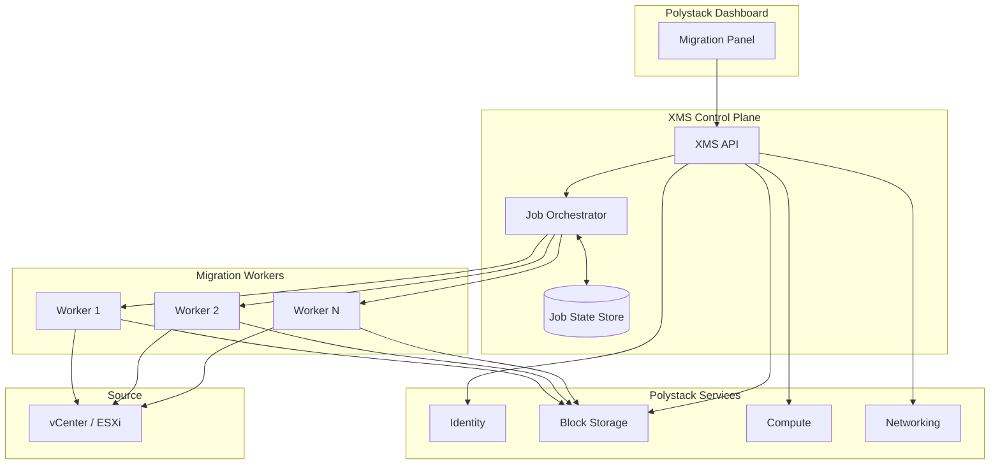
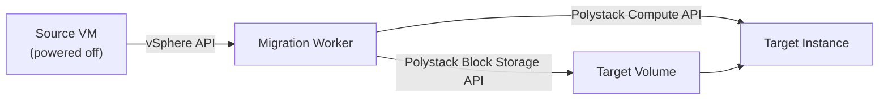
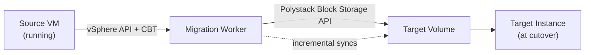

## Overview

XMS is a service inside the Polystack platform. It has a control plane that
exposes the user-facing APIs and a pool of migration workers that execute the
actual disk transport and guest conversion work. Both run alongside the rest
of Polystack and integrate with the platform's identity, storage, compute, and
networking services.

---

## Component Map

| Component | Responsibility |
|-----------|----------------|
| **Migration Panel** | User-facing UI in the Polystack Dashboard — sources, discovery, preflight, jobs, events |
| **XMS API** | REST API that the dashboard and CLI call. Validates requests, enforces project scoping, and hands jobs off to the orchestrator |
| **Job Orchestrator** | Assigns jobs to workers, tracks phase transitions, and publishes events |
| **Job State Store** | Authoritative store of every job's state, progress, and event history |
| **Migration Worker** | Executes the disk transport and guest conversion pipeline for a single job |

---

## Workload Data Flow

### Cold Migration

1. Worker opens a disk transport session against the source via vSphere API
2. Worker creates an empty target volume through Polystack Block Storage
3. Disk data is streamed from the source and written into the target volume
4. Guest conversion runs against the target volume
5. The target instance is created and attached to the target volume

### Warm Migration

1. Worker takes a baseline snapshot on the source
2. Full sync copies every block into the target volume
3. Between syncs, the job sits idle in the **Ready** state
4. Each incremental sync reads only the blocks that changed since the last
   baseline and writes them to the same offsets in the target volume
5. At cutover, a final incremental sync and guest conversion run before the
   target instance is launched

---

## Disk Transport Libraries

XMS uses the vSphere storage APIs and a disk transport library to read
source VM disks efficiently. The library version is selected to match the
source vSphere version and is an operator-managed component of the XMS
deployment.

<Tip>
  The transport library is the same code path for cold migrations, warm full
  syncs, and warm incremental syncs — only the set of blocks read differs
  between the three cases.
</Tip>

---

## Integration with Polystack Services

| Polystack Service | Purpose |
|---------------|---------|
| **Identity** | Project scoping, token validation, and role enforcement for every XMS API call |
| **Block Storage** | Target volumes are created and written through the platform's block storage API, so they are indistinguishable from volumes created any other way |
| **Compute** | The target instance is a normal Polystack compute instance — flavors, networking, and metadata all apply as usual |
| **Networking** | Target instance NICs are attached to target Polystack networks using the network mapping chosen at submit time |

Because migrated volumes and instances are native Polystack objects, the standard
Polystack tooling — quotas, volume types, availability zones, security groups,
snapshots, backups — applies automatically.

---

## Multi-Source, Multi-Project

A single XMS deployment can:

- Register multiple source environments (one or more vCenters, standalone
  ESXi hosts)
- Run concurrent migration jobs across different sources
- Target different Polystack projects for different migrations

<Note>
  Project scoping is enforced at the API layer using the caller's identity
  token — users only see migrations for projects they are authorized to access.
</Note>

---

## Next Steps

<CardGroup cols={3}>
  <Card title="Prerequisites" href="/services/migration/admin-guide/prerequisites" color="#197560">
    Platform, project, quota, and identity prerequisites
  </Card>
  <Card title="Network Ports" href="/services/migration/admin-guide/network-ports" color="#197560">
    Which ports must be reachable between XMS, sources, and targets
  </Card>
  <Card title="Capacity Planning" href="/services/migration/admin-guide/capacity-planning" color="#197560">
    Sizing XMS for concurrent migrations and multi-wave campaigns
  </Card>
</CardGroup>
