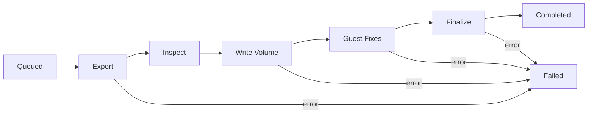

## Overview

Cold migration is the simplest way to move a workload from VMware to Polystack.
The source VM is powered off, all disks are exported through the vSphere API,
written into Polystack Block Storage volumes, converted for Polystack drivers, and
the migrated instance is started in the target Polystack project. The source VM
remains in the source environment (powered off) until you confirm the
migration succeeded.

<Note>
  **Prerequisites**
  - A discovered workload that has passed [preflight assessment](/services/migration/user-guide/preflight)
  - A target Polystack project with sufficient quota for the compute, memory, and
    volume footprint of the migrated VM
  - A target Polystack network that can host the migrated VM's NICs
  - An acceptable maintenance window — the source VM will be powered off for
    the duration of the migration
</Note>

---

## Lifecycle



| Stage | What Happens |
|-------|--------------|
| **Queued** | The job is accepted and waits for an available worker slot |
| **Export** | Source VM is powered off; disks are streamed over the vSphere API |
| **Inspect** | Guest OS family, firmware, and disk layout are detected |
| **Write Volume** | A new Polystack Block Storage volume is created and disk data is written directly into it |
| **Guest Fixes** | VirtIO drivers are injected, the boot loader is repaired, and hypervisor-specific tooling is removed |
| **Finalize** | The volume is marked bootable, metadata is attached, and the target Polystack instance is prepared |
| **Completed** | The target instance is created and ready to launch |

---

## Submit a Cold Migration

<Tabs>
  <Tab title="Dashboard" icon="gauge">
    <Steps titleSize="h3">
      <Step title="Open the Migrations tab" icon="truck">
        Navigate to **Migration → Migrations** and click **New Migration**.
        Select **Cold Migration** and pick the source environment.
      </Step>
      <Step title="Select the workload" icon="check-square">
        Pick one or more VMs from the discovered inventory. Each selected VM
        must have a Pass or Warn preflight verdict.
      </Step>
      <Step title="Choose target project and quota" icon="folder">
        | Field | Description |
        |-------|-------------|
        | **Target Project** | Polystack project to receive the migrated instance |
        | **Instance Name** | Name in the target project (defaults to the source VM name) |
        | **Flavor** | Polystack flavor that matches or exceeds the source vCPU and memory |
        | **Volume Type** | Target storage tier for the migrated volumes |
        | **Availability Zone** | Optional — pin the instance to a specific zone |
      </Step>
      <Step title="Map networks" icon="network">
        For each source NIC, pick a target Polystack network and subnet. You can
        optionally request the same MAC address on the target network, subject
        to network policy.

        <Tip>
          Save a network mapping as a reusable profile if you plan to migrate
          many VMs from the same source into the same target environment.
        </Tip>
      </Step>
      <Step title="Review and submit" icon="play">
        Review the job summary, estimated runtime, and target resources. Click
        **Submit**. The job enters **Queued** state and is picked up by the
        next available migration worker.
      </Step>
      <Step title="Watch live progress" icon="activity">
        The **Migrations** tab updates live with per-stage progress, bytes
        transferred, and an event stream. A completed job shows a link to
        the newly created Polystack instance.

        <Check>Job status reaches **Completed** and the target instance is visible in the Polystack Dashboard.</Check>
      </Step>
    </Steps>
  </Tab>
  <Tab title="CLI" icon="terminal">
    ```bash
    # Submit a cold migration for a single VM
    xms migration submit \
      --source prod-vcenter \
      --vm win-ser-2022 \
      --kind cold \
      --target-project infra \
      --flavor m1.large \
      --volume-type ssd \
      --network-map 'VM Network=internal-net'

    # Watch live progress
    xms migration events --job <job-id> --follow

    # Inspect the result
    xms migration show <job-id>
    ```
  </Tab>
</Tabs>

---

## What Happens to the Source VM

<CardGroup cols={2}>
  <Card title="During Migration" icon="pause" color="#197560">
    The source VM is powered off. All reads happen through the vSphere API,
    and the source disks are **never** written to — the migration is
    read-only on the source side.
  </Card>
  <Card title="After Migration" icon="shield" color="#197560">
    The source VM remains powered off in its source environment. XMS does
    not delete it — you choose when to decommission the source after you
    have validated the migrated instance on Polystack.
  </Card>
</CardGroup>

<Warning>
  Do **not** power the source VM back on after cutover if the target instance
  has already booted on Polystack. The two VMs share identity (hostname, MAC,
  disk UUIDs) and running both simultaneously can cause network and
  storage-level conflicts.
</Warning>

---

## Progress and Event Stream

Every cold migration publishes a stream of events that are visible live in
the **Migrations** tab:

| Event | When It Fires |
|-------|---------------|
| `source.powered_off` | Source VM has reached `poweredOff` |
| `export.started` | Disk export has opened a session with the source |
| `export.progress` | Emitted periodically with bytes transferred |
| `write.started` | Target volume has been created and disk write has begun |
| `write.progress` | Emitted periodically during volume write |
| `guest_fixes.started` | VirtIO driver injection and boot loader repair have begun |
| `finalize.completed` | Target volume is bootable and attached to the target instance |
| `migration.completed` | Job is complete — target instance is ready |

---

## Next Steps

<CardGroup cols={3}>
  <Card title="Post-Migration Validation" href="/services/migration/user-guide/post-migration" color="#197560">
    Verify the migrated instance boots and works as expected
  </Card>
  <Card title="Warm Migration" href="/services/migration/user-guide/warm-migration" color="#197560">
    Use incremental sync for workloads that can't tolerate a maintenance window
  </Card>
  <Card title="Troubleshooting" href="/services/migration/user-guide/troubleshooting" color="#197560">
    Diagnose stuck jobs and guest boot issues
  </Card>
</CardGroup>
