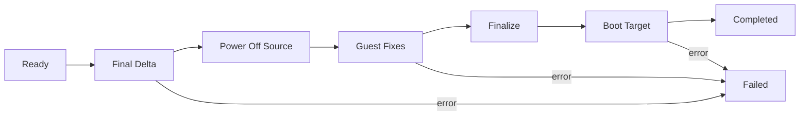

## Overview

Cutover is the final step of a warm migration. XMS takes a last incremental
sync to bring the target volume fully up to date, powers off the source VM,
runs guest conversion against the target volume, and launches the migrated
instance on Polystack. When cutover completes, the source VM is left powered off
and the target instance is the authoritative copy.

<Note>
  **Prerequisites**
  - A warm migration job in **Ready** state (full sync completed and at least
    one successful incremental sync)
  - A maintenance window long enough for the final sync, guest conversion,
    and target boot — typically a few minutes for small workloads
  - Agreement from the workload owner that the source VM can be powered off
</Note>

---

## Lifecycle



| Phase | What Happens |
|-------|--------------|
| **Final Delta** | A last incremental sync transfers any blocks that changed since the previous sync. |
| **Power Off Source** | XMS issues a graceful shutdown to the source VM. If the guest does not respond in time, a hard power off is used. |
| **Guest Fixes** | VirtIO drivers are injected, the boot loader is repaired, and hypervisor-specific tooling is removed. |
| **Finalize** | The target volume is marked bootable and attached to the target instance record. |
| **Boot Target** | The target Polystack instance is launched from the migrated volume. |
| **Completed** | Cutover is complete — the target instance is running on Polystack. |

---

## Trigger Cutover

<Tabs>
  <Tab title="Dashboard" icon="gauge">
    <Steps titleSize="h3">
      <Step title="Open the warm migration job" icon="folder">
        Navigate to **Migration → Warm Migration** and select the job you want
        to cut over. The job must be in **Ready** state.
      </Step>
      <Step title="Confirm the lag is acceptable" icon="clock">
        Check the **Lag** column. A low lag means the final delta sync will be
        quick. If the lag is high, trigger a **Sync Now** first and wait for
        it to finish before starting cutover.
      </Step>
      <Step title="Click Cutover" icon="play">
        Click **Cutover**. A confirmation dialog summarizes what happens next:

        - Final incremental sync runs immediately
        - Source VM is powered off
        - Guest conversion runs against the target volume
        - Target Polystack instance is launched

        Confirm to proceed. The job transitions to **Cutting Over**.
      </Step>
      <Step title="Watch live progress" icon="activity">
        The panel shows live progress for every phase. Events stream in real
        time — final delta bytes, source power off state, guest conversion
        steps, and target boot.

        <Check>Job status reaches **Completed** and the target instance is visible in the Polystack Dashboard.</Check>
      </Step>
      <Step title="Validate the target" icon="check-square">
        Click the link to the target instance, confirm it reaches an active
        power state, and proceed to
        [post-migration validation](/services/migration/user-guide/post-migration).
      </Step>
    </Steps>
  </Tab>
  <Tab title="CLI" icon="terminal">
    ```bash
    # Trigger cutover on an existing warm job
    xms migration cutover --job <job-id>

    # Stream events live
    xms migration events --job <job-id> --follow

    # Confirm final status
    xms migration show <job-id>
    ```
  </Tab>
</Tabs>

---

## What Happens to the Source VM

<CardGroup cols={2}>
  <Card title="During Cutover" icon="pause" color="#197560">
    XMS issues a graceful shutdown to the source. If the guest does not
    respond within the configured timeout, a hard power off is used to keep
    the cutover window tight.
  </Card>
  <Card title="After Cutover" icon="shield" color="#197560">
    The source VM stays powered off in its source environment. XMS does not
    delete the source — decommission it manually only after you have validated
    the migrated workload on Polystack.
  </Card>
</CardGroup>

<Warning>
  Do **not** power the source VM back on after cutover. The source and target
  share identity (hostname, MAC, disk UUIDs) and running both simultaneously
  can cause network and storage-level conflicts.
</Warning>

---

## Cutover Window

The cutover window is the time between the start of the final delta sync and
the target instance booting on Polystack. It determines how long the workload is
unavailable. Typical contributions:

| Phase | Typical Duration |
|-------|-----------------|
| **Final delta sync** | Seconds to a few minutes — depends on churn since the last incremental |
| **Source power off** | Seconds to a minute — graceful shutdown of the guest |
| **Guest fixes** | 30 seconds to a few minutes — VirtIO driver injection and boot loader repair |
| **Finalize and boot** | Under a minute — attach volume and launch target instance |

<Tip>
  To minimize the cutover window, run a manual **Sync Now** immediately before
  triggering cutover. This reduces the number of blocks the final delta has to
  transfer.
</Tip>

---

## Rollback

If cutover fails at any phase before the target boots, XMS leaves the source
VM powered off and the job in **Failed** state. You can:

- Power the source VM back on manually — the source data is unchanged
- Inspect the failure in the event stream and in
  [Troubleshooting](/services/migration/user-guide/troubleshooting)
- Re-trigger cutover once the underlying issue is resolved

If the target instance has already booted and you need to roll back, treat
the target as the authoritative copy and migrate back from Polystack to VMware
separately — there is no in-place revert once the target is live.

<Warning>
  A target instance that has booted on Polystack and accepted writes **cannot** be
  reverted to the source by XMS. Plan cutover timing so you have confidence in
  the migrated workload before releasing it to users.
</Warning>

---

## Next Steps

<CardGroup cols={3}>
  <Card title="Post-Migration Validation" href="/services/migration/user-guide/post-migration" color="#197560">
    Verify the migrated instance boots, networks, and behaves correctly
  </Card>
  <Card title="Troubleshooting" href="/services/migration/user-guide/troubleshooting" color="#197560">
    Diagnose failed cutovers, stuck guest conversion, and boot errors
  </Card>
  <Card title="Warm Migration" href="/services/migration/user-guide/warm-migration" color="#197560">
    Review the warm migration lifecycle and sync mechanics
  </Card>
</CardGroup>
