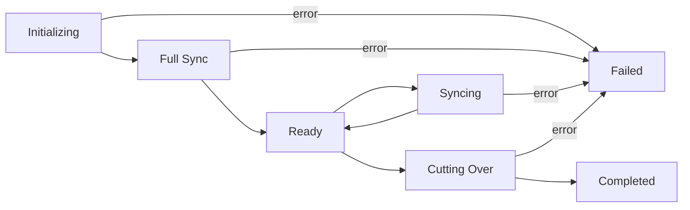
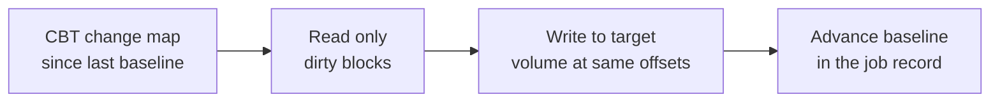

## Overview

Warm migration moves a workload from VMware to Xloud while the source VM
continues to run. XMS takes a snapshot on the source, copies the full disk
contents into a target Xloud Block Storage volume, and then replicates only
the blocks that change on the source between syncs. When you trigger cutover,
XMS replicates the final delta, powers the source off, runs guest conversion,
and starts the target instance on Xloud — typically within minutes.

<Note>
  **Prerequisites**
  - A discovered workload that has passed [preflight assessment](/services/migration/user-guide/preflight)
  - Changed Block Tracking (CBT) available on the source host
  - A target Xloud project with enough quota for the compute, memory, and
    volume footprint of the migrated VM
  - A stable network path between the migration service and the source
    environment that can sustain the full sync and incremental syncs
</Note>

---

## Lifecycle



| Phase | Meaning |
|-------|---------|
| **Initializing** | XMS enables CBT on the source if needed and records a change tracking baseline |
| **Full Sync** | The entire disk contents are copied to the target volume. Source VM keeps running the whole time. |
| **Ready** | Initial copy is complete. The job sits idle between scheduled syncs. |
| **Syncing** | An incremental sync is in progress — only blocks changed since the last baseline are read and applied |
| **Cutting Over** | Final delta sync, source power off, guest conversion, and target boot |
| **Completed** | Target instance is running on Xloud |

---

## Submit a Warm Migration

<Tabs>
  <Tab title="Dashboard" icon="gauge">
    <Steps titleSize="h3">
      <Step title="Start a new migration" icon="rotate-cw">
        Navigate to **Migration → Migrations** and click **New Migration**.
        Select **Warm Migration** as the migration type and pick the source
        environment.
      </Step>
      <Step title="Pick source workload" icon="check-square">
        Select the VM from the discovered inventory. Only VMs with a Pass or
        Warn preflight verdict are eligible.
      </Step>
      <Step title="Configure target" icon="folder">
        | Field | Description |
        |-------|-------------|
        | **Target Project** | Xloud project that will host the migrated instance |
        | **Instance Name** | Name the target instance will use after cutover |
        | **Flavor** | Xloud flavor to match or exceed the source shape |
        | **Volume Type** | Storage tier for the target volume (chosen once, used for every sync) |
        | **Availability Zone** | Optional — pin the target instance to a zone |
      </Step>
      <Step title="Map networks and set sync schedule" icon="network">
        Map every source NIC to a target Xloud network and subnet. Choose a
        sync cadence:

        | Cadence | Typical Use |
        |---------|-------------|
        | **Manual** | You trigger each incremental sync explicitly |
        | **Every 15 min** | Small, steady-state workloads |
        | **Hourly** | Medium workloads with predictable churn |
        | **Daily** | Large workloads or low-churn archives |

        <Tip>
          You can change the cadence at any time. Scheduling sync only
          controls how often new syncs start — it does not affect cutover.
        </Tip>
      </Step>
      <Step title="Start full sync" icon="play">
        Click **Start Full Sync**. XMS takes the baseline snapshot on the
        source, starts streaming disk data, and writes it into the target
        volume. The panel shows live progress — bytes read, bytes written,
        and estimated completion time.
      </Step>
      <Step title="Monitor ready state" icon="activity">
        When the full sync completes, the job transitions to **Ready**. From
        here, you can let the scheduler drive incrementals or trigger
        **Sync Now** manually.

        The **Last Sync** and **Lag** columns in the job list show how far
        behind the target is from the source.

        <Check>Job status reaches **Ready** and per-sync lag stays within your tolerance.</Check>
      </Step>
    </Steps>
  </Tab>
  <Tab title="CLI" icon="terminal">
    ```bash
    # Submit a warm migration
    xms migration submit \
      --source prod-vcenter \
      --vm db-prod-01 \
      --kind warm \
      --target-project infra \
      --flavor m1.xlarge \
      --volume-type ssd \
      --network-map 'VM Network=internal-net' \
      --sync-cadence 1h

    # Trigger an incremental sync manually
    xms migration sync --job <job-id>

    # Watch the lag
    xms migration show <job-id>
    ```
  </Tab>
</Tabs>

---

## How Incremental Sync Works

XMS uses vSphere Changed Block Tracking (CBT) to read only the blocks that
have changed since the previous sync. Each sync runs through the same disk
transport library used for the full sync, so the data path is identical — the
only difference is that incremental syncs read the change map first and then
stream only the dirty regions.



Because every write targets the same offsets on the same Xloud Block Storage
volume, there is no intermediate copy and the target volume is always a
byte-for-byte current replica of the source at the time of the last sync.

---

## Ready, Waiting for Cutover

Once the full sync has completed, the job stays in **Ready** state indefinitely.
You can:

- Let the scheduler run incrementals on the cadence you configured
- Trigger **Sync Now** manually to force an incremental at any time
- **Pause** the job to stop incrementals without losing progress
- Proceed to [cutover](/services/migration/user-guide/cutover) when you are
  ready to switch the workload to Xloud

<Warning>
  The job retains CBT baselines as long as it is active. If you pause a warm
  migration for an extended period, re-enable CBT tracking and run a fresh
  sync before cutover to keep the delta small.
</Warning>

---

## Sync Metrics

Each warm migration exposes live sync metrics in the Warm Migration tab:

| Metric | Description |
|--------|-------------|
| **Last Sync** | Timestamp of the most recent completed sync |
| **Lag** | Time elapsed since the last successful sync |
| **Bytes (Full)** | Total bytes read during the initial full sync |
| **Bytes (Incr)** | Total bytes transferred across all incremental syncs so far |
| **Sync Count** | Number of successful incremental syncs performed |
| **Rate** | Current sync throughput (bytes/s during active sync) |

---

## Next Steps

<CardGroup cols={3}>
  <Card title="Cutover" href="/services/migration/user-guide/cutover" color="#197560">
    Execute the final sync and switch the workload to Xloud
  </Card>
  <Card title="Post-Migration Validation" href="/services/migration/user-guide/post-migration" color="#197560">
    Verify the migrated instance boots and behaves correctly
  </Card>
  <Card title="Troubleshooting" href="/services/migration/user-guide/troubleshooting" color="#197560">
    Diagnose stalled syncs, CBT resets, and connectivity errors
  </Card>
</CardGroup>
