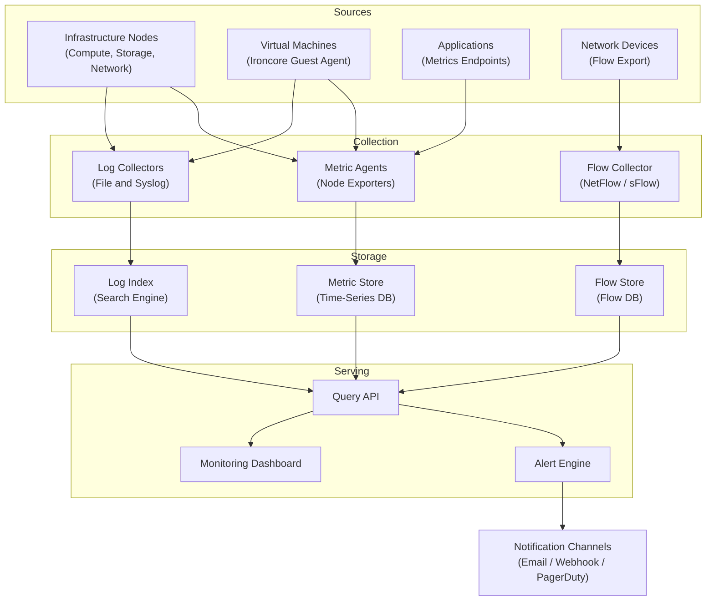

import AdminWarning from '/snippets/admin-warning.mdx';

## Overview

Monitoring is composed of multiple service layers that collect, transport, store, and serve
observability data to operators and automation systems. Understanding the architecture
helps administrators plan deployments, troubleshoot ingestion issues, and optimize
resource allocation for the monitoring platform itself.

<AdminWarning />

<Tabs>
  <Tab title="Web Console" icon="server">
    Monitoring services are enabled and configured through the deployment console Configuration panel:

    <Steps titleSize="h3">
      <Step title="Open Configuration" icon="gear">
        Navigate to **the deployment console → Configuration** and select the **Monitoring** tab.
      </Step>
      <Step title="Enable monitoring components" icon="toggle-left">
        Toggle the monitoring services your deployment requires:

        | Setting | Description |
        |---------|-------------|
        | **Enable Prometheus** | Metric collection and time-series storage |
        | **Enable Grafana** | Visualization dashboards and metric exploration |
        | **Enable Central Logging** | Log collection, indexing, and search (OpenSearch + Fluentd) |
        | **CIS Compliance Level** | Security compliance scanning tier |
        | **Scan Schedule** | Automated compliance scan frequency |
      </Step>
      <Step title="Save and deploy" icon="rocket">
        Click **Save Configuration**, then navigate to **the deployment console → Operations** and
        run a **Deploy** or **Reconfigure** for the monitoring services.

        <Check>Monitoring monitoring stack is deployed and collecting data.</Check>
      </Step>
    </Steps>
  </Tab>
  <Tab title="CLI" icon="terminal">
    Configure monitoring services by editing configuration files directly at
    `/etc/ironcore/config/prometheus/`, `/etc/ironcore/config/grafana/`, and
    `/etc/ironcore/config/opensearch/`. See the individual component guides for
    detailed parameters.
  </Tab>
</Tabs>

---

## Architecture Diagram

---

## Service Components

| Layer | Component | Role |
|-------|-----------|------|
| **Collection** | Metric Agent | Runs on each node; scrapes metrics from local services and exports to metric store |
| **Collection** | Log Collector | Tails log files and forwards structured log events to the log index |
| **Collection** | Flow Collector | Receives NetFlow/sFlow exports from network devices for traffic analysis |
| **Storage** | Metric Store | High-performance time-series database for metric retention and query |
| **Storage** | Log Index | Full-text search engine for log data with configurable retention |
| **Storage** | Flow Store | Database optimized for network flow record storage and aggregation |
| **Serving** | Query API | Unified query interface for metrics, logs, and flow data |
| **Serving** | Alert Engine | Evaluates rules against live metric and log streams; fires notifications |
| **Serving** | Dashboard | Web interface for visualization, exploration, and alert management |

---

## Component Deep Dive

<AccordionGroup>
  <Accordion title="Metric Agent" icon="activity">
    The Metric Agent runs as a systemd service (`monitoring-agent`) on every managed node.
    It scrapes metrics from:
    - Local node exporters (CPU, memory, disk, network)
    - Service-specific exporters registered as scrape targets
    - Application endpoints exposing metrics in the standard format

    Agents authenticate to the Monitoring collector using per-node tokens. Tokens are
    generated during node registration and rotated on a configurable schedule.

    Default scrape interval: **30 seconds**
  </Accordion>

  <Accordion title="Log Collector" icon="file-lines">
    The Log Collector tails configured log file paths and forwards events to the
    Log Index. It handles:
    - Multi-line log entries (stack traces, long SQL queries)
    - JSON-structured log parsing for service logs
    - Syslog reception for services that write to syslog instead of files

    Log collector configuration is defined in `/etc/monitoring/log-sources.yaml` on each
    managed node and managed by the deployment console.
  </Accordion>

  <Accordion title="Alert Engine" icon="bell">
    The Alert Engine evaluates all active alert rules against the metric and log
    streams on each collection cycle. When a rule's condition is met for the
    full evaluation period:
    1. An alert event is created and stored
    2. Notifications are sent to all configured channels
    3. The alert remains active until the condition is no longer met (resolution event)

    The engine supports inhibition rules and silence matching to reduce notification
    noise during major incidents or maintenance windows.
  </Accordion>
</AccordionGroup>

---

## Deployment Topology

<Tabs>
  <Tab title="Standard (Single-Node Monitoring)" icon="server">
    For environments up to ~50 monitored nodes, all Monitoring services can run on a
    single dedicated node:

    - Metric Store, Log Index, Flow Store co-located
    - Query API and Dashboard on the same node
    - Alert Engine evaluates all rules
    - Estimated resources: 8 vCPU, 32 GB RAM, 2 TB SSD storage
  </Tab>
  <Tab title="Scaled (Multi-Node Monitoring)" icon="layer-group">
    For larger environments (50+ nodes) or high-cardinality metric workloads,
    distribute Monitoring services:

    - Metric Store: dedicated node with NVMe storage for write throughput
    - Log Index: dedicated node with SSD storage for index performance
    - Multiple collector nodes for horizontal scraping scale
    - Shared Query API and Dashboard behind load balancer

    the deployment console manages the multi-node Monitoring deployment. Navigate to
    **the deployment console → Configuration → Monitoring** to configure the topology.
  </Tab>
</Tabs>

---

## Next Steps

<CardGroup cols={2}>
  <Card title="Agent Configuration" href="/services/monitoring/admin-guide/agent-config" color="#bf9667">
    Deploy and configure monitoring agents on managed nodes
  </Card>
  <Card title="Metric Endpoints" href="/services/monitoring/admin-guide/metric-endpoints" color="#bf9667">
    Configure scrape targets and metric namespaces
  </Card>
  <Card title="Log Collection" href="/services/monitoring/admin-guide/log-collection" color="#bf9667">
    Set up log source paths and syslog forwarding
  </Card>
  <Card title="Retention Policies" href="/services/monitoring/admin-guide/retention" color="#bf9667">
    Configure how long metric and log data is retained
  </Card>
</CardGroup>
