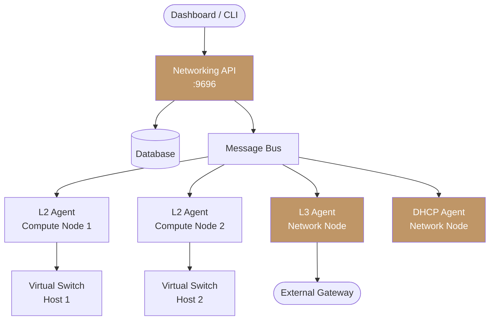

import AdminWarning from '/snippets/admin-warning.mdx';

<p style={{ fontSize: '1.25rem', fontWeight: 700, marginBottom: '0.75rem' }}>Overview</p>

Polystack Networking administration covers the full lifecycle of the SDN fabric — from
deploying and monitoring the agents that drive the virtual switching layer to defining
provider networks, enforcing QoS policies, and hardening the network plane against
misconfiguration and spoofing attacks. Use this guide to maintain the networking infrastructure across your cluster.

<AdminWarning />

<Tabs>
  <Tab title="Web Console" icon="server">
    Network configuration is managed through the deployment console Configuration panel:

    <Steps titleSize="h3">
      <Step title="Open Configuration" icon="gear">
        Navigate to **the deployment console → Configuration** and select the **Network** tab.
      </Step>
      <Step title="Configure network settings" icon="network-wired">
        Set the following options as needed:

        | Setting | Description |
        |---------|-------------|
        | **External Interface** | Physical interface for provider network traffic |
        | **VPNaaS** | Toggle to enable VPN-as-a-Service |
        | **QoS** | Toggle to enable Quality of Service bandwidth policies |
        | **VLAN Trunking** | Toggle to enable VLAN trunk port support |
        | **Agent HA** | Toggle to enable L3/DHCP agent high availability |
        | **SR-IOV** | Toggle to enable Single Root I/O Virtualization |
      </Step>
      <Step title="Save and deploy" icon="rocket">
        Click **Save Configuration**, then navigate to **the deployment console → Operations** and
        run a **Deploy** or **Reconfigure** for the Networking service.

        <Check>Network configuration is applied across all nodes.</Check>
      </Step>
    </Steps>
  </Tab>
  <Tab title="CLI" icon="terminal">
    Configure networking by editing `neutron.conf`, `ml2_conf.ini`, and agent
    configuration files directly at `/etc/ironcore/config/neutron/`. See the individual
    topic guides below for detailed parameters.
  </Tab>
</Tabs>

<Note>
  **Prerequisites**
  - Admin credentials sourced from `openrc.sh`
  - `openstack` CLI installed and configured
  - the deployment console access for cluster-level configuration changes
  - All networking agents running and healthy on all nodes
</Note>

---

<p style={{ fontSize: '1.25rem', fontWeight: 700, marginBottom: '0.75rem' }}>Administration Topics</p>

<CardGroup cols={4}>
  <Card title="Service Architecture" icon="network-wired" href="/services/networking/architecture" color="#bf9667">
    Distributed SDN agent model — API server, message bus, L2/L3 agents, DHCP, and metadata
  </Card>
  <Card title="Provider Networks" icon="layer-group" href="/services/networking/provider-networks" color="#bf9667">
    Configure VLAN, flat, and VXLAN provider networks and physical interface mappings
  </Card>
  <Card title="Network Agent Management" icon="activity" href="/services/networking/network-agents" color="#bf9667">
    Monitor agent health, enable or disable agents for maintenance, and recover failed agents
  </Card>
  <Card title="DHCP Configuration" icon="server" href="/services/networking/dhcp" color="#bf9667">
    Manage DHCP agents, network assignments, and high-availability DHCP
  </Card>
  <Card title="L3 Router Configuration" icon="route" href="/services/networking/l3-routing" color="#bf9667">
    Enable HA routers with VRRP failover and distributed virtual routing for scale
  </Card>
  <Card title="Quality of Service" icon="gauge" href="/services/networking/qos" color="#bf9667">
    Apply bandwidth limits and burst controls to ports and networks
  </Card>
  <Card title="Network Quotas" icon="shield" href="/services/networking/quotas" color="#bf9667">
    Set per-project limits for networks, subnets, routers, floating IPs, and security groups
  </Card>
  <Card title="Security Hardening" icon="lock" href="/services/networking/security" color="#bf9667">
    Port security, anti-spoofing enforcement, allowed address pairs, and default group hardening
  </Card>
  <Card title="Troubleshooting" icon="wrench" href="/services/networking/admin-troubleshooting" color="#bf9667">
    Diagnose agent failures, VXLAN tunnel issues, HA router failover, and MTU problems
  </Card>
</CardGroup>

---

<p style={{ fontSize: '1.25rem', fontWeight: 700, marginBottom: '0.75rem' }}>Architecture Overview</p>



---

<p style={{ fontSize: '1.25rem', fontWeight: 700, marginBottom: '0.75rem' }}>Agent Health Quick Check</p>

```bash title="Check all networking agent status"
openstack network agent list
```

All agents should show `Alive: True` and `Admin State: UP`. If any agent shows
`Alive: False`, see [Network Agent Management](/services/networking/network-agents)
for recovery procedures.

---

<p style={{ fontSize: '1.25rem', fontWeight: 700, marginBottom: '0.75rem' }}>Related Resources</p>

<CardGroup cols={4}>
  <Card title="Networking User Guide" icon="book-open" href="/services/networking/user-guide" color="#bf9667">
    User-facing workflows for creating networks, routers, floating IPs, and security groups
  </Card>
  <Card title="Compute Admin Guide" icon="server" href="/services/compute/admin-guide" color="#bf9667">
    Manage compute hosts, flavors, and quotas alongside networking configuration
  </Card>
  <Card title="Authentication" icon="key" href="/cli-setup" color="#bf9667">
    Configure admin credentials and project-scoped access for networking operations
  </Card>
  <Card title="CLI Setup" icon="terminal" href="/cli-setup" color="#bf9667">
    Install and configure the `openstack` CLI for full administrative control
  </Card>
</CardGroup>
