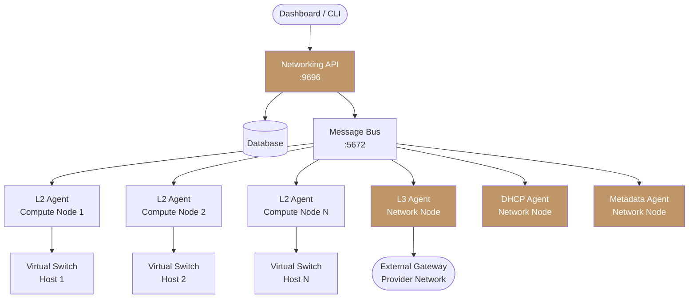
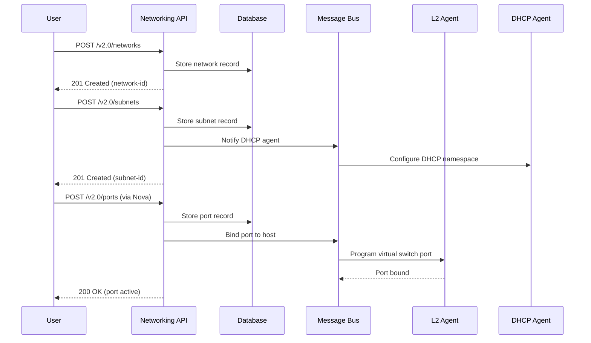

import AdminWarning from '/snippets/admin-warning.mdx';

## Overview

Polystack Networking follows a distributed agent model. A central API and database tier manages
resource state, while per-node agents program the virtual switching fabric in real time.
Understanding this architecture helps administrators diagnose failures, plan capacity, and
maintain the networking plane across the cluster.

<AdminWarning />

---

## Architecture Diagram

---

## Agent Components

| Agent | Default Port | Role |
|-------|-------------|------|
| Networking API | 9696 | RESTful endpoint for all network resource management |
| L2 Agent | N/A (message bus) | Programs virtual switching and port bindings on each compute node |
| L3 Agent | N/A (message bus) | Manages routers, NAT rules, and floating IP translation |
| DHCP Agent | 67/68 (DHCP) | Provides IP address assignment for tenant subnets |
| Metadata Agent | 80 (internal proxy) | Forwards instance metadata requests from the network namespace |
| RPC Message Bus | 5672 (AMQP) | Carries control messages between the API server and distributed agents |

---

## Request Flow: Create Network and Create Instance

---

## Data Plane: Virtual Switching

Each compute node runs an L2 agent that programs the local virtual switch to enforce:

- **Port bindings** — connect instance virtual NICs to the correct network segment
- **VLAN or VXLAN segmentation** — isolate tenant traffic from other projects
- **Security group rules** — iptables/nftables rules enforced per port
- **Anti-spoofing** — MAC and IP address binding prevents address impersonation

<Info>
  The specific virtual switch backend (Linux bridge, Open vSwitch, or OVN) is configured
  during cluster deployment via the deployment console. The choice of backend affects performance
  characteristics and advanced features like DVR and hardware offload.
</Info>

---

## High Availability Considerations

| Component | HA Mechanism | Impact of Failure |
|-----------|-------------|-------------------|
| Networking API | Multiple API instances behind HAProxy | Single instance loss: no impact |
| Database | Galera cluster (3+ nodes) | Partial loss: degraded writes |
| Message Bus | RabbitMQ cluster (3+ nodes) | Partial loss: agent messaging delayed |
| L2 Agent | One per compute node | Agent loss: no new port bindings on that host |
| L3 Agent | VRRP failover (HA routers) | Active agent loss: standby takes over |
| DHCP Agent | Multiple agents per network | Agent loss: secondary agent serves leases |

---

## Next Steps

<CardGroup cols={2}>
  <Card title="Network Agent Management" href="/services/networking/network-agents" color="#bf9667">
    Monitor agent health and manage agent lifecycle
  </Card>
  <Card title="Provider Networks" href="/services/networking/provider-networks" color="#bf9667">
    Configure physical network mappings and segmentation types
  </Card>
  <Card title="L3 Router Configuration" href="/services/networking/l3-routing" color="#bf9667">
    Enable HA and distributed routing for production deployments
  </Card>
  <Card title="DHCP Configuration" href="/services/networking/dhcp" color="#bf9667">
    Manage DHCP agents and subnet assignments
  </Card>
</CardGroup>
