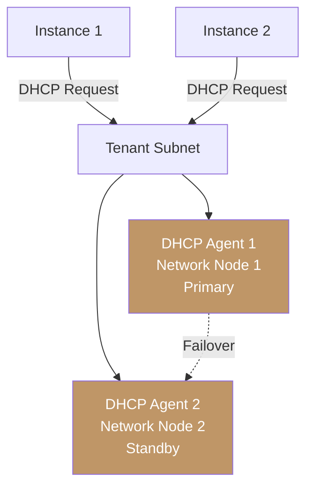

import AdminWarning from '/snippets/admin-warning.mdx';
import CliAuth from '/snippets/cli-auth.mdx';

## Overview

The DHCP agent provides IP address assignment, DNS resolver delivery, and host route
injection for tenant subnets. Multiple DHCP agents can serve the same network for high
availability — when the active agent fails, a standby takes over without disrupting
existing DHCP leases.

<AdminWarning />

<Note>
  **Prerequisites**
  - Admin credentials sourced from `openrc.sh`
  - At least one running DHCP agent (verify with `openstack network agent list --agent-type dhcp`)
</Note>

---

## View Networks Served by an Agent

<Tabs>
  <Tab title="Dashboard" icon="gauge">
    Navigate to **Network > Network Agents** (admin view). Click the agent ID of a DHCP agent.
    The **Networks** tab lists all networks this agent is currently serving.
  </Tab>
  <Tab title="CLI" icon="terminal">
    ```bash title="List networks served by a specific DHCP agent"
    openstack network list --agent <dhcp-agent-id>
    ```
  </Tab>
</Tabs>

---

## Schedule a Network to a DHCP Agent

<Tabs>
  <Tab title="Dashboard" icon="gauge">
    Navigate to **Network > Network Agents** (admin view), click a DHCP agent, then click
    **Add Network** in the **Networks** tab. Select the network from the list.
  </Tab>
  <Tab title="CLI" icon="terminal">
    <Steps titleSize="h3">
      <Step title="Authenticate" icon="key">
        <CliAuth />
      </Step>
      <Step title="List available DHCP agents" icon="list">
        ```bash title="List DHCP agents with host names"
        openstack network agent list --agent-type dhcp
        ```
        Note the agent IDs for the agents you want to use.
      </Step>
      <Step title="Assign network to primary agent" icon="plus">
        ```bash title="Schedule network to DHCP agent"
        openstack network agent add network --dhcp <agent-id> <network-id>
        ```
      </Step>
      <Step title="Assign to a second agent for HA" icon="shield">
        ```bash title="Add network to second DHCP agent for redundancy"
        openstack network agent add network --dhcp <second-agent-id> <network-id>
        ```
        Both agents will serve DHCP requests for the network. The agents elect a primary
        using a distributed locking mechanism — the other acts as standby.

        <Check>The network now has two DHCP agents for high availability.</Check>
      </Step>
    </Steps>
  </Tab>
</Tabs>

---

## Remove a Network from an Agent

```bash title="Remove network from a specific DHCP agent"
openstack network agent remove network --dhcp <agent-id> <network-id>
```

<Warning>
  Remove the network from a DHCP agent only after confirming another healthy agent is
  serving it. Run `openstack network list --agent <standby-agent-id>` to verify the
  standby agent shows the network before removing the primary.
</Warning>

---

## DHCP Agent HA Architecture



---

## Troubleshoot DHCP Issues

<AccordionGroup>
  <Accordion title="Instances not receiving IP addresses" icon="server">
    **Cause**: DHCP agent is down, subnet DHCP is disabled, or allocation pool is exhausted.

    **Resolution**:

    1. Confirm DHCP is enabled on the subnet:
       ```bash title="Check subnet DHCP status"
       openstack subnet show <subnet-name> -f json | grep enable_dhcp
       ```
    2. Verify the DHCP agent is alive:
       ```bash title="Check DHCP agent health"
       openstack network agent list --agent-type dhcp
       ```
    3. Check the allocation pool size vs. current port count:
       ```bash title="Count ports on network"
       openstack port list --network <network-name> | wc -l
       ```
  </Accordion>

  <Accordion title="Stale DNS or gateway options on instances" icon="gear">
    **Cause**: Subnet DNS or gateway was updated but running instances have stale DHCP leases.

    **Resolution**:
    Force DHCP renewal on the affected instance:
    ```bash title="Renew DHCP lease on Linux guest"
    sudo dhclient -r eth0 && sudo dhclient eth0
    ```
    Alternatively, restart the network interface or reboot the instance.
  </Accordion>
</AccordionGroup>

---

## Next Steps

<CardGroup cols={2}>
  <Card title="Network Agent Management" href="/services/networking/network-agents" color="#bf9667">
    Monitor and manage the full set of SDN agents across your cluster
  </Card>
  <Card title="Subnets" href="/services/networking/subnets" color="#bf9667">
    Configure DHCP allocation pools, DNS, and host routes at the subnet level
  </Card>
  <Card title="DNS Configuration" href="/services/networking/dns-config" color="#bf9667">
    Control DNS resolver delivery to instances through DHCP
  </Card>
  <Card title="Admin Troubleshooting" href="/services/networking/admin-troubleshooting" color="#bf9667">
    Resolve agent and connectivity issues with diagnostic commands
  </Card>
</CardGroup>
