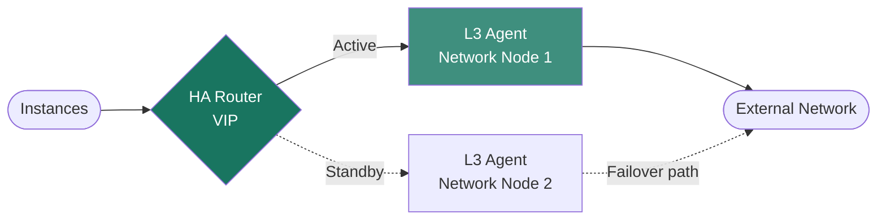

import AdminWarning from '/snippets/admin-warning.mdx';
import CliAuth from '/snippets/cli-auth.mdx';

## Overview

Xloud Networking supports two advanced router modes for production deployments: High
Availability (HA) routers using VRRP for automatic failover between L3 agents, and
Distributed Virtual Routing (DVR) that moves L3 forwarding to each compute node to
eliminate centralized bottlenecks. This guide covers enabling and validating both modes.

<AdminWarning />

<Note>
  **Prerequisites**
  - Admin credentials sourced from `openrc.sh`
  - At least two L3 agents running for HA routers
  - XDeploy access to enable DVR cluster-wide
</Note>

---

## High-Availability Routers

HA routers use VRRP to provide automatic failover between L3 agent instances. When the
active L3 agent fails, a standby agent takes ownership of the router's namespace and
floating IP NAT rules within seconds.



### Create an HA Router

<Tabs>
  <Tab title="CLI" icon="terminal">
    <Steps titleSize="h3">
      <Step title="Authenticate" icon="key">
        <CliAuth />
      </Step>
      <Step title="Create HA router with external gateway" icon="plus">
        ```bash title="Create HA router"
        openstack router create ha-router \
          --ha \
          --external-gateway public
        ```
        The `--ha` flag schedules the router across all available L3 agents automatically.
      </Step>
      <Step title="Verify HA state" icon="circle-check">
        ```bash title="Show HA router fields"
        openstack router show ha-router -f json | grep ha
        ```
        Confirm `ha: true` and `status: ACTIVE` in the output.

        ```bash title="List L3 agents handling the router"
        openstack network agent list --router ha-router
        ```

        <Check>At least two L3 agents appear, one `active` and one `standby`.</Check>
      </Step>
    </Steps>
  </Tab>
</Tabs>

<Info>
  HA routers require at least two L3 agents running in the cluster. Xloud Networking
  automatically schedules the router across all available L3 agents. Verify with
  `openstack network agent list --agent-type l3` before creating HA routers.
</Info>

---

## Distributed Virtual Routing (DVR)

DVR moves L3 forwarding from a centralized agent to each compute node, eliminating the
network node as a bottleneck for east-west and north-south traffic.

| Mode | Traffic Path | Best For |
|------|-------------|---------|
| Centralized L3 | All traffic through network node | Simple deployments, ≤ 10 compute nodes |
| DVR | East-west direct between compute nodes; north-south via dedicated gateway | High-throughput workloads, large clusters |

### Enable DVR

<Tabs>
  <Tab title="XDeploy" icon="rocket">
    Enable DVR cluster-wide in XDeploy under **Configuration → Networking**:

    | Parameter | Value | Description |
    |-----------|-------|-------------|
    | `neutron_l3_ha` | `True` | Enable VRRP HA for centralized L3 agents |
    | `enable_neutron_dvr` | `True` | Distribute L3 forwarding to compute nodes |

    Click **Save and Deploy**. XDeploy applies the configuration via xavs-ansible.

    <Warning>
      Enabling DVR on an existing cluster requires a rolling restart of all L3 and
      L2 agents. Plan a maintenance window and verify floating IP connectivity after
      the change. Test with a non-production network first.
    </Warning>
  </Tab>
</Tabs>

### Create a Distributed Router

<Tabs>
  <Tab title="CLI" icon="terminal">
    ```bash title="Create distributed router"
    openstack router create distributed-router \
      --distributed \
      --external-gateway public
    ```
    ```bash title="Verify distributed routing is enabled"
    openstack router show distributed-router -f json | grep distributed
    ```

    Confirm `distributed: true` in the output.
  </Tab>
</Tabs>

---

## Router Administration Reference

| Operation | CLI Command |
|-----------|-------------|
| List all routers | `openstack router list` |
| Show router detail | `openstack router show <name>` |
| Enable router | `openstack router set <name> --enable` |
| Disable router | `openstack router set <name> --disable` |
| Set external gateway | `openstack router set <name> --external-gateway <network>` |
| Remove external gateway | `openstack router unset <name> --external-gateway` |
| Add subnet interface | `openstack router add subnet <router> <subnet>` |
| Remove subnet interface | `openstack router remove subnet <router> <subnet>` |
| Add static route | `openstack router set <name> --route destination=X,gateway=Y` |
| Delete router | `openstack router delete <name>` |

---

## Next Steps

<CardGroup cols={2}>
  <Card title="Network Agent Management" href="/services/networking/network-agents" color="#197560">
    Verify L3 agents are healthy across all network nodes
  </Card>
  <Card title="Provider Networks" href="/services/networking/provider-networks" color="#197560">
    Configure external networks that routers use as gateways
  </Card>
  <Card title="Routers and Gateways" href="/services/networking/routers" color="#197560">
    User guide for creating and managing routers
  </Card>
  <Card title="Admin Troubleshooting" href="/services/networking/admin-troubleshooting" color="#197560">
    Diagnose HA router failover and DVR issues
  </Card>
</CardGroup>
