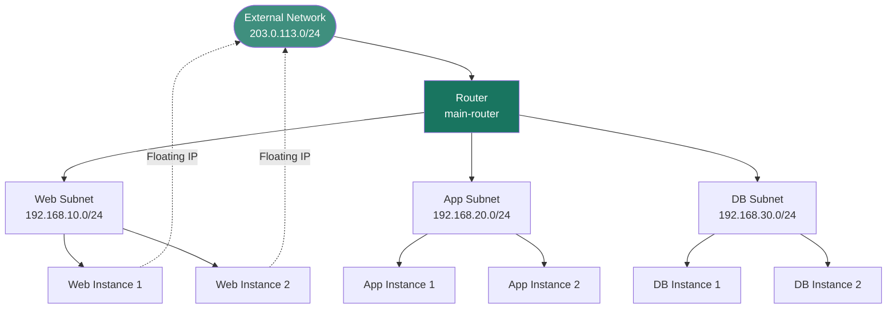
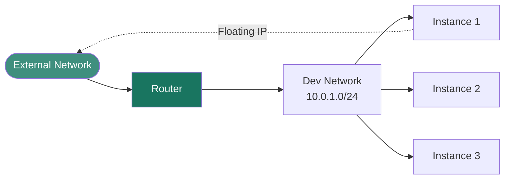
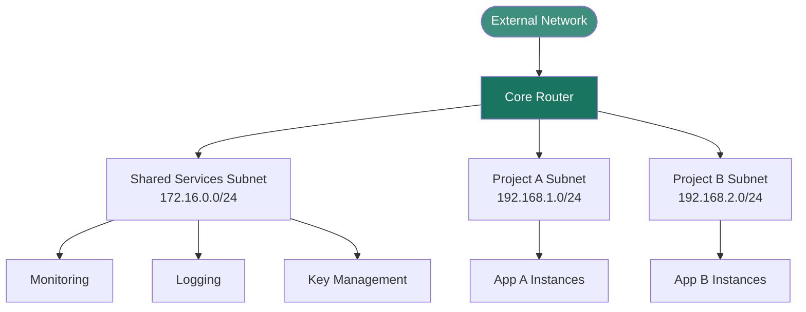
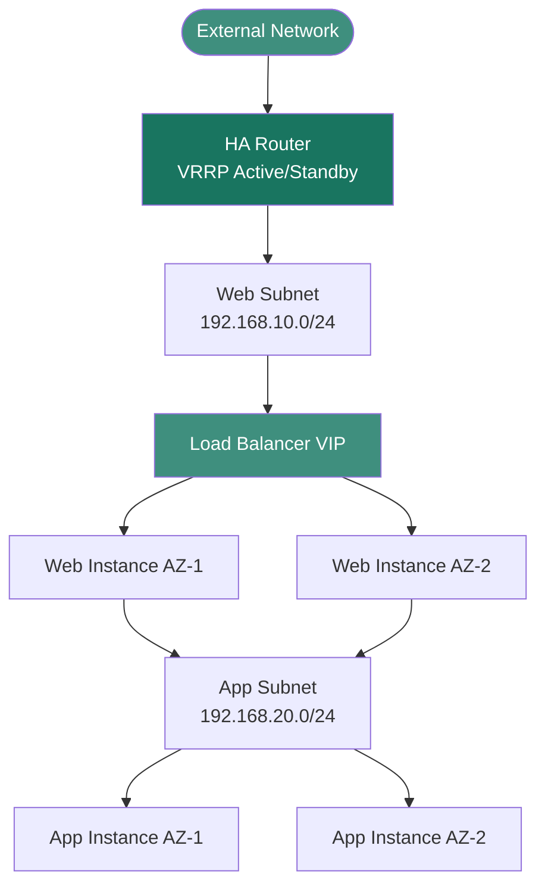

## Overview

Xloud Networking's SDN fabric supports a wide range of topology patterns — from a single
flat network for development environments to fully isolated multi-tier architectures for
production workloads. This page describes common reference topologies, their component
requirements, and how security groups enforce trust boundaries between tiers.

<Note>
  **Prerequisites**
  - Familiarity with [networks](/services/networking/create-network), [subnets](/services/networking/subnets), [routers](/services/networking/routers), and [security groups](/services/networking/security-groups)
  - At least one external or provider network available in your cluster
</Note>

---

## Standard Three-Tier Topology

The recommended topology for most production applications. Each application tier is
isolated on its own subnet, all tiers route through a shared router, and only the
web tier exposes floating IPs to the internet.



### Component Checklist

| Resource | Purpose |
|----------|---------|
| `web-network` / `web-subnet` (192.168.10.0/24) | Hosts web-tier instances with floating IPs |
| `app-network` / `app-subnet` (192.168.20.0/24) | Internal app tier — no floating IPs |
| `db-network` / `db-subnet` (192.168.30.0/24) | Database tier — no floating IPs, restricted access |
| `main-router` | Routes all subnets, external gateway for NAT |
| `web-sg` | Allows TCP 80, 443 from internet; TCP 22 from management CIDR |
| `app-sg` | Allows traffic from `web-sg` only |
| `db-sg` | Allows database port from `app-sg` only |

<Info>
  Security groups enforce the trust boundary between tiers. Apply a strict group to
  the DB subnet that only allows connections from the App subnet's security group —
  not from `0.0.0.0/0`.
</Info>

---

## Isolated Development Topology

A minimal topology for development and testing environments. All instances share a single
network and subnet. One floating IP provides external access for the developer.



This topology is appropriate for individual developer sandboxes, CI/CD test environments,
and proof-of-concept workloads. It minimizes resource consumption while providing full
internet egress via NAT.

---

## Shared Services Topology

A multi-project topology where shared infrastructure services (monitoring, logging, secrets)
run on a dedicated network accessible to all application projects via router peering.



---

## High Availability Topology

A topology designed for production availability requirements. Redundant instances in each
tier are distributed across the router's subnet interfaces, with HA floating IPs that can
be reassigned during failover events.



<Tip>
  Enable HA routers (`--ha` flag) for production deployments to protect against L3 agent
  failures. See the [L3 Router Configuration](/services/networking/l3-routing) guide for
  HA and DVR setup.
</Tip>

---

## MTU Considerations

Different network types require different MTU settings to avoid packet fragmentation.

| Network Type | Recommended MTU | Reason |
|-------------|----------------|--------|
| VXLAN tenant networks | 1450 | 50-byte VXLAN encapsulation overhead |
| VLAN provider networks | 1500 | No encapsulation overhead |
| Jumbo-frame VLAN | Up to 9000 | Requires switch support end-to-end |

```bash title="Set network MTU for VXLAN"
openstack network set app-network --mtu 1450
```

---

## Next Steps

<CardGroup cols={2}>
  <Card title="Create a Network" href="/services/networking/create-network" color="#197560">
    Provision the networks required for your chosen topology
  </Card>
  <Card title="Routers and Gateways" href="/services/networking/routers" color="#197560">
    Connect your subnets and configure the external gateway
  </Card>
  <Card title="Network Security Groups" href="/services/networking/security-groups" color="#197560">
    Define trust boundaries between tiers with stateful firewall rules
  </Card>
  <Card title="L3 Router Configuration" href="/services/networking/l3-routing" color="#197560">
    Enable HA routers and distributed virtual routing for production deployments
  </Card>
</CardGroup>
