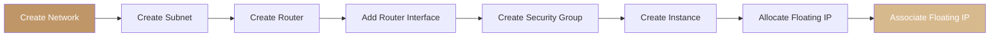

import PrerequisitesAuth from '/snippets/prerequisites-auth.mdx';

Overview

Polystack Networking delivers software-defined connectivity for your cloud workloads. Every
project receives its own isolated network plane — you define the topology, address space,
routing policy, and access controls. Project networks remain fully isolated from one another
and from the physical underlay unless you explicitly connect them through a router with an
external gateway.

<PrerequisitesAuth />

---

Key Concepts

| Resource | Description |
|----------|-------------|
| **Network** | An isolated L2 broadcast domain. Instances attach to networks via virtual ports. |
| **Subnet** | An IP address range assigned to a network, with DHCP, gateway, and DNS configuration. |
| **Router** | An L3 device that routes traffic between subnets and provides external gateway connectivity via NAT. |
| **Port** | A virtual network interface connecting an instance or router to a network. |
| **Floating IP** | A publicly routable address that maps to a port's private IP via NAT on the router. |
| **Security Group** | A stateful, per-port firewall ruleset controlling ingress and egress traffic. |

<Tip>
  Start with the simplest topology that meets your requirements: one network, one subnet,
  one router with an external gateway, and a security group. Expand from there as your
  workload grows.
</Tip>

---

Networking Topics

<CardGroup cols={4}>
  <Card title="Create a Network" icon="network" href="/services/networking/create-network" color="#bf9667">
    Provision an isolated project network and configure its IP address space with a subnet
  </Card>
  <Card title="Create and Manage Subnets" icon="layers" href="/services/networking/subnets" color="#bf9667">
    Add subnets, configure DHCP allocation pools, DNS resolvers, and host routes
  </Card>
  <Card title="Routers and Gateways" icon="route" href="/services/networking/routers" color="#bf9667">
    Connect project subnets to the internet with L3 routers and external gateways
  </Card>
  <Card title="Floating IP Addresses" icon="globe" href="/services/networking/floating-ips" color="#bf9667">
    Allocate public IPs from the external pool and associate them with instances
  </Card>
  <Card title="Network Security Groups" icon="shield" href="/services/networking/security-groups" color="#bf9667">
    Define stateful firewall rules controlling ingress and egress traffic per instance port
  </Card>
  <Card title="DNS Configuration" icon="server" href="/services/networking/dns-config" color="#bf9667">
    Configure DNS name servers pushed to instances via DHCP for hostname resolution
  </Card>
  <Card title="Network Topologies" icon="layout-grid" href="/services/networking/network-topology" color="#bf9667">
    Reference architectures for three-tier, HA, and shared-services network designs
  </Card>
  <Card title="Troubleshooting" icon="wrench" href="/services/networking/troubleshooting" color="#bf9667">
    Diagnose and resolve connectivity, floating IP, and DHCP issues
  </Card>
</CardGroup>

---

Getting Started Workflow

---

Related Resources

<CardGroup cols={4}>
  <Card title="Networking Admin Guide" icon="settings" href="/services/networking/admin-guide" color="#bf9667">
    Provider networks, QoS, quotas, agent management, and security hardening
  </Card>
  <Card title="Compute User Guide" icon="server" href="/services/compute/user-guide" color="#bf9667">
    Launch instances and attach them to the networks you create here
  </Card>
  <Card title="Authentication" icon="key" href="/cli-setup" color="#bf9667">
    Configure project credentials and CLI access for networking operations
  </Card>
  <Card title="CLI Setup" icon="terminal" href="/cli-setup" color="#bf9667">
    Install and configure the `openstack` CLI for networking management
  </Card>
</CardGroup>
