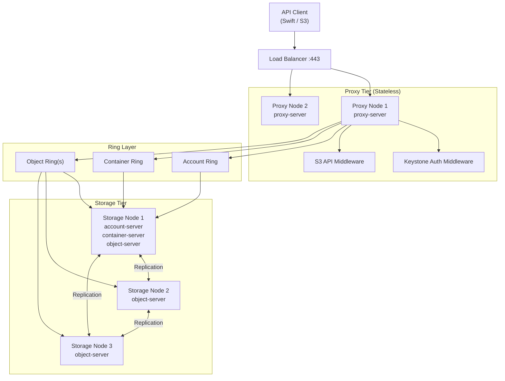
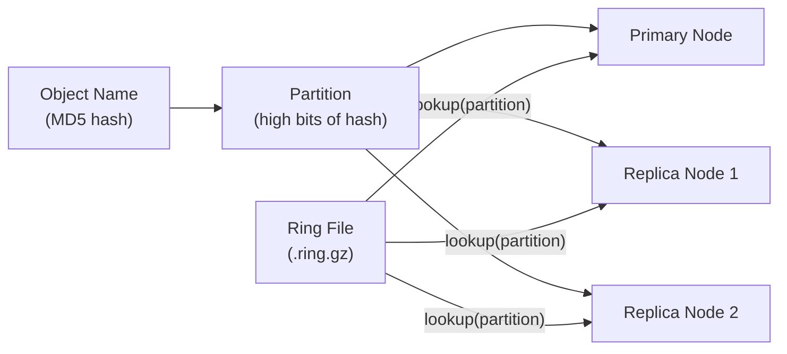

## Overview

Xloud Object Storage uses a three-tier, fully distributed architecture. Proxy nodes handle all API requests and authentication. Storage nodes persist object data on local drives. The consistent hash ring maps every object to its target storage locations without a central metadata server. This design eliminates single points of failure and enables horizontal scaling of each tier independently.

<Note>
  **Prerequisites**
  - Familiarity with Xloud Object Storage [storage policies](/services/object-storage/storage-policies)
  - Admin access to review cluster topology
</Note>

---

## Cluster Topology



<Info>
  Proxy nodes are fully stateless — they hold only ring files (updated via ring distribution). All persistent state lives on storage nodes. Adding proxy nodes scales API throughput without touching the storage tier.
</Info>

---

## Component Descriptions

<AccordionGroup>
  <Accordion title="Proxy Server" icon="server" defaultOpen>
    The proxy server is the single entry point for all client requests (Swift and S3 API). It performs:
    - Token validation via Keystone auth middleware
    - Ring lookups to identify target storage nodes for each request
    - Parallel writes to all replica nodes for PUT operations
    - Read fan-out and quorum resolution for GET operations
    - Transparent S3 API translation via `s3api` middleware

    Proxy nodes never store object data. They are horizontally scalable and stateless.
  </Accordion>
  <Accordion title="Account Server" icon="user">
    The account server manages project-level metadata:
    - Tracks all containers belonging to a project
    - Stores account-level statistics (bytes used, object count, container count)
    - Enforces quota limits in conjunction with the proxy
    - Served from the account ring — one partition per account
  </Accordion>
  <Accordion title="Container Server" icon="folder">
    The container server manages container-level metadata:
    - Lists all objects within a container (object listings)
    - Stores container-level statistics and custom metadata headers
    - Container records are replicated across the container ring
    - Object listings are eventually consistent — updates propagate asynchronously via the updater
  </Accordion>
  <Accordion title="Object Server" icon="file">
    The object server handles the actual object data:
    - Stores objects on local XFS or ext4 filesystems
    - Each object stored as a file at a path derived from its MD5 hash
    - Handles PUT, GET, DELETE, HEAD, and COPY operations
    - Writes metadata (content-type, custom headers) as extended file attributes
    - Generates a unique transaction ID for every operation
  </Accordion>
  <Accordion title="Replication Engine" icon="refresh-cw">
    The replication engine runs continuously on every storage node to maintain the configured replica count:
    - **Object replicator**: Compares local partition hashes with remote nodes; pushes missing objects via rsync or direct HTTP
    - **Container replicator**: Synchronizes container database records across ring replicas
    - **Account replicator**: Synchronizes account database records
    - Replication is partition-based — the ring divides the hash space into partitions, and each partition's primary and handoff nodes are replicated to
  </Accordion>
  <Accordion title="Background Services" icon="settings">
    Additional background services maintain cluster health:

    | Service | Function |
    |---------|----------|
    | **Auditor** | Reads every stored object and verifies checksum integrity. Quarantines corrupted objects. |
    | **Updater** | Processes failed container and account update queues asynchronously. Resolves eventually-consistent listings. |
    | **Expirer** | Deletes objects that have reached their `X-Delete-At` or `X-Delete-After` expiry timestamp. |
    | **Reconstructor** | EC-specific: reconstructs missing or corrupted EC fragments from surviving shards. |
  </Accordion>
  <Accordion title="S3 API Middleware" icon="code">
    The `s3api` middleware translates S3-format requests into Swift internal requests transparently:
    - Mounted in the proxy pipeline before the auth middleware
    - Translates S3 bucket operations to Swift container operations
    - Translates S3 object operations to Swift object operations
    - Handles S3 authentication (HMAC-SHA256 signature v4)
    - Translates S3 ACLs to Swift ACL headers
    - Supports multipart upload via Swift dynamic large objects
    - Supports object versioning via Swift versioning middleware

    <Info>
      S3 and Swift APIs share the same underlying storage. An object uploaded via S3 API is immediately accessible via the Swift API using the same account/container/object path structure, and vice versa.
    </Info>
  </Accordion>
</AccordionGroup>

---

## Consistent Hash Ring

The consistent hash ring is the core distribution mechanism. It determines which storage nodes hold each object without any central directory server.



Ring mechanics:

| Concept | Description |
|---------|-------------|
| **Partition power** | `2^partition_power` partitions in the ring (typically 2^18 = 262,144) |
| **Partition** | A slice of the hash space. Every object maps to exactly one partition. |
| **Device** | A physical drive with assigned weight (capacity proportion) |
| **Weight** | Determines what fraction of partitions a device receives |
| **Replica count** | How many distinct devices hold each partition's data |
| **Zone** | Fault domain grouping — ring enforces replicas land in distinct zones |
| **Region** | Geographic grouping — for geo-redundant deployments across data centers |

<Tip>
  Higher partition power means more partitions and finer-grained data distribution, but larger ring files. Use `2^18` for clusters up to ~200 storage nodes. Use `2^20` for very large clusters.
</Tip>

---

## Object Request Flow

<Tabs>
  <Tab title="Write (PUT)" icon="upload">
    ```mermaid
    sequenceDiagram
        participant Client
        participant LB as Load Balancer
        participant Proxy as Proxy Server
        participant Ring as Object Ring
        participant S1 as Storage Node 1
        participant S2 as Storage Node 2
        participant S3 as Storage Node 3

        Client->>LB: PUT /v1/AUTH_proj/container/object
        LB->>Proxy: Forward request
        Proxy->>Proxy: Keystone token validation
        Proxy->>Ring: lookup(MD5(object path))
        Ring-->>Proxy: Primary: S1, Replicas: S2, S3
        Proxy->>S1: PUT object (replica 1) — parallel
        Proxy->>S2: PUT object (replica 2) — parallel
        Proxy->>S3: PUT object (replica 3) — parallel
        S1-->>Proxy: 201 Created
        S2-->>Proxy: 201 Created
        S3-->>Proxy: 201 Created
        Proxy->>Proxy: Quorum check (2 of 3 required)
        Proxy-->>Client: 201 Created
    ```

    The proxy writes to all replicas in parallel. It returns success to the client once a write quorum (default: `(replicas // 2) + 1`) confirms the write.
  </Tab>
  <Tab title="Read (GET)" icon="download">
    ```mermaid
    sequenceDiagram
        participant Client
        participant Proxy as Proxy Server
        participant Ring as Object Ring
        participant S1 as Storage Node 1
        participant S2 as Storage Node 2

        Client->>Proxy: GET /v1/AUTH_proj/container/object
        Proxy->>Proxy: Keystone token validation
        Proxy->>Ring: lookup(MD5(object path))
        Ring-->>Proxy: Primary: S1, Replicas: S2, S3
        Proxy->>S1: GET object (primary)
        S1-->>Proxy: 200 OK + data stream
        Proxy-->>Client: 200 OK + data stream
        Note over Proxy,S2: S2/S3 not contacted on successful primary read
    ```

    Reads go to the primary node first. If the primary is unreachable, the proxy automatically falls back to replica nodes — transparent to the client.
  </Tab>
  <Tab title="S3 API" icon="code">
    ```mermaid
    sequenceDiagram
        participant Client as S3 Client
        participant Proxy as Proxy + s3api middleware
        participant Keystone
        participant Storage as Storage Nodes

        Client->>Proxy: PUT /bucket/object (S3 signature v4)
        Proxy->>Proxy: s3api: validate HMAC signature
        Proxy->>Keystone: Exchange S3 creds for Swift token
        Keystone-->>Proxy: Swift auth token
        Proxy->>Proxy: Translate S3 → Swift request
        Proxy->>Storage: Swift PUT /v1/AUTH_proj/bucket/object
        Storage-->>Proxy: 201 Created
        Proxy->>Proxy: Translate Swift → S3 response
        Proxy-->>Client: 200 OK (S3 format)
    ```

    The S3 middleware translates the entire request and response lifecycle. The underlying storage operation is identical to a native Swift write.
  </Tab>
</Tabs>

---

## Replication Zones and Fault Domains

Storage nodes are grouped into zones for fault domain separation. The ring builder enforces replica placement across distinct zones.

| Zone | Typical Mapping | Failure Isolated |
|------|----------------|-----------------|
| Zone 1 | Rack 1 / PDU A / Switch A | Any single rack failure |
| Zone 2 | Rack 2 / PDU B / Switch B | Any single rack failure |
| Zone 3 | Rack 3 / PDU C / Switch C | Any single rack failure |

A 3-replica policy distributes one replica per zone. A full zone failure (rack down, switch failure) results in zero data loss and read/write operations continue using the two surviving zones.

<Warning>
  For geo-redundant deployments, configure regions in addition to zones. Each region hosts a complete replica set. Cross-region replication introduces higher write latency — design policies accordingly.
</Warning>

---

## Capacity Planning

<CardGroup cols={2}>
  <Card title="Replication Overhead" icon="layers" color="#197560">
    3-replica policy: usable capacity = raw capacity ÷ 3.
    For 60 TB raw storage across 10 nodes, usable capacity = 20 TB.
  </Card>
  <Card title="EC Overhead" icon="shield" color="#197560">
    8+4 EC policy: usable capacity = raw capacity × (8 ÷ 12) = 66.7%.
    For 60 TB raw storage, usable capacity = 40 TB — 2× more efficient than 3-replica.
  </Card>
  <Card title="Minimum Nodes per Policy" icon="server" color="#197560">
    Replication (3×): minimum 3 nodes in 3 distinct zones.
    EC 8+4: minimum 12 nodes. EC 4+2: minimum 6 nodes.
  </Card>
  <Card title="Ring Rebalancing" icon="refresh-cw" color="#197560">
    Adding nodes triggers a ring rebalance. Set `min_part_hours` (minimum 1 hour) to limit
    partition moves per cycle and prevent rebalance storms during rapid node additions.
  </Card>
</CardGroup>

---

## Next Steps

<CardGroup cols={2}>
  <Card title="Storage Policies" href="/services/object-storage/storage-policies" color="#197560">
    Configure replication, EC, and multi-tier storage policies
  </Card>
  <Card title="Ring Management" href="/services/object-storage/ring-management" color="#197560">
    Add drives, adjust weights, and distribute updated rings
  </Card>
  <Card title="Replication" href="/services/object-storage/replication" color="#197560">
    Monitor replication health and manage quarantined objects
  </Card>
  <Card title="Monitoring" href="/services/object-storage/monitoring" color="#197560">
    Track cluster capacity and proxy request metrics
  </Card>
</CardGroup>
