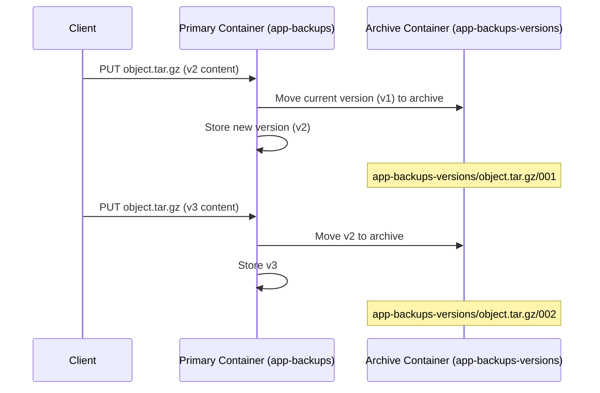

import PrerequisitesAuth from '/snippets/prerequisites-auth.mdx';

## Overview

Enable versioning on a container to retain all previous versions of objects. Each time
an object is overwritten, the previous version is preserved in a linked archive container.
This protects against accidental overwrites and provides a manual recovery mechanism.

<PrerequisitesAuth />

<Warning>
  Versioning must be enabled before overwrites occur — it cannot be applied retroactively.
  Objects overwritten before versioning was enabled have no archived versions.
</Warning>

---

## How Versioning Works



---

## Enable Versioning

<Tabs>
  <Tab title="Dashboard" icon="gauge">
    <Steps titleSize="h3">
      <Step title="Create the archive container">
        Create a separate container to store previous versions. Navigate to
        **Storage > Object Storage** and click **Create Container**.
        Name it `app-backups-versions` (or similar).

        <Info>
          Create the archive container before enabling versioning on the primary container.
          The archive container must already exist.
        </Info>
      </Step>
      <Step title="Enable versioning on the primary container">
        Navigate to the primary container settings, click **Edit**, and enable
        **Object Versioning**. Specify the archive container name.
      </Step>
    </Steps>
  </Tab>
  <Tab title="CLI" icon="terminal">
    <Steps titleSize="h3">
      <Step title="Create the archive container">
        ```bash title="Create versioning archive"
        openstack container create app-backups-versions
        ```
      </Step>
      <Step title="Enable versioning on the primary container">
        ```bash title="Enable versioning"
        openstack container set \
          --property "X-Versions-Location=app-backups-versions" \
          app-backups
        ```
      </Step>
      <Step title="Verify versioning is active">
        ```bash title="Check versioning header"
        openstack container show app-backups | grep -i version
        ```

        <Check>Container metadata shows `X-Versions-Location` set to the archive container name.</Check>
      </Step>
    </Steps>
  </Tab>
</Tabs>

---

## Recover a Previous Version

When an object is overwritten, the previous version is stored in the archive container
with a name that includes the original object name and a timestamp prefix.

```bash title="List archived versions"
openstack object list app-backups-versions | grep object.tar.gz
```

```bash title="Download a specific archived version"
openstack object save app-backups-versions \
  "app-backups/object.tar.gz/001t<timestamp>"
```

To restore a version, copy it back to the primary container:
```bash title="Restore an archived version"
# Download the archived version
openstack object save app-backups-versions \
  "app-backups/object.tar.gz/001t<timestamp>" \
  --file /tmp/restored.tar.gz

# Re-upload to the primary container
openstack object create app-backups /tmp/restored.tar.gz \
  --name object.tar.gz
```

---

## Disable Versioning

```bash title="Disable versioning"
openstack container set \
  --property "X-Versions-Location=" \
  app-backups
```

<Warning>
  Disabling versioning stops archiving new overwrites but does not remove existing
  archived versions. The archive container and its contents remain and accrue storage costs.
</Warning>

---

## Next Steps

<CardGroup cols={2}>
  <Card title="Upload Objects" href="/services/object-storage/upload-objects" color="#197560">
    Upload and manage objects within versioned containers
  </Card>
  <Card title="Access Control" href="/services/object-storage/access-control" color="#197560">
    Configure ACLs on both primary and archive containers
  </Card>
  <Card title="Large Objects" href="/services/object-storage/large-objects" color="#197560">
    Handle files over 5 GB with SLO and DLO mechanisms
  </Card>
  <Card title="Troubleshooting" href="/services/object-storage/troubleshooting" color="#197560">
    Resolve versioning configuration and recovery issues
  </Card>
</CardGroup>
