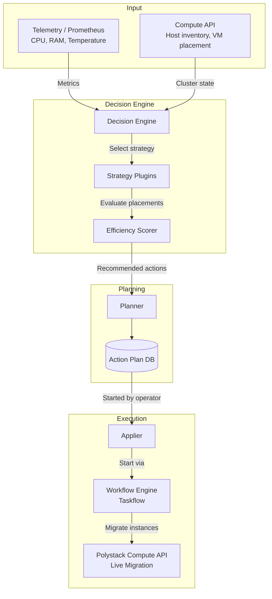
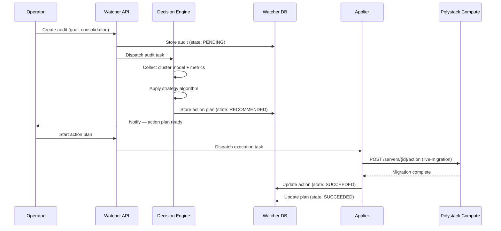

## Overview

The Polystack Optimization is composed of three collaborating services: the API and
Decision Engine (analysis), the Planner (action plan generation), and the Applier (execution).
Understanding the architecture helps administrators tune the system, diagnose failures,
and integrate custom data sources or strategies.

<Warning>
  This guide requires administrator privileges. Changes to strategy configuration and
  data source settings affect all ongoing and future audits platform-wide.
</Warning>

---

## Component Diagram



---

## Components

<AccordionGroup>
  <Accordion title="Decision Engine" icon="microchip" defaultOpen>
    The analytical core. On each audit, the Decision Engine:
    1. Collects the cluster data model from the Compute API (host inventory, VM placement)
    2. Fetches time-series metrics from configured data sources (Prometheus, Telemetry)
    3. Selects the strategy plugin for the requested goal
    4. Runs the strategy algorithm to identify suboptimal placements
    5. Passes the resulting recommended actions to the Planner

    Deployed as: `watcher_decision_engine` container on controller nodes.
  </Accordion>
  <Accordion title="Planner" icon="clipboard-list">
    Receives the recommended action set from the Decision Engine and applies dependency
    ordering — ensuring migrations that depend on free capacity from an earlier migration
    execute in the correct sequence.

    The Planner is embedded in the Decision Engine container and does not run as a
    separate service.
  </Accordion>
  <Accordion title="Applier" icon="play">
    Executes approved action plans through a Taskflow workflow engine. The Applier:
    - Processes actions in priority order
    - Handles retries for transient failures
    - Updates action state in the database in real time
    - Halts execution on non-retriable failures

    Deployed as: `watcher_applier` container on controller nodes.
  </Accordion>
  <Accordion title="API" icon="code">
    Exposes the REST API used by the Dashboard and CLI to create audits, view action
    plans, and execute or cancel plans.

    Deployed as: `watcher_api` container on controller nodes.
  </Accordion>
</AccordionGroup>

---

## Deployment Topology

<Tree>
  <Tree.Folder name="Controller Nodes" defaultOpen>
    <Tree.File name="watcher_api — REST API" />
    <Tree.File name="watcher_decision_engine — Analysis + Planner" />
    <Tree.File name="watcher_applier — Plan execution" />
  </Tree.Folder>
</Tree>

---

## Data Flow: Audit to Execution



---

## Service Configuration File

```bash title="Configuration file location"
cat /etc/ironcore/watcher/watcher.conf
```

Key sections:

| Section | Purpose |
|---------|---------|
| `[DEFAULT]` | Service identity, RPC transport, action plan expiry |
| `[watcher_cluster_data_model_collectors]` | Data source configuration |
| `[watcher_strategies.*]` | Per-strategy tuning parameters |
| `[keystone_authtoken]` | Polystack Identity authentication |
| `[database]` | Database connection |

---

## Next Steps

<CardGroup cols={2}>
  <Card title="Strategy Configuration" href="/services/optimization/admin-guide/strategy-config" color="#bf9667">
    Configure and tune optimization strategy plugins.
  </Card>
  <Card title="Data Sources" href="/services/optimization/admin-guide/data-sources" color="#bf9667">
    Connect Prometheus and Telemetry data sources to the Decision Engine.
  </Card>
  <Card title="Scheduling" href="/services/optimization/admin-guide/scheduling" color="#bf9667">
    Automate recurring audits with audit templates and schedules.
  </Card>
  <Card title="Security" href="/services/optimization/admin-guide/security" color="#bf9667">
    Configure RBAC and service account credentials for the Optimization.
  </Card>
</CardGroup>
