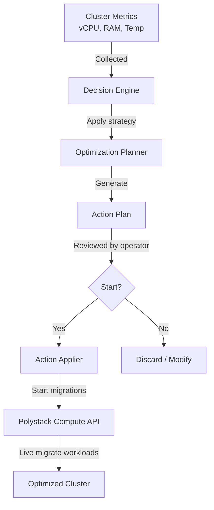

Maximize infrastructure efficiency with automated workload analysis and intelligent
placement. Polystack Cluster Optimization continuously audits your compute cluster, generates
actionable improvement plans, and executes workload rebalancing — reducing resource
waste, lowering energy consumption, and improving workload performance.

<Card title="Powered by VM2Cloud" icon="up-right-from-square" href="https://vm2cloud.com/" color="#bf9667" horizontal>
  Ironcore virtualization technology is powered by VM2Cloud.
</Card>

---

Cluster Optimization

<CardGroup cols={2}>
  <Card title="User Guide" icon="book-open" href="/services/optimization/user-guide" color="#bf9667">
    Run optimization audits, select goals and strategies, review action plans, and
    execute workload rebalancing from the Dashboard or CLI.
  </Card>
  <Card title="Admin Guide" icon="shield-halved" href="/services/optimization/admin-guide" color="#bf9667">
    Configure optimization strategies, data sources, scheduled audits, and integration
    with compute metrics for platform-wide resource management.
  </Card>
  <Card title="CLI Reference" icon="terminal" href="/services/optimization/cli-reference" color="#bf9667">
    Complete command reference for managing goals, audits, action plans, and strategies
    using the openstack CLI.
  </Card>
  <Card title="Compute Service" icon="server" href="/services/compute" color="#bf9667">
    Polystack Compute provides the workload and host metrics that drive optimization
    decisions and executes the resulting migration actions.
  </Card>
</CardGroup>

---

Key Capabilities

<CardGroup cols={2}>
  <Card title="Intelligent Workload Consolidation" icon="layer-group" href="/services/optimization/user-guide/run-audit" color="#bf9667">
    Identify underutilized hosts and consolidate workloads to reduce the active host
    footprint — enabling idle hosts to enter low-power states or be decommissioned.
  </Card>
  <Card title="Thermal Optimization" icon="thermometer" href="/services/optimization/user-guide/optimization-goals" color="#bf9667">
    Monitor inlet temperatures and redistribute workloads away from overheating compute
    racks, protecting hardware and extending its operational lifespan.
  </Card>
  <Card title="Workload Stability" icon="activity" href="/services/optimization/user-guide/optimization-goals" color="#bf9667">
    Detect noisy-neighbor interference and migrate workloads to hosts where they
    can achieve stable, consistent performance metrics.
  </Card>
  <Card title="Energy Efficiency" icon="bolt" href="/services/optimization/user-guide/optimization-goals" color="#bf9667">
    Optimize placement to minimize the number of active compute hosts, reducing
    power consumption during off-peak periods.
  </Card>
  <Card title="Scheduled Audits" icon="calendar" href="/services/optimization/admin-guide/scheduling" color="#bf9667">
    Run optimization analyses on a schedule — daily, weekly, or triggered by capacity
    events — without manual initiation.
  </Card>
  <Card title="Review Before Execute" icon="eye" href="/services/optimization/user-guide/action-plans" color="#bf9667">
    Every audit produces a human-readable action plan. Review and approve actions
    before execution, or configure fully automated application.
  </Card>
</CardGroup>

---

How It Works

---

Optimization Goals

| Goal | Description | Common Strategy |
|------|-------------|-----------------|
| Server Consolidation | Reduce the number of active compute hosts | `server_consolidation` |
| Thermal Optimization | Reduce inlet temperatures by redistributing heat load | `outlet_temperature` |
| Workload Stabilization | Improve instance performance consistency | `workload_stabilization` |
| Energy Savings | Minimize active host count to reduce power draw | `saving_energy` |
| Zone Rebalancing | Distribute workloads evenly across availability zones | `zone_migration` |
| Noisy Neighbor Mitigation | Isolate CPU/memory contention between instances | `noisy_neighbor` |

---

Related Services

<CardGroup cols={3}>
  <Card title="Polystack Compute" icon="server" href="/services/compute" color="#bf9667">
    Workload placement and live migration executed by the Optimization
  </Card>
  <Card title="Instance HA" icon="heart-pulse" href="/services/instance-ha/index" color="#bf9667">
    Recovery events that trigger rebalancing workflows
  </Card>
  <Card title="Polystack Identity" icon="fingerprint" href="/services/identity/index" color="#bf9667">
    RBAC policies governing who can approve and execute optimization actions
  </Card>
</CardGroup>
