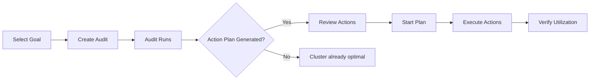

Overview

The Polystack Optimization analyzes your running workloads against optimization goals —
consolidation, thermal management, workload stability, or energy savings — and generates
a prioritized action plan. You review the plan before approving execution, giving you
full visibility and control over every workload migration.

This guide covers the full operator workflow from selecting a goal to reviewing history.

<Warning>
  The Optimization is an administrator tool. All operations described in this guide require the `admin` role in the Dashboard.
</Warning>

---

In This Guide

<CardGroup cols={4}>
  <Card title="Optimization Goals" icon="target" href="/services/optimization/user-guide/optimization-goals" color="#bf9667">
    Understand the available optimization objectives and which goal to select for your
    current operational need.
  </Card>
  <Card title="Run an Audit" icon="play" href="/services/optimization/user-guide/run-audit" color="#bf9667">
    Create and run an optimization audit via the Dashboard or CLI — step-by-step walkthrough.
  </Card>
  <Card title="Action Plans" icon="clipboard-list" href="/services/optimization/user-guide/action-plans" color="#bf9667">
    Review the migrations recommended by a completed audit before approving execution.
  </Card>
  <Card title="Execute Actions" icon="bolt" href="/services/optimization/user-guide/execute-actions" color="#bf9667">
    Start an action plan, monitor live migration progress, and verify results.
  </Card>
  <Card title="Audit History" icon="clock-rotate-left" href="/services/optimization/user-guide/audit-history" color="#bf9667">
    Review past audits, track optimization trends, and compare cluster state over time.
  </Card>
  <Card title="Troubleshooting" icon="wrench" href="/services/optimization/user-guide/troubleshooting" color="#bf9667">
    Diagnose failed audits, stalled action plans, and live migration errors.
  </Card>
</CardGroup>

---

Key Concepts

| Concept | Description |
|---------|-------------|
| **Audit** | An analysis run that evaluates the cluster against an optimization goal and produces an action plan |
| **Goal** | The optimization objective — consolidation, thermal, stability, energy, or zone rebalancing |
| **Strategy** | The algorithm the Decision Engine applies to identify suboptimal placements |
| **Action Plan** | A prioritized list of workload migrations generated by an audit, awaiting approval |
| **Action** | A single operation within an action plan — typically a live migration |

---

Typical Workflow

---

Next Steps

<CardGroup cols={4}>
  <Card title="Optimization Admin Guide" icon="shield-check" href="/services/optimization/admin-guide" color="#bf9667">
    Configure strategies, data sources, scheduling, and action plan policies.
  </Card>
  <Card title="Optimization Overview" icon="layers" href="/services/optimization/index" color="#bf9667">
    Architecture, service overview, and getting started with the Optimization.
  </Card>
</CardGroup>
