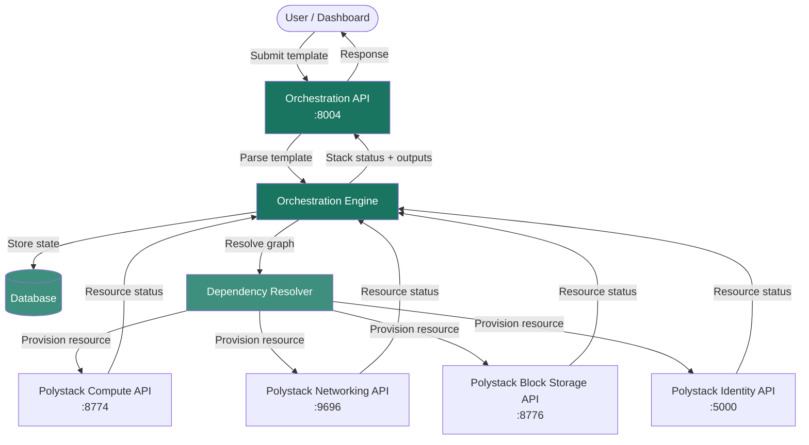
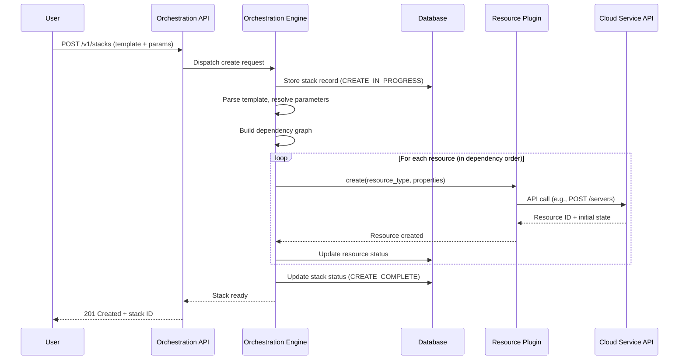

import AdminWarning from '/snippets/admin-warning.mdx';

## Overview

Polystack Orchestration is built on a three-tier architecture: an API tier that accepts
template submissions, an engine tier that resolves dependencies and drives resource
provisioning, and a plugin layer that delegates individual resource operations to the
appropriate cloud service API. The engine is stateless — all stack state is persisted
in a relational database, enabling horizontal engine scaling.

<AdminWarning />

---

## Service Topology

---

## Service Components

| Component | Port | Runs On | Description |
|-----------|------|---------|-------------|
| **Orchestration API** | 8004 | Controller nodes | REST API endpoint — accepts template submissions, parameter updates, and stack lifecycle commands |
| **Orchestration Engine** | Internal | Controller nodes | Core processing service — parses templates, builds dependency graphs, drives resource provisioning, and tracks stack state |
| **CloudWatch-Compatible API** | 8000 | Controller nodes | Alarm and metric compatibility endpoint used by `WaitCondition` signal handling and scaling policy webhooks |
| **Resource Plugins** | N/A | Engine process | In-process plugins that translate resource type operations into calls to the underlying service APIs |

<Note>
  The Orchestration API and CloudWatch-compatible API are separate processes. Both must
  be running for auto-scaling and `WaitCondition` resources to function correctly.
  Port 8000 must be accessible from instances that use `WaitCondition` signal URLs.
</Note>

---

## How the Engine Processes a Template

---

## Request Flow Details

### Template Parsing

The engine parses the YAML template and evaluates all `parameters` sections, applying
default values where the caller did not provide overrides. Intrinsic functions are
not evaluated at parse time — they are resolved lazily when a resource is being
provisioned and its dependencies are known.

### Dependency Graph Resolution

The engine constructs a directed acyclic graph (DAG) from:
- Explicit `depends_on` declarations in resource definitions
- Implicit dependencies detected from `get_resource` and `get_attr` references in
  resource properties

Resources without dependencies are provisioned in parallel. Resources with dependencies
are queued until all prerequisite resources reach `CREATE_COMPLETE`.

### Resource Plugin Architecture

Each resource type (`Polystack::Compute::Server`, `Polystack::Networking::Net`, etc.) is
handled by a dedicated plugin that implements a standard interface:

| Plugin Method | Trigger | Description |
|---------------|---------|-------------|
| `create()` | Stack create | Calls the service API to provision the resource |
| `update()` | Stack update | Applies property changes — either in-place or via replacement |
| `delete()` | Stack delete | Removes the resource from the cloud service |
| `get_reference()` | `get_resource` call | Returns the resource's primary ID |
| `get_live_state()` | Stack drift check | Polls the service API for the current resource state |

---

## Database Schema Overview

The Orchestration service persists all state in a dedicated database schema:

| Table | Contents |
|-------|----------|
| `stack` | Stack metadata, status, template, and owner |
| `resource` | Individual resource records with type, properties, and status |
| `resource_data` | Per-resource key-value metadata (e.g., resource IDs, attributes) |
| `event` | Ordered log of all stack and resource state transitions |
| `software_config` | Configuration objects for software deployment resources |
| `stack_tag` | Tag associations for stacks |

---

## Next Steps

<CardGroup cols={2}>
  <Card title="Configuration" href="/services/orchestration/configuration" color="#197560">
    Configure the Orchestration service, quotas, and stack domain
  </Card>
  <Card title="Scaling the Service" href="/services/orchestration/scaling" color="#197560">
    Deploy multiple engine workers for high-throughput deployments
  </Card>
  <Card title="Security" href="/services/orchestration/security" color="#197560">
    Stack domain users, trust authorization, and policy configuration
  </Card>
  <Card title="Admin Troubleshooting" href="/services/orchestration/admin-troubleshooting" color="#197560">
    Diagnose engine failures and service-level issues
  </Card>
</CardGroup>
